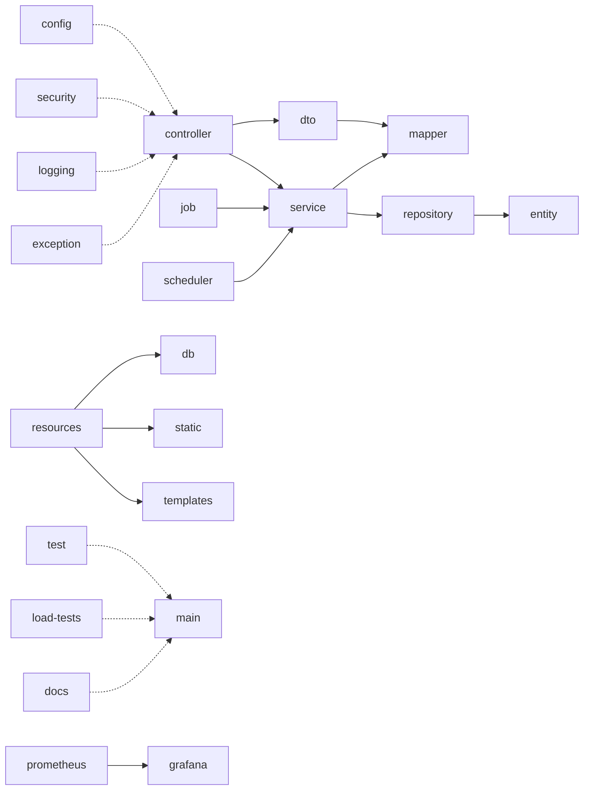

# Kiến trúc thư mục dự án

> Chỉ hiển thị thư mục. Không gồm `.git/`, `.idea/` và `target/` vì đây là metadata hoặc nội dung được sinh tự động.

## Luồng kiến trúc chính



## Cây thư mục đầy đủ

```text
QuanLyThuVien/
├── .agents/
├── .github/
│   └── modernize/
│       └── java-upgrade/
│           └── hooks/
│               └── scripts/
├── .mvn/
│   └── wrapper/
├── .windsurf/
│   └── workflows/
├── docs/
│   ├── implements/
│   │   └── circulation-flows/
│   └── lol/
│       └── dev-specs/
├── grafana/
│   ├── dashboards/
│   └── provisioning/
│       ├── dashboards/
│       └── datasources/
├── load-tests/
│   └── reports/
├── prometheus/
├── skills/
└── src/
    ├── main/
    │   ├── java/
    │   │   └── com/
    │   │       └── vn/
    │   │           ├── config/
    │   │           ├── controller/
    │   │           │   └── docs/
    │   │           ├── dto/
    │   │           │   ├── auth/
    │   │           │   │   ├── request/
    │   │           │   │   └── response/
    │   │           │   ├── catalog/
    │   │           │   │   ├── request/
    │   │           │   │   └── response/
    │   │           │   ├── circulation/
    │   │           │   │   ├── request/
    │   │           │   │   └── response/
    │   │           │   ├── common/
    │   │           │   ├── ebook/
    │   │           │   │   ├── request/
    │   │           │   │   └── response/
    │   │           │   ├── member/
    │   │           │   │   ├── request/
    │   │           │   │   └── response/
    │   │           │   ├── payment/
    │   │           │   │   ├── provider/
    │   │           │   │   ├── request/
    │   │           │   │   └── response/
    │   │           │   ├── review/
    │   │           │   │   ├── request/
    │   │           │   │   └── response/
    │   │           │   └── staff/
    │   │           │       ├── dashboard/
    │   │           │       │   └── response/
    │   │           │       ├── hold/
    │   │           │       │   └── response/
    │   │           │       ├── loan/
    │   │           │       │   └── response/
    │   │           │       └── member/
    │   │           │           ├── internal/
    │   │           │           └── response/
    │   │           ├── entity/
    │   │           ├── enums/
    │   │           ├── exception/
    │   │           ├── job/
    │   │           ├── logging/
    │   │           ├── mapper/
    │   │           ├── repository/
    │   │           │   └── projection/
    │   │           ├── scheduler/
    │   │           ├── security/
    │   │           │   └── cookie/
    │   │           └── service/
    │   │               ├── borrow/
    │   │               ├── ebook/
    │   │               ├── image/
    │   │               ├── impl/
    │   │               │   ├── circulation/
    │   │               │   │   ├── autorenewal/
    │   │               │   │   ├── hold/
    │   │               │   │   ├── holdexpiry/
    │   │               │   │   ├── overdue/
    │   │               │   │   ├── policy/
    │   │               │   │   ├── reminder/
    │   │               │   │   ├── support/
    │   │               │   │   └── usecase/
    │   │               │   ├── ebook/
    │   │               │   ├── idempotency/
    │   │               │   ├── importer/
    │   │               │   │   ├── batch/
    │   │               │   │   ├── chunk/
    │   │               │   │   ├── csv/
    │   │               │   │   ├── job/
    │   │               │   │   └── model/
    │   │               │   ├── job/
    │   │               │   └── staff/
    │   │               │       └── member/
    │   │               ├── payment/
    │   │               │   ├── business/
    │   │               │   ├── idempotency/
    │   │               │   └── provider/
    │   │               │       └── vnpay/
    │   │               ├── rag/
    │   │               └── storage/
    │   │                   ├── cloudinary/
    │   │                   └── ebook/
    │   └── resources/
    │       ├── db/
    │       │   └── migration/
    │       ├── static/
    │       └── templates/
    └── test/
        └── java/
            └── com/
                └── vn/
                    ├── controller/
                    │   ├── circulation/
                    │   ├── fine/
                    │   ├── hold/
                    │   └── staff/
                    ├── exception/
                    ├── mapper/
                    ├── service/
                    │   ├── auth/
                    │   ├── borrow/
                    │   ├── circulation/
                    │   ├── ebook/
                    │   ├── idempotency/
                    │   ├── image/
                    │   ├── impl/
                    │   │   └── importer/
                    │   ├── member/
                    │   ├── payment/
                    │   │   ├── business/
                    │   │   └── provider/
                    │   │       └── vnpay/
                    │   ├── review/
                    │   └── storage/
                    │       └── ebook/
                    └── testsupport/
```

## Vai trò các nhóm thư mục

| Nhóm thư mục | Vai trò |
|---|---|
| `controller`, `dto` | Nhận yêu cầu và định dạng dữ liệu vào/ra. |
| `service`, `impl` | Xử lý nghiệp vụ và các luồng chức năng. |
| `repository`, `entity`, `enums` | Truy cập dữ liệu và biểu diễn miền nghiệp vụ. |
| `mapper`, `projection` | Chuyển đổi và tạo góc nhìn dữ liệu cần thiết. |
| `config`, `security`, `logging`, `exception` | Cấu hình và các xử lý dùng chung toàn hệ thống. |
| `job`, `scheduler` | Tác vụ nền và lịch chạy tự động. |
| `resources` | Cấu hình, phiên bản cơ sở dữ liệu và tài nguyên giao diện. |
| `test`, `load-tests` | Kiểm thử chức năng và hiệu năng. |
| `prometheus`, `grafana` | Thu thập và trực quan hóa số liệu vận hành. |
| `docs`, `skills` | Tài liệu kỹ thuật và quy ước phát triển. |
| `.github`, `.mvn`, `.windsurf`, `.agents` | Tự động hóa và công cụ hỗ trợ dự án. |

Luồng chính: `controller` → `service` → `repository`; dữ liệu được trao đổi qua `dto`, chuyển đổi bởi `mapper` và lưu theo `entity`.
