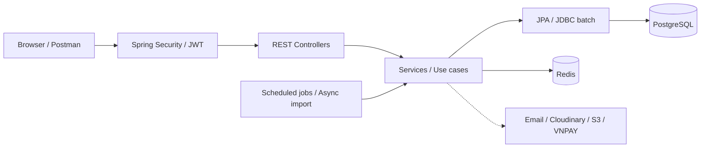

# Library Management System · Java Backend

Backend quản lý thư viện, hỗ trợ bạn đọc tra cứu và đặt giữ sách; hỗ trợ thủ thư
quản lý bản sách, mượn/trả, gia hạn và theo dõi quá hạn. Dự án tập trung vào
quy tắc nghiệp vụ, tính toàn vẹn dữ liệu và API có thể kiểm thử, vận hành.

Tác giả phụ trách toàn bộ đồ án. Repository này chứa backend Java/Spring Boot,
migration database, kiểm thử và cấu hình chạy local.

[Kiến trúc & ERD](docs/architecture-overview.md) ·
[Kịch bản demo](docs/demo-script.md) ·
[API contract](docs/api-contract.md) ·
[Postman collection](docs/postman/QuanLyThuVien.postman_collection.json)

> Phạm vi demo chính: nghiệp vụ thư viện vật lý, không cần S3 hoặc RAG.
> RAG chưa phải chức năng hỏi đáp AI hoàn chỉnh và mặc định tắt.
> Chạy ứng dụng hiện cần database local/snapshot tương thích lịch sử Flyway;
> chưa hỗ trợ khởi tạo demo từ database trống. Suite test có đường chạy riêng.

## Chức năng

| Nhóm | Phạm vi đã triển khai |
| --- | --- |
| Tài khoản & phân quyền | Đăng ký, xác thực email, đăng nhập, refresh/logout; đổi/quên/đặt lại mật khẩu; các vai trò `MEMBER`, `LIBRARIAN`, `ADMIN` |
| Danh mục & kho sách | Sách, tác giả, thể loại; tìm kiếm nhiều tiêu chí, phân trang; quản lý bản sách theo barcode, tình trạng, vị trí và xóa mềm |
| Bạn đọc | Hồ sơ cá nhân, lịch sử mượn, khoản phạt; đánh giá sách và thống kê rating; staff tra cứu thành viên, admin thay đổi trạng thái kèm bản ghi audit |
| Mượn/trả & gia hạn | Preview điều kiện mượn, checkout/checkin, gia hạn; kiểm tra hạn mức, khoản phạt, trạng thái tài khoản và bản sách |
| Đặt giữ sách | Hàng đợi khi hết bản có sẵn; chuyển sách trả về cho người đang chờ; nhận sách, hủy hoặc hết hạn giữ chỗ |
| Công việc định kỳ | Đánh dấu quá hạn, nhắc hạn qua email, xử lý hold hết hạn; tự động gia hạn theo cấu hình nghiệp vụ |
| Nhập liệu & thống kê | Import CSV bất đồng bộ, theo dõi tiến độ qua polling/SSE và lỗi từng dòng; dashboard và thống kê mượn cho staff |

Tích hợp mở rộng có trong source, cần cấu hình và kiểm chứng môi trường riêng:

- **Cloudinary:** upload ảnh bìa sách và ảnh tác giả.
- **Ebook/S3-compatible storage:** upload PDF, metadata, mượn ebook miễn phí,
  phiên đọc và URL truy cập có thời hạn.
- **VNPAY sandbox:** tạo giao dịch cho ebook/phạt quá hạn, xác minh callback,
  xử lý callback lặp, tra cứu giao dịch và biên nhận.
- **Prometheus/Grafana:** thu thập và hiển thị metrics qua Compose profile.

Email xác thực, đặt lại mật khẩu và nhắc hạn cần cấu hình Resend SMTP hợp lệ.
Tự động gia hạn có mã xử lý nhưng mặc định tắt nếu chưa bật trong `system_settings`.

## Những điểm kỹ thuật đáng chú ý

| Bài toán | Cách xử lý trong dự án | Source / bằng chứng |
| --- | --- | --- |
| Client gửi lại một thao tác mượn/trả | Redis `SETNX`, request hash và TTL; phân biệt đang xử lý, hoàn tất, thất bại; replay kết quả theo actor, endpoint và `Idempotency-Key` | [Idempotency service](src/main/java/com/vn/service/impl/IdempotencyServiceImpl.java), [unit test](src/test/java/com/vn/service/idempotency/IdempotencyServiceImplTest.java) |
| Ràng buộc dữ liệu khi có thao tác cạnh tranh | Transaction; khóa member khi kiểm tra hạn mức mượn, khóa đầu sách khi cấp vị trí hold; partial unique index bảo vệ bản sách đang mượn và hold đang hoạt động | [Hold service](src/main/java/com/vn/service/impl/HoldServiceImpl.java), [V14](src/main/resources/db/migration/V14__update_open_borrow_copy_constraint.sql), [V15](src/main/resources/db/migration/V15__hold_queue_constraints.sql), [test khóa row](src/test/java/com/vn/repository/BookRepositoryLockIntegrationTest.java) |
| Import nhiều bản sách mà không giữ HTTP request chờ xử lý | Background executor, transaction theo chunk 500 dòng, JPA cho metadata + JDBC batch cho bản sách; lưu trạng thái job và phát SSE | [CSV processor](src/main/java/com/vn/service/impl/importer/csv/BookImportProcessor.java), [chunk processor](src/main/java/com/vn/service/impl/importer/chunk/BookImportChunkProcessor.java), [unit test](src/test/java/com/vn/service/impl/importer/BookImportProcessorTest.java) |
| Lỗi từ controller và lớp security có format khác nhau | `ApiResponse`, mã lỗi nghiệp vụ, global exception handler và security error writer; trace ID để đối chiếu log | [Exception handler](src/main/java/com/vn/exception/GlobalExceptionHandler.java), [security writer](src/main/java/com/vn/security/SecurityErrorResponseWriter.java), [test lỗi](src/test/java/com/vn/exception/GlobalExceptionHandlerTest.java) |
| Callback thanh toán sai hoặc lặp | Kiểm tra chữ ký và số tiền, khóa payment row, kiểm tra trạng thái trước khi áp dụng nghiệp vụ; lưu payment event | [Callback service](src/main/java/com/vn/service/impl/PaymentCallbackServiceImpl.java), [unit test](src/test/java/com/vn/service/payment/PaymentCallbackServiceImplTest.java) |

Các cơ chế trên có phạm vi riêng: Redis idempotency không phải transaction phân tán
với PostgreSQL; test khóa row chưa chứng minh toàn bộ luồng checkout/gia hạn an toàn
trong mọi tình huống cạnh tranh. Xem thêm giới hạn kiểm thử bên dưới.

## Kiến trúc & công nghệ

Ứng dụng **monolith phân lớp**: controller nhận HTTP và trả DTO; service/use case
xử lý nghiệp vụ; repository truy cập dữ liệu. Các use case circulation được tách
khỏi policy, job và phần hỗ trợ dùng chung.



| Thành phần | Công nghệ và vai trò |
| --- | --- |
| Runtime & API | Java 21, Spring Boot 4.0.6, Spring MVC, Bean Validation, Springdoc OpenAPI |
| Bảo mật | Spring Security, JWT access token, refresh token qua HttpOnly cookie, BCrypt |
| Lưu trữ | PostgreSQL 16, Spring Data JPA/Specifications, JDBC batch, Flyway V1–V42 |
| Redis | Refresh token, blacklist/revocation, giới hạn yêu cầu email, idempotency và cache phiên đọc ebook; chưa có cache catalog |
| Kiểm thử | JUnit Jupiter, Mockito, Spring MVC test, Testcontainers, JaCoCo, k6 |
| Build & vận hành | Maven Wrapper, Docker multi-stage chạy non-root, Docker Compose, GitHub Actions, Actuator/Micrometer |

Chi tiết package, ERD và luồng nghiệp vụ nằm trong
[tài liệu kiến trúc](docs/architecture-overview.md).

## Chạy và kiểm tra dự án

### 1. Chạy suite test độc lập

Yêu cầu **JDK 21** và **Docker đang chạy**. Không cần khôi phục database demo
để chạy suite; integration test tự tạo PostgreSQL/Redis bằng Testcontainers.

```powershell
# Windows / PowerShell, tại thư mục repository
.\mvnw.cmd verify
```

Trên Linux/macOS dùng `./mvnw verify`. Report sinh tại
`target/surefire-reports/` và `target/site/jacoco/index.html`.
Nếu không có Docker, các lớp Testcontainers đang được cấu hình **skip**;
cần kiểm tra số test skipped trước khi kết luận toàn bộ suite đã đạt.

### 2. Chạy ứng dụng local/demo

Yêu cầu Docker Compose và **database/snapshot tương thích đã đi qua V22**.
Snapshot demo chưa được đóng gói trong repo. Nếu chưa có, có thể xem source,
chạy test ở bước 1 và đọc kịch bản demo, nhưng chưa thể chạy đầy đủ ứng dụng.

```powershell
# Chỉ tạo file khi chưa có; không ghi đè cấu hình local đang dùng
if (-not (Test-Path .env)) { Copy-Item .env.example .env }

# Điền POSTGRES_PASSWORD, JWT_SECRET riêng cho môi trường của bạn trong .env.
# Kiểm tra POSTGRES_DB, POSTGRES_USER, POSTGRES_PORT và LIBRARY_APP_PORT.
docker compose up -d postgres redis
```

Trước khi khởi động backend, khôi phục snapshot vào đúng database nếu cần và
đối chiếu `flyway_schema_history` theo [hướng dẫn migration](docs/migration-upgrade-guide.md).
V22 là data-fix lịch sử cần giữ nguyên; không sửa checksum, bỏ migration hoặc
chạy `docker compose down -v` để xử lý lỗi trên database cần bảo toàn.

```powershell
docker compose up --build -d library-service
```

Các địa chỉ dưới đây dùng cổng mặc định `8080`; đổi theo `LIBRARY_APP_PORT` của bạn:

- [Swagger UI](http://localhost:8080/swagger-ui.html)
- [OpenAPI JSON](http://localhost:8080/api-docs)
- [Health](http://localhost:8080/actuator/health)

```powershell
Invoke-RestMethod 'http://localhost:8080/actuator/health'
Invoke-RestMethod 'http://localhost:8080/api/books?page=0&size=5'
```

Tài khoản seed dành riêng cho local/demo, nếu snapshot vẫn giữ dữ liệu seed:

| Vai trò | Email | Mật khẩu |
| --- | --- | --- |
| Admin | `admin@library.local` | `Password123` |
| Librarian | `librarian@library.local` | `Password123` |
| Member | `member1@library.local`, `member2@library.local` | `Password123` |

Không dùng tài khoản/mật khẩu demo cho môi trường công khai. Không commit `.env`.
Kịch bản [demo](docs/demo-script.md) và [Postman collection](docs/postman/QuanLyThuVien.postman_collection.json)
giúp thử luồng đăng nhập → tra cứu → mượn/trả → kiểm tra kết quả.

## Quy ước API

- `ResponseEntity` quản lý HTTP status/header; `ApiResponse<T>` quản lý JSON body.
- Danh sách phân trang trả items trong `data`, thông tin trang trong `meta: PageMeta`;
  trang bắt đầu từ `0`. Không có lớp `PageResponse` riêng.
- Lỗi có `success: false`, `code`, `message`, `timestamp` và `traceId` khi qua
  global handler/security writer. Field `null` được bỏ khỏi JSON.
- Các thao tác circulation/payment yêu cầu `Idempotency-Key` theo từng endpoint.
- SSE trả `text/event-stream`; VNPAY IPN giữ `{ RspCode, Message }`, không bọc
  `ApiResponse` để tránh phá contract riêng.

Xem [API contract](docs/api-contract.md) và Swagger để biết request/status cụ thể.

## Kiểm thử, CI & số đo

Snapshot báo cáo local ngày **08/09/2026**, đọc từ Surefire và JaCoCo:

| Chỉ số | Kết quả |
| --- | --- |
| Test | 207; 0 failures, 0 errors, 0 skipped |
| Instruction coverage | 52.39% |
| Line coverage | 50.03% |
| Branch coverage | 34.14% |

Đây là kết quả của lần chạy đã lưu, không phải cam kết cho mọi commit hoặc badge
CI hiện tại. [Workflow](.github/workflows/backend-ci.yml) cấu hình `mvn verify`
trên push/pull request và lưu Surefire/JaCoCo artifact. Docker image build bỏ qua
test, vì vậy build image không thay thế bước `verify`.

Suite bao gồm unit test nghiệp vụ, MVC test, context/security test với PostgreSQL
và Redis thật, cùng test PostgreSQL pessimistic lock. Test profile **tắt Flyway**;
test repository dùng schema Hibernate tạo riêng. Vì vậy các kết quả này chưa
chứng minh migration từ database trống hoặc toàn bộ HTTP workflow/concurrency.

Baseline k6 local đã ghi nhận ngày 08/09/2026: `GET /api/books/3105`,
20 VUs trong 20 giây, mỗi vòng nghỉ 1 giây, tại `127.0.0.1:18090`.
Lần chạy trên stack đã warm có 400 request, 0% lỗi, trung bình 25.97 ms,
p95 62.11 ms; lần đầu sau restart có p95 572.2 ms, vượt ngưỡng 300 ms.
Đây không phải phép đo công suất production hay so sánh hiệu quả Redis cache.
Xem [cách chạy lại](load-tests/README.md); tên `book-cache-test.js` là tên script
cũ, không phản ánh việc API catalog đã có cache.

## Giới hạn & hướng phát triển

- Đóng gói dữ liệu demo đã ẩn thông tin nhạy cảm và quy trình restore có thể tái lập,
  đồng thời giữ nguyên lịch sử migration local.
- Bổ sung integration test cho toàn bộ luồng mượn/trả/hold, gia hạn cạnh tranh,
  vòng đời reset token/session và nâng cấp Flyway từ snapshot tương thích.
- CSV import chạy trong executor của ứng dụng; chưa có cơ chế tự khôi phục job
  đang chạy sau khi process dừng. Redis và PostgreSQL không commit nguyên tử cùng nhau.
- Chưa công bố bản triển khai production hoặc kết quả tải production.
  Tích hợp email, storage và payment cần kiểm chứng riêng trước khi công khai demo.
- RAG để giai đoạn sau; không nằm trong cam kết hoàn thành của bản demo này.

## Tài liệu bổ sung

- [Schema PostgreSQL](docs/schema-current.md) và [chiến lược CSV import](docs/csv-import-strategy.md)
- [Các flow circulation](docs/implements/circulation-flows/README.md)
- [Error handling](skills/error-handling-guide.md) và [logging](skills/logging-guide.md)
- [CI/CD production một VPS](docs/ci-cd-deployment.md), [Monitoring](docs/monitoring-prometheus-grafana.md), [triển khai Nginx](docs/nginx-deployment-guide.md), [Resend](docs/resend-email-setup.md)
- [Release notes](docs/release-notes-2026-09.md)

Các tài liệu trong thư mục kế hoạch/spec mô tả cả hướng phát triển; dùng source,
migration và test để xác định chức năng thực tế của phiên bản đang xem.
