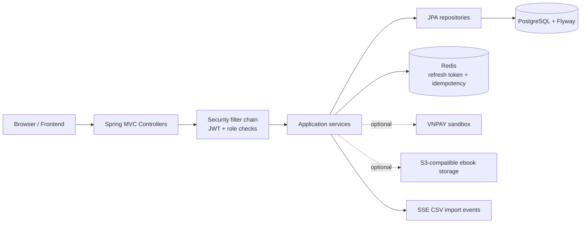
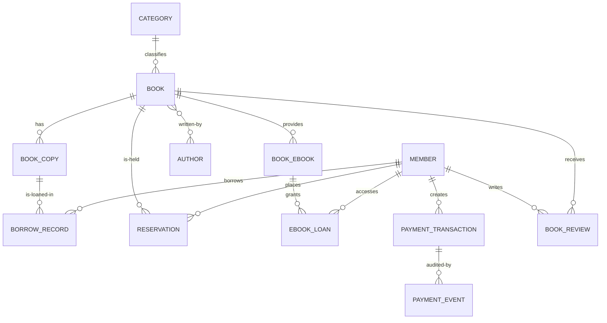
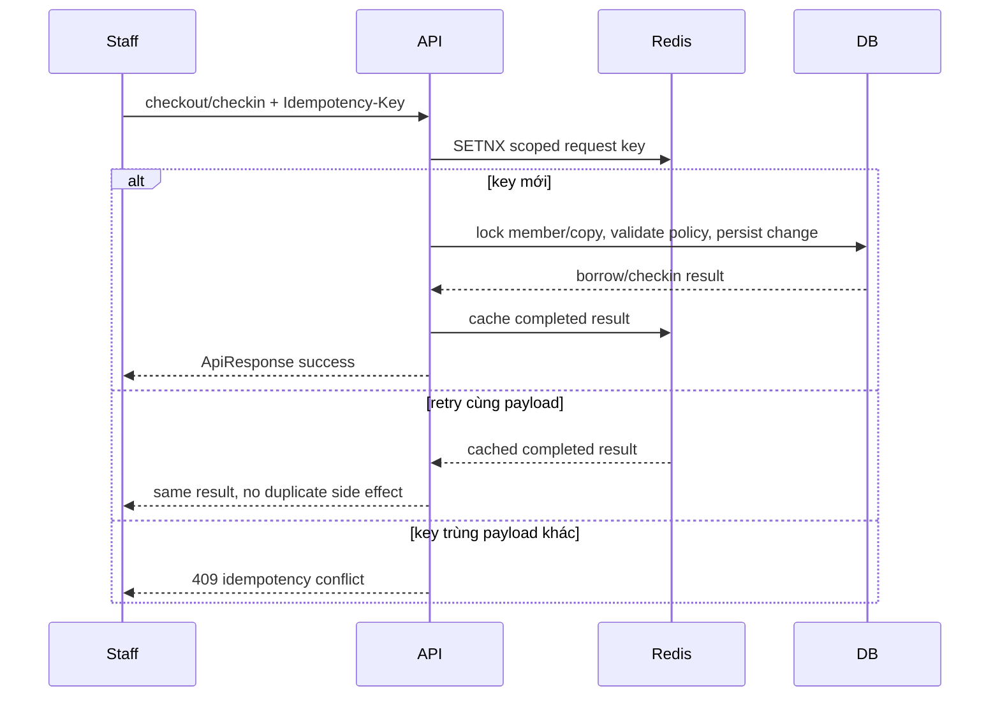
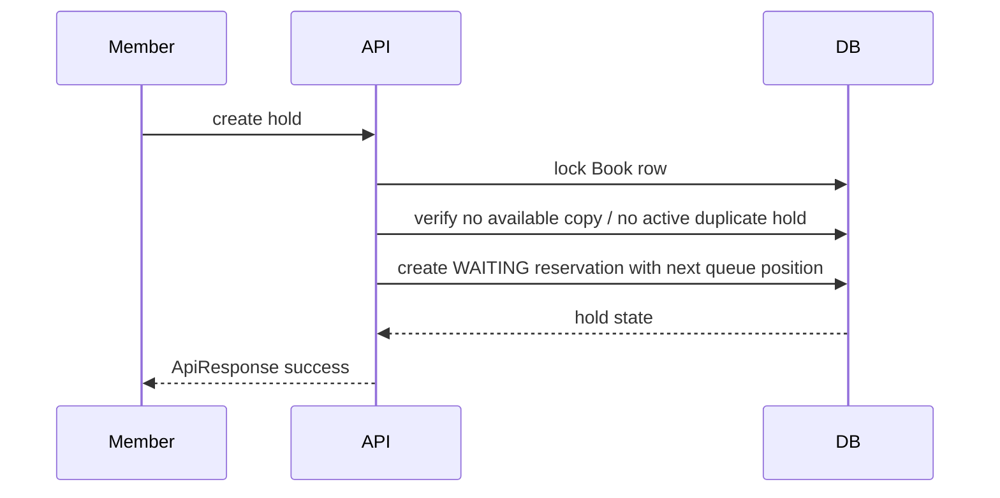
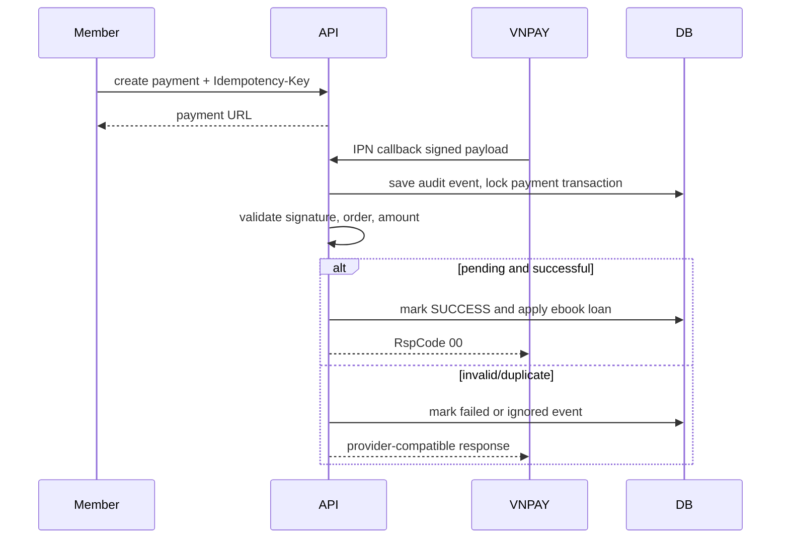

# Kiến trúc, ERD và ba luồng demo chính

## Kiến trúc ở mức component

Mọi API thông thường trả `ApiResponse`; danh sách phân trang đặt nội dung ở
`data` và `PageMeta` ở `meta`. Tạo `Book` và `Payment` trả `201 Created` kèm
`Location` đến resource đọc lại được; import CSV trả `202 Accepted`. VNPAY IPN
và SSE là hai ngoại lệ có contract riêng để tương thích provider/EventSource.

## ERD rút gọn

Chi tiết cột, constraint và index nằm tại [schema-current.md](schema-current.md).

## Mượn/trả sách vật lý

## Đặt giữ chỗ

Khi copy được trả, queue service đưa hold đầu hàng đợi sang
`READY_FOR_PICKUP`. Checkout hold kiểm tra trạng thái/copy, lock member, rồi
tạo một `BorrowRecord`.

## Thanh toán VNPAY

Callback retry không tạo loan trùng: payment transaction được khóa và trạng
thái terminal được ghi audit rồi bỏ qua.
