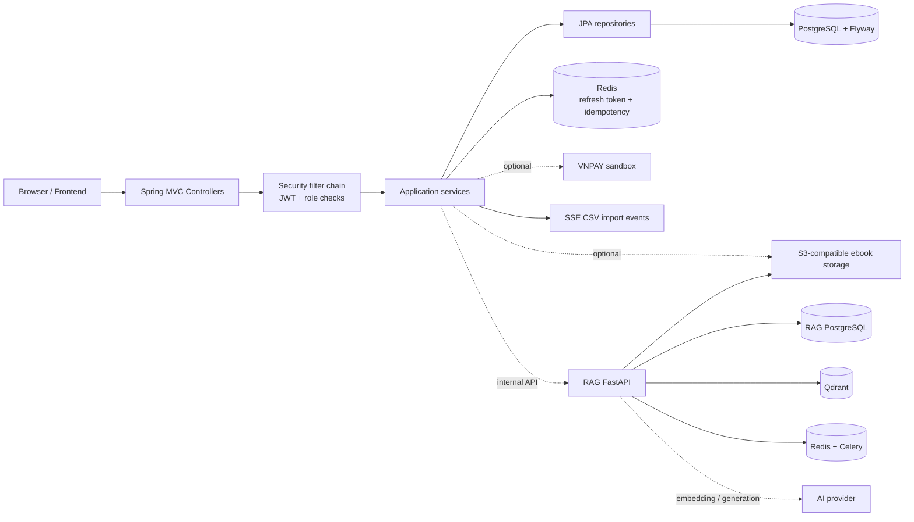
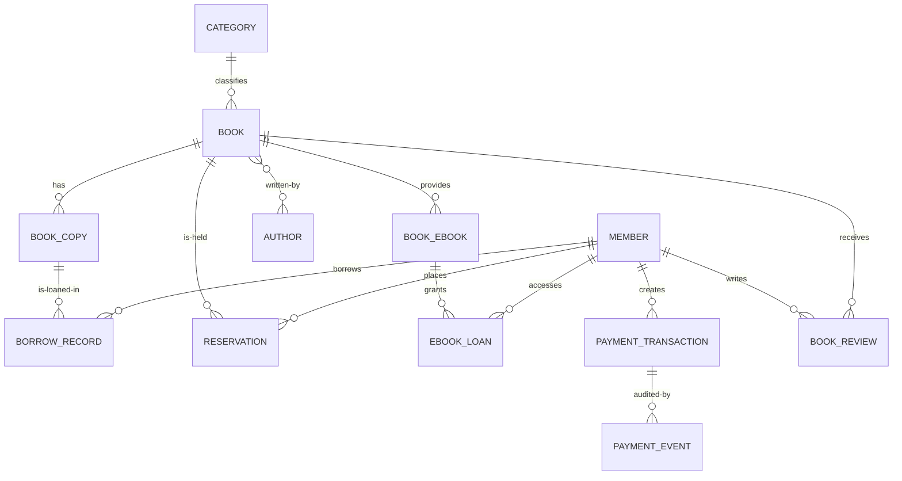
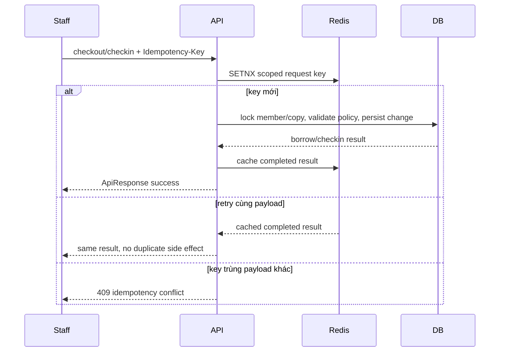
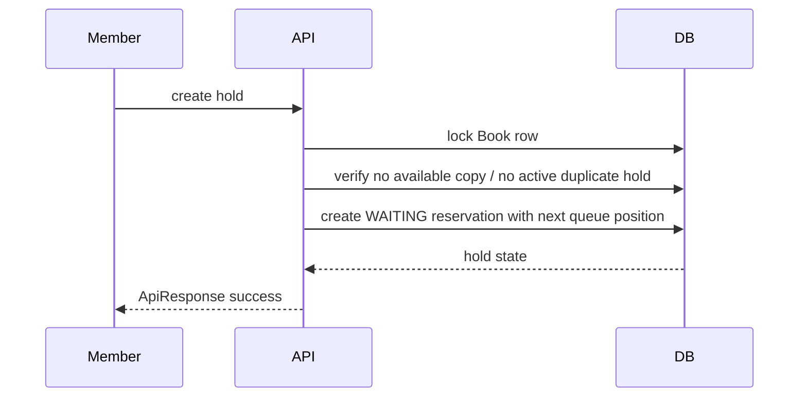
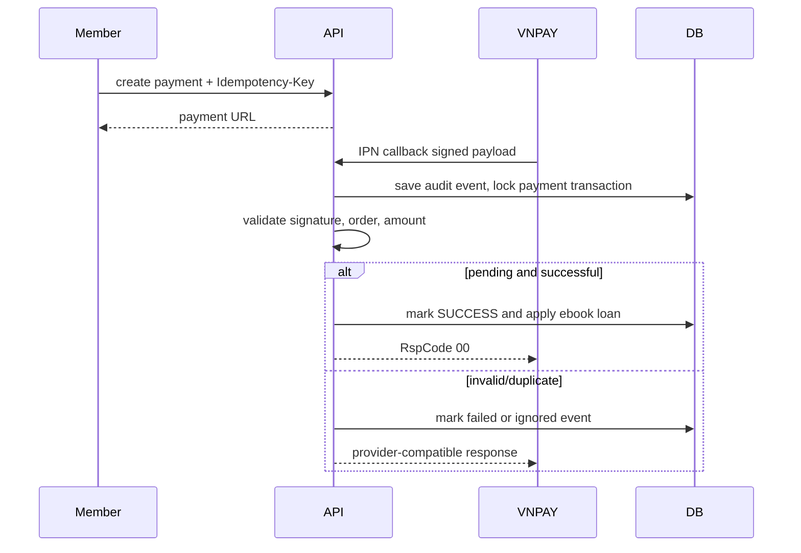
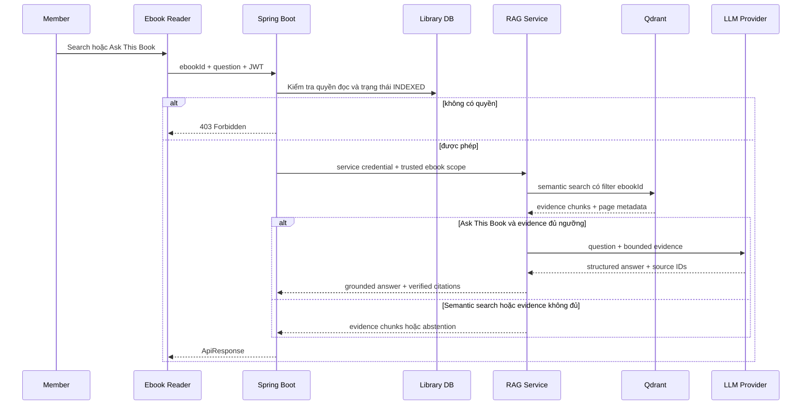

# Kiến trúc, ERD và các luồng chính

Định hướng AI ưu tiên của project là
[Secure AI Ebook Reader](secure-ai-ebook-reader-roadmap.md). Luồng này đang
được hoàn thiện theo từng phase; các luồng thư viện còn lại vẫn hoạt động độc
lập khi RAG tắt.

## Kiến trúc ở mức component

```mermaid
flowchart LR
    Client[Browser / Frontend] --> API[Spring MVC Controllers]
    API --> Security[Security filter chain\nJWT + role checks]
    Security --> Service[Application services]
    Service --> JPA[JPA repositories]
    JPA --> PG[(PostgreSQL + Flyway)]
    Service --> Redis[(Redis\nrefresh token + idempotency)]
    Service -. optional .-> VNPAY[VNPAY sandbox]
    Service -. optional .-> Storage[S3-compatible ebook storage]
    Service --> SSE[SSE CSV import events]
    Service -. internal API .-> RAG[RAG FastAPI]
    RAG --> RAGDB[(RAG PostgreSQL)]
    RAG --> Qdrant[(Qdrant)]
    RAG --> RedisRAG[(Redis + Celery)]
    RAG --> Storage
    RAG -. embedding / generation .-> AI[AI provider]
```

Mọi API thông thường trả `ApiResponse`; danh sách phân trang đặt nội dung ở
`data` và `PageMeta` ở `meta`. Tạo `Book` và `Payment` trả `201 Created` kèm
`Location` đến resource đọc lại được; import CSV trả `202 Accepted`. VNPAY IPN
và SSE là hai ngoại lệ có contract riêng để tương thích provider/EventSource.

## ERD rút gọn

```mermaid
erDiagram
    MEMBER ||--o{ BORROW_RECORD : borrows
    MEMBER ||--o{ RESERVATION : places
    BOOK ||--o{ BOOK_COPY : has
    BOOK ||--o{ RESERVATION : is-held
    BOOK_COPY ||--o{ BORROW_RECORD : is-loaned-in
    CATEGORY ||--o{ BOOK : classifies
    BOOK }o--o{ AUTHOR : written-by
    BOOK ||--o{ BOOK_EBOOK : provides
    MEMBER ||--o{ EBOOK_LOAN : accesses
    BOOK_EBOOK ||--o{ EBOOK_LOAN : grants
    MEMBER ||--o{ PAYMENT_TRANSACTION : creates
    PAYMENT_TRANSACTION ||--o{ PAYMENT_EVENT : audited-by
    BOOK ||--o{ BOOK_REVIEW : receives
    MEMBER ||--o{ BOOK_REVIEW : writes
```

Chi tiết cột, constraint và index nằm tại [schema-current.md](schema-current.md).

## Mượn/trả sách vật lý

```mermaid
sequenceDiagram
    participant Staff
    participant API
    participant Redis
    participant DB
    Staff->>API: checkout/checkin + Idempotency-Key
    API->>Redis: SETNX scoped request key
    alt key mới
        API->>DB: lock member/copy, validate policy, persist change
        DB-->>API: borrow/checkin result
        API->>Redis: cache completed result
        API-->>Staff: ApiResponse success
    else retry cùng payload
        Redis-->>API: cached completed result
        API-->>Staff: same result, no duplicate side effect
    else key trùng payload khác
        API-->>Staff: 409 idempotency conflict
    end
```

## Đặt giữ chỗ

```mermaid
sequenceDiagram
    participant Member
    participant API
    participant DB
    Member->>API: create hold
    API->>DB: lock Book row
    API->>DB: verify no available copy / no active duplicate hold
    API->>DB: create WAITING reservation with next queue position
    DB-->>API: hold state
    API-->>Member: ApiResponse success
```

Khi copy được trả, queue service đưa hold đầu hàng đợi sang
`READY_FOR_PICKUP`. Checkout hold kiểm tra trạng thái/copy, lock member, rồi
tạo một `BorrowRecord`.

## Thanh toán VNPAY

```mermaid
sequenceDiagram
    participant Member
    participant API
    participant VNPAY
    participant DB
    Member->>API: create payment + Idempotency-Key
    API-->>Member: payment URL
    VNPAY->>API: IPN callback signed payload
    API->>DB: save audit event, lock payment transaction
    API->>API: validate signature, order, amount
    alt pending and successful
        API->>DB: mark SUCCESS and apply ebook loan
        API-->>VNPAY: RspCode 00
    else invalid/duplicate
        API->>DB: mark failed or ignored event
        API-->>VNPAY: provider-compatible response
    end
```

Callback retry không tạo loan trùng: payment transaction được khóa và trạng
thái terminal được ghi audit rồi bỏ qua.

## Secure AI Ebook Reader

```mermaid
sequenceDiagram
    participant Member
    participant UI as Ebook Reader
    participant API as Spring Boot
    participant DB as Library DB
    participant RAG as RAG Service
    participant Vector as Qdrant
    participant LLM as LLM Provider

    Member->>UI: Search hoặc Ask This Book
    UI->>API: ebookId + question + JWT
    API->>DB: Kiểm tra quyền đọc và trạng thái INDEXED
    alt không có quyền
        API-->>UI: 403 Forbidden
    else được phép
        API->>RAG: service credential + trusted ebook scope
        RAG->>Vector: semantic search có filter ebookId
        Vector-->>RAG: evidence chunks + page metadata
        alt Ask This Book và evidence đủ ngưỡng
            RAG->>LLM: question + bounded evidence
            LLM-->>RAG: structured answer + source IDs
            RAG-->>API: grounded answer + verified citations
        else Semantic search hoặc evidence không đủ
            RAG-->>API: evidence chunks hoặc abstention
        end
        API-->>UI: ApiResponse
    end
```

Spring Boot luôn là lớp xác thực/quyền nghiệp vụ; frontend không gọi trực tiếp
RAG. Public semantic search và Ask This Book đều yêu cầu JWT + reading session +
active loan. Ask This Book trả answer có citation hoặc chủ động abstain khi
không đủ evidence. Chi tiết trạng thái và roadmap nằm trong
[secure-ai-ebook-reader-roadmap.md](secure-ai-ebook-reader-roadmap.md).
