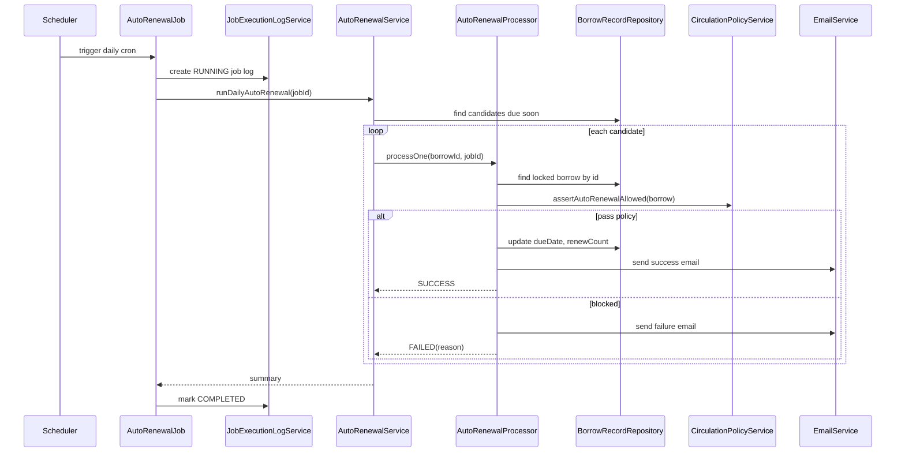
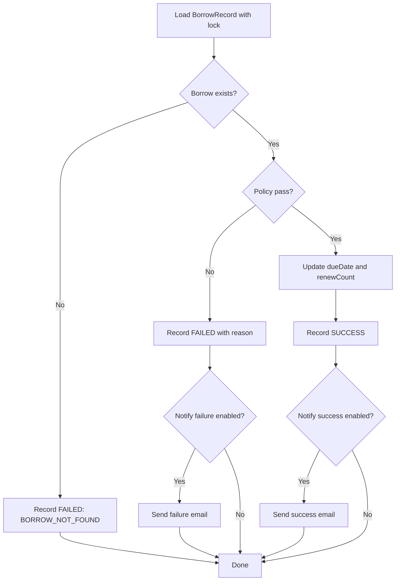

# Auto-renewal Policy Spec

Tài liệu này mô tả đề xuất thêm tính năng auto-renewal cho The Athenaeum. Mục tiêu là có một feature đủ thực tế để gây ấn tượng khi demo/intern, nhưng vẫn vừa sức với codebase hiện tại.

Auto-renewal nghĩa là hệ thống tự động gia hạn một lượt mượn khi gần đến hạn, nếu lượt mượn đó vẫn thỏa circulation policy. Đây không phải là bypass nghiệp vụ. Nó là một scheduled job chạy nền, dùng lại các rule hiện có như max renewals, hold queue, trạng thái tài khoản và overdue policy.

## 1. Cơ sở thực tế từ ILS lớn

### 1.1. Koha

Koha có cron script `automatic_renewals.pl`. Script này tìm các loan được cấu hình auto-renew, kiểm tra còn lượt renew không, kiểm tra rule "No renewal before", rồi mới renew. Koha manual cũng ghi rõ automatic renewal là cron job chạy theo lịch và cần tham số confirm để thực sự ghi dữ liệu.

Nguồn tham khảo:

- Koha cron jobs manual: `automatic_renewals.pl`, automatic renewal, nightly frequency: https://koha-community.org/manual/23.05/en/html/cron_jobs.html
- Koha perldoc: `automatic_renewals.pl - cron script to renew loans`: https://perldoc.koha-community.org/misc/cronjobs/automatic_renewals.html

### 1.2. Evergreen

Evergreen có autorenewals trong circulation policies. Tài liệu Evergreen nói circulation có thể tự động renew item trong tài khoản patron, patron không cần login OPAC hoặc nhờ staff. Evergreen cũng có `max_auto_renewals`, notice khi auto-renew thành công/thất bại, và chặn auto-renew nếu item có holds, vượt số lần auto-renew cho phép, hoặc patron bị block.

Nguồn tham khảo:

- Evergreen docs: `Autorenewals in Evergreen`: https://docs.evergreen-ils.org/docs/latest/admin/autorenewals.html
- Evergreen docs: `Autorenewal Notices and Action Triggers`: https://docs.evergreen-ils.org/docs/latest/admin/autorenewals.html

Kết luận áp dụng cho đồ án:

```text
Auto-renewal là nghiệp vụ thật.
Không gia hạn vô hạn.
Không bỏ qua hold queue.
Không bỏ qua tài khoản bị block.
Không thay thế staff renewal.
Nó chỉ tự động hóa một renewal hợp lệ theo policy.
```

## 2. Mục tiêu trong The Athenaeum

### 2.1. Mục tiêu nghiệp vụ

Tính năng cần đạt:

```text
1. Tự động gia hạn sách sắp đến hạn nếu đủ điều kiện.
2. Không cho user giữ sách vô hạn.
3. Không gia hạn nếu có member khác đang hold sách.
4. Không gia hạn nếu tài khoản member không hợp lệ.
5. Gửi thông báo thành công hoặc thất bại cho member.
6. Ghi log job để staff biết job đã xử lý bao nhiêu record.
7. Mỗi borrow xử lý độc lập để lỗi một record không làm fail cả job.
```

### 2.2. Mục tiêu kỹ thuật

Tính năng nên reuse code hiện có:

```text
BorrowRecordRepository
CirculationPolicyService
CirculationSettingService
RenewalUseCase hoặc một AutoRenewalUseCase riêng
ReservationRepository
EmailService
job_execution_logs
```

Không nên tạo một workflow quá lớn ngay từ đầu:

```text
Không cần message queue.
Không cần Redis lock.
Không cần Spring Batch ở phase đầu.
Không cần UI quản trị phức tạp ngay.
```

## 3. Codebase hiện tại liên quan

### 3.1. BorrowRecord

Entity hiện có:

```java
private Instant borrowedAt;
private Instant dueDate;
private Instant returnedAt;
private BorrowStatus status;
private Integer renewCount;
private Integer maxRenewalsAtCheckout;
```

Điểm quan trọng:

```text
renewCount:
  số lần đã gia hạn

maxRenewalsAtCheckout:
  số lần gia hạn tối đa được snapshot tại thời điểm checkout
```

Việc snapshot `maxRenewalsAtCheckout` là thiết kế tốt. Nếu admin đổi setting sau này, các lượt mượn cũ vẫn giữ rule tại thời điểm checkout.

### 3.2. CirculationSettingService

Hiện có các setting:

```text
BORROW_DAYS_DEFAULT = 14
RENEWAL_DAYS_DEFAULT = 7
MAX_RENEWALS_DEFAULT = 2
ALLOW_RENEW_OVERDUE = false
HOLD_PICKUP_DAYS_DEFAULT = 3
```

Auto-renewal có thể reuse:

```text
RENEWAL_DAYS_DEFAULT
ALLOW_RENEW_OVERDUE
```

Cần thêm setting mới:

```text
AUTO_RENEW_ENABLED
AUTO_RENEW_DAYS_BEFORE_DUE
AUTO_RENEW_NOTIFY_SUCCESS
AUTO_RENEW_NOTIFY_FAILURE
AUTO_RENEW_MAX_ITEMS_PER_RUN
```

### 3.3. CirculationPolicyService

Hiện có:

```java
public void assertRenewalAllowed(Long actorId, boolean staffFlow, BorrowRecord borrow)
```

Rule hiện tại:

```text
1. Borrower phải là MEMBER.
2. Borrower phải ACTIVE.
3. Membership chưa hết hạn.
4. Nếu self-renew thì borrow phải thuộc actor hiện tại.
5. Borrow status phải renewable.
6. Nếu borrow quá hạn và ALLOW_RENEW_OVERDUE=false thì chặn.
7. renewCount < maxRenewalsAtCheckout.
8. Book không có active reservation.
```

Auto-renewal nên dùng cùng rule nền, nhưng cần một method riêng để tránh truyền actor giả:

```java
public void assertAutoRenewalAllowed(BorrowRecord borrow)
```

Lý do không nên gọi `assertRenewalAllowed(actorId, true, borrow)`:

```text
staffFlow=true có nghĩa là staff đang renew hộ.
auto-renewal không phải staff flow.
Nếu dùng staffFlow để né owner check thì đọc code dễ hiểu sai.
```

### 3.4. RenewalUseCase

Hiện renewal làm:

```text
1. Load BorrowRecord.
2. Validate policy.
3. requestedDays = request.requestedDays hoặc RENEWAL_DAYS_DEFAULT.
4. newDueDate = oldDueDate + requestedDays.
5. renewCount += 1.
6. save.
```

Auto-renewal có thể reuse logic cộng ngày, nhưng nên tách phần apply renewal thành helper để tránh duplicate:

```java
public RenewBorrowResponse renew(...)
private RenewBorrowResponse applyRenewal(BorrowRecord borrow, int requestedDays)
```

Hoặc tạo service nhỏ:

```text
RenewalApplier
```

Nhưng với codebase hiện tại, tách private method trong `RenewalUseCase` là đủ.

### 3.5. BorrowRecordRepository

Hiện có:

```java
Page<BorrowRecord> findOverdueCandidates(BorrowStatus status, Instant now, Pageable pageable)
```

Cần thêm query lấy candidate sắp đến hạn:

```java
@EntityGraph(attributePaths = {"member", "bookCopy", "bookCopy.book"})
@Query("""
    select borrow
    from BorrowRecord borrow
    where borrow.status = :status
      and borrow.dueDate >= :windowStart
      and borrow.dueDate < :windowEnd
    order by borrow.dueDate asc
""")
Page<BorrowRecord> findAutoRenewalCandidates(
        @Param("status") BorrowStatus status,
        @Param("windowStart") Instant windowStart,
        @Param("windowEnd") Instant windowEnd,
        Pageable pageable
);
```

Không lấy `RETURNED`, `LOST`, `OVERDUE` ở phase đầu.

Phase đầu chỉ xử lý:

```text
status = BORROWED
dueDate trong cửa sổ auto-renew
```

## 4. Chính sách auto-renewal đề xuất

### 4.1. Khi nào job chạy?

Đề xuất:

```text
Mỗi ngày lúc 07:00 Asia/Bangkok
```

Ví dụ cron:

```java
@Scheduled(cron = "0 0 7 * * *", zone = "Asia/Bangkok")
```

Lý do:

```text
1. Chạy buổi sáng giúp email đến user trước giờ thư viện mở cửa.
2. Dễ demo hơn so với midnight.
3. Dùng zone nghiệp vụ giống fine calculation đang dùng Asia/Bangkok.
```

Nếu muốn giống Koha hơn có thể chạy ban đêm:

```text
03:00 Asia/Bangkok
```

Nhưng với đồ án, 07:00 dễ giải thích hơn.

### 4.2. Candidate window

Setting:

```text
AUTO_RENEW_DAYS_BEFORE_DUE = 1
```

Nếu hôm nay là `2026-05-18`, job lấy các borrow có `dueDate` trong ngày `2026-05-19`.

Business window:

```text
windowDate = today + AUTO_RENEW_DAYS_BEFORE_DUE
windowStart = windowDate 00:00 Asia/Bangkok
windowEnd = windowDate + 1 day
```

Không nên dùng:

```text
dueDate <= now + 1 day
```

Vì cách đó dễ quét lại cùng record nhiều lần trong ngày nếu job chạy lại.

### 4.3. Điều kiện được auto-renew

Một borrow được auto-renew nếu pass toàn bộ rule:

```text
1. AUTO_RENEW_ENABLED = true.
2. BorrowRecord.status = BORROWED.
3. dueDate nằm trong candidate window.
4. Borrower role = MEMBER.
5. Borrower status = ACTIVE.
6. Membership chưa hết hạn.
7. Borrow chưa quá hạn, trừ khi ALLOW_RENEW_OVERDUE = true.
8. renewCount < maxRenewalsAtCheckout.
9. Book không có active hold/reservation.
10. Book chưa bị soft delete.
11. BookCopy vẫn đang BORROWED.
12. Member không bị block bởi policy mượn hiện tại nếu muốn strict.
```

Rule số 8 là điểm chặn giữ sách vô hạn:

```text
renewCount = 0, max = 2 -> renew được lần 1
renewCount = 1, max = 2 -> renew được lần 2
renewCount = 2, max = 2 -> bị chặn
```

### 4.4. Điều kiện không được auto-renew

Job không auto-renew nếu:

```text
1. Có hold active trên cùng book.
2. Đã hết max renewals.
3. Member không ACTIVE.
4. Membership expired.
5. Borrow không còn BORROWED.
6. Copy không còn BORROWED.
7. Book bị soft delete.
8. Borrow đã overdue và policy không cho renew overdue.
```

Khi bị chặn, hệ thống không nên im lặng. Nên ghi attempt log và gửi email failure nếu bật setting.

## 5. Kết quả sau khi auto-renew

### 5.1. Thành công

Khi success:

```text
oldDueDate = borrow.dueDate
newDueDate = oldDueDate + RENEWAL_DAYS_DEFAULT
borrow.dueDate = newDueDate
borrow.renewCount += 1
```

Không thay đổi:

```text
borrowedAt
returnedAt
fineAmount
bookCopy.status
book.totalCopies
book.availableCopies
```

Lý do:

```text
Auto-renewal chỉ kéo dài hạn mượn.
Nó không tạo lượt mượn mới, không reset renewCount, không làm checkin/checkout lại.
```

### 5.2. Thất bại

Khi fail:

```text
Không update BorrowRecord.
Không update BookCopy.
Ghi reason.
Gửi email nhắc user nếu bật AUTO_RENEW_NOTIFY_FAILURE.
```

Ví dụ reason:

```text
MAX_RENEWALS_REACHED
BLOCKED_BY_HOLD
MEMBER_NOT_ACTIVE
MEMBERSHIP_EXPIRED
BORROW_OVERDUE
BOOK_COPY_NOT_BORROWED
BOOK_DELETED
```

## 6. Database design

### 6.1. MVP không cần bảng mới

Ở mức MVP, có thể chỉ dùng:

```text
borrow_records
job_execution_logs
system_settings
application logs
```

Ưu điểm:

```text
Ít migration.
Ít entity.
Dễ implement.
```

Nhược điểm:

```text
Không xem được từng borrow fail vì lý do gì nếu chỉ nhìn DB.
Chỉ có tổng success/fail trong job_execution_logs.
```

### 6.2. Khuyến nghị cho đồ án: thêm auto_renewal_attempts

Để gây ấn tượng hơn, nên thêm bảng:

```sql
CREATE TABLE auto_renewal_attempts (
    id BIGSERIAL PRIMARY KEY,
    borrow_record_id BIGINT NOT NULL REFERENCES borrow_records(id),
    member_id BIGINT NOT NULL REFERENCES members(id),
    book_copy_id BIGINT NOT NULL REFERENCES book_copies(id),
    job_execution_log_id BIGINT REFERENCES job_execution_logs(id),

    attempted_at TIMESTAMP NOT NULL,
    result VARCHAR(30) NOT NULL,
    reason_code VARCHAR(100),
    reason_message TEXT,

    old_due_date TIMESTAMP,
    new_due_date TIMESTAMP,
    renew_count_before INT,
    renew_count_after INT,

    CONSTRAINT chk_auto_renewal_attempt_result
        CHECK (result IN ('SUCCESS', 'FAILED'))
);
```

Index đề xuất:

```sql
CREATE INDEX idx_auto_renewal_attempt_borrow
    ON auto_renewal_attempts(borrow_record_id, attempted_at DESC);

CREATE INDEX idx_auto_renewal_attempt_member
    ON auto_renewal_attempts(member_id, attempted_at DESC);

CREATE INDEX idx_auto_renewal_attempt_job
    ON auto_renewal_attempts(job_execution_log_id);
```

Lý do nên có bảng này:

```text
1. Demo được lịch sử auto-renewal từng borrow.
2. Giải thích được vì sao một sách không được renew.
3. Hỗ trợ staff kiểm tra tranh chấp với user.
4. Tách rõ application log và business audit của job.
```

### 6.3. Thêm system settings

Migration mới nên là V16, không sửa V13/V15 đã chạy.

```sql
INSERT INTO system_settings (key, value, description)
VALUES
    ('AUTO_RENEW_ENABLED', 'false', 'Enable daily automatic renewal job'),
    ('AUTO_RENEW_DAYS_BEFORE_DUE', '1', 'Run auto-renewal for borrows due in this many days'),
    ('AUTO_RENEW_NOTIFY_SUCCESS', 'true', 'Send email when auto-renewal succeeds'),
    ('AUTO_RENEW_NOTIFY_FAILURE', 'true', 'Send email when auto-renewal is blocked'),
    ('AUTO_RENEW_MAX_ITEMS_PER_RUN', '500', 'Maximum borrow records processed per auto-renewal job run')
ON CONFLICT (key) DO NOTHING;
```

`AUTO_RENEW_ENABLED` nên để `false` mặc định trong môi trường đồ án/dev để tránh job tự thay đổi dữ liệu hoặc gửi email thật ngoài ý muốn. Khi demo hoặc chạy production, admin bật setting này trong `system_settings`.

## 7. Job execution logs

Schema `job_execution_logs` đã có trong V13:

```text
job_name
started_at
finished_at
status
total_processed
success_count
failed_count
error_message
```

Hiện codebase chưa có:

```text
JobExecutionLog entity
JobExecutionLogRepository
JobExecutionLogService
```

Nên khi implement auto-renewal, cần thêm 3 phần này.

### 7.1. Job status

Status:

```text
RUNNING
COMPLETED
FAILED
```

Behavior:

```text
Khi job bắt đầu:
  insert RUNNING

Khi job xử lý xong:
  update COMPLETED, finishedAt, totalProcessed, successCount, failedCount

Nếu lỗi hệ thống ở cấp job:
  update FAILED, finishedAt, errorMessage
```

Lưu ý:

```text
Lỗi từng borrow không nên làm job FAILED.
Nó chỉ làm failedCount tăng.
Job FAILED chỉ dùng khi lỗi infrastructure hoặc bug khiến job không thể chạy tiếp.
```

## 8. Email/notification

### 8.1. EmailService hiện tại

Hiện `EmailService` mới có:

```java
void sendVerificationEmail(Long memberId, String toEmail, String fullName, String token);
```

Cần mở rộng:

```java
void sendAutoRenewalSuccessEmail(
        Long memberId,
        String toEmail,
        String fullName,
        String bookTitle,
        String barcode,
        Instant oldDueDate,
        Instant newDueDate,
        Integer renewCount,
        Integer maxRenewals
);

void sendAutoRenewalFailureEmail(
        Long memberId,
        String toEmail,
        String fullName,
        String bookTitle,
        String barcode,
        Instant dueDate,
        String reasonCode,
        String reasonMessage
);
```

### 8.2. Template

Thêm Thymeleaf templates:

```text
src/main/resources/templates/auto-renewal-success.html
src/main/resources/templates/auto-renewal-failure.html
```

Email success nên có:

```text
Tên member
Tên sách
Barcode
Ngày hạn cũ
Ngày hạn mới
Số lần renew đã dùng / tối đa
```

Email failure nên có:

```text
Tên member
Tên sách
Barcode
Ngày đến hạn
Lý do không thể tự động gia hạn
Hướng dẫn trả sách hoặc liên hệ thủ thư
```

### 8.3. Resend sau này

Nếu sau này refactor sang Resend, service interface vẫn giữ nguyên. Chỉ thay implementation:

```text
EmailServiceImpl dùng JavaMail hiện tại
ResendEmailServiceImpl dùng Resend API sau này
```

Vì auto-renewal chỉ gọi `EmailService`, không phụ thuộc trực tiếp vào SMTP hay Resend.

## 9. Service design đề xuất

### 9.1. Package

Đề xuất thêm:

```text
com.vn.service.impl.circulation.autorenewal
```

Các class:

```text
AutoRenewalJob
AutoRenewalService
AutoRenewalProcessor
AutoRenewalResult
AutoRenewalAttemptRecorder
```

Nếu muốn ít class hơn ở phase đầu:

```text
AutoRenewalJob
AutoRenewalService
AutoRenewalAttemptRecorder
```

### 9.2. AutoRenewalJob

Trách nhiệm:

```text
1. Chạy theo @Scheduled.
2. Kiểm tra AUTO_RENEW_ENABLED.
3. Tạo JobExecutionLog RUNNING.
4. Gọi AutoRenewalService.processDueSoonBorrows().
5. Update JobExecutionLog COMPLETED/FAILED.
```

Không nên nhét logic renew từng borrow vào job class.

### 9.3. AutoRenewalService

Trách nhiệm:

```text
1. Tính candidate window.
2. Query borrow candidates theo page.
3. Gọi processor cho từng borrow.
4. Tổng hợp total/success/failed.
```

Pseudo:

```java
public AutoRenewalJobSummary runDailyAutoRenewal(Long jobLogId) {
    AutoRenewalWindow window = buildWindow();
    Page<BorrowRecord> page = borrowRecordRepository.findAutoRenewalCandidates(
            BorrowStatus.BORROWED,
            window.start(),
            window.end(),
            PageRequest.of(0, maxItems)
    );

    for (BorrowRecord borrow : page.getContent()) {
        AutoRenewalResult result = processor.processOne(borrow.getId(), jobLogId);
        summary.add(result);
    }

    return summary;
}
```

### 9.4. AutoRenewalProcessor

Trách nhiệm:

```text
1. Xử lý một BorrowRecord.
2. Mở transaction riêng cho từng borrow.
3. Load borrow mới nhất.
4. Validate auto-renewal policy.
5. Apply renewal nếu pass.
6. Record attempt success/failure.
7. Gửi email nếu bật.
```

Khuyến nghị:

```java
@Transactional(propagation = Propagation.REQUIRES_NEW)
public AutoRenewalResult processOne(Long borrowId, Long jobLogId)
```

Lý do dùng transaction riêng:

```text
Nếu borrow A lỗi thì borrow B vẫn xử lý được.
Không giữ transaction dài trên cả batch.
```

## 10. Transaction và concurrency

### 10.1. Có cần lock không?

Auto-renewal là background job có thể chạy cùng lúc với user self-renew hoặc staff renew. Vì vậy cần tránh tăng `renewCount` hai lần.

Có 2 hướng:

```text
Hướng A: Lock BorrowRecord khi process auto-renew.
Hướng B: Dùng conditional update ở repository.
```

Với project hiện tại, hướng A dễ hiểu hơn:

```java
@Lock(LockModeType.PESSIMISTIC_WRITE)
@EntityGraph(attributePaths = {"member", "bookCopy", "bookCopy.book"})
@Query("select borrow from BorrowRecord borrow where borrow.id = :id")
Optional<BorrowRecord> findLockedForRenewalById(@Param("id") Long id);
```

Lý do lock ở đây hợp lý hơn checkin/renew manual:

```text
Auto-renewal là job nền, không phải một thao tác quầy đơn lẻ.
Nó có thể đụng với user bấm renew hoặc staff renew cùng thời điểm.
Lock một borrow row trong transaction ngắn là chấp nhận được.
```

### 10.2. Idempotency có cần không?

Auto-renewal job không phải HTTP request từ frontend, nên không dùng `Idempotency-Key`.

Thay vào đó dùng:

```text
1. Candidate window theo ngày.
2. renewCount/maxRenewals check.
3. Lock borrow khi process.
4. Attempt log để trace.
```

### 10.3. Tránh job chạy trùng

Phase đầu có thể chấp nhận vì app chạy một instance local.

Nếu muốn chắc hơn:

```text
Option 1: Dùng ShedLock với DB lock.
Option 2: Tự tạo system lock table.
Option 3: Chỉ chạy một app instance trong đồ án.
```

Khuyến nghị cho đồ án:

```text
Chưa cần ShedLock ở phase đầu.
Ghi rõ assumption: single backend instance.
Nếu scale nhiều instance thì dùng ShedLock.
```

## 11. Policy reason codes

Nên tạo enum:

```java
public enum AutoRenewalResultCode {
    SUCCESS,
    AUTO_RENEW_DISABLED,
    BORROW_NOT_FOUND,
    BORROW_NOT_RENEWABLE_STATUS,
    MAX_RENEWALS_REACHED,
    BLOCKED_BY_HOLD,
    MEMBER_NOT_ACTIVE,
    MEMBERSHIP_EXPIRED,
    BORROWER_MUST_BE_MEMBER,
    BORROW_OVERDUE,
    BOOK_COPY_NOT_BORROWED,
    BOOK_DELETED,
    SYSTEM_ERROR
}
```

Không nên chỉ lưu message tự do, vì:

```text
1. Frontend dễ filter theo code.
2. Email template dễ map message.
3. Test dễ assert.
4. Job report rõ hơn.
```

## 12. API có cần thêm không?

Phase đầu không bắt buộc thêm API.

Auto-renewal là background job:

```text
Không có user trigger.
Không cần Idempotency-Key.
Không cần endpoint public.
```

Nếu muốn demo dễ hơn, có thể thêm admin endpoint chỉ dùng development/demo:

```http
POST /api/admin/jobs/auto-renewals/run
```

Role:

```text
ADMIN
```

Mục tiêu:

```text
Cho phép demo job ngay thay vì chờ cron.
```

Nhưng nếu thêm endpoint này, phải ghi rõ:

```text
Đây là endpoint vận hành/admin, không phải user feature.
```

API xem log có thể thêm sau:

```http
GET /api/admin/jobs
GET /api/admin/jobs/{jobId}
GET /api/admin/auto-renewal-attempts?borrowId=&memberId=
```

Không cần làm ngay nếu scope đang lớn.

## 13. Error handling và logging

### 13.1. Error handling

Không throw lỗi từng borrow ra ngoài làm fail cả job.

Với từng borrow:

```text
AppException:
  convert thành failed attempt với reasonCode = errorCode

Exception khác:
  failed attempt với reasonCode = SYSTEM_ERROR
  log.error kèm exception
```

### 13.2. Logging

Log success/failure theo job summary:

```text
eventType=AUTO_RENEWAL_JOB result=SUCCESS jobId=... totalProcessed=... successCount=... failedCount=...
```

Log lỗi từng borrow ở mức warn:

```text
eventType=AUTO_RENEWAL_ATTEMPT result=FAILED borrowId=... memberId=... reasonCode=MAX_RENEWALS_REACHED
```

Không log email body, token, thông tin nhạy cảm.

## 14. Flow chi tiết

### 14.1. Sequence tổng quát



### 14.2. Activity flow một borrow



## 15. Implementation steps đề xuất

### Step 1: Migration V16

Thêm:

```text
system_settings cho auto-renew
auto_renewal_attempts nếu chọn bản impressive
```

Không sửa migration cũ.

### Step 2: Entity/repository

Thêm:

```text
JobExecutionLog
JobExecutionLogRepository
AutoRenewalAttempt
AutoRenewalAttemptRepository
```

Nếu bỏ attempts table ở MVP, chỉ thêm job log.

### Step 3: Setting service

Thêm method:

```java
boolean isAutoRenewEnabled()
int getAutoRenewDaysBeforeDue()
boolean isAutoRenewNotifySuccessEnabled()
boolean isAutoRenewNotifyFailureEnabled()
int getAutoRenewMaxItemsPerRun()
```

### Step 4: Repository query

Thêm:

```text
findAutoRenewalCandidates
findLockedForRenewalById
```

### Step 5: Policy

Thêm:

```java
assertAutoRenewalAllowed(BorrowRecord borrow)
```

Nên reuse các private helper hiện có:

```text
validateBorrowerAccount
isMembershipExpired
reservationRepository.existsByBookIdAndStatusIn
```

### Step 6: Auto-renewal services

Thêm:

```text
AutoRenewalJob
AutoRenewalService
AutoRenewalProcessor
AutoRenewalAttemptRecorder
```

### Step 7: Email

Mở rộng:

```text
EmailService
EmailServiceImpl
Thymeleaf templates
```

### Step 8: Tests

Test nên có:

```text
AutoRenewalProcessorTest
  - success updates dueDate and renewCount
  - blocked by max renewals
  - blocked by hold
  - blocked by inactive member
  - blocked by membership expired
  - blocked by book copy not borrowed

AutoRenewalServiceTest
  - calculates candidate window correctly
  - respects max items per run
  - continues when one borrow fails

CirculationPolicyServiceTest
  - assertAutoRenewalAllowed uses same important rules as renewal

JobExecutionLogServiceTest
  - create RUNNING
  - mark COMPLETED
  - mark FAILED
```

## 16. Demo scenario

### Scenario 1: Auto-renew success

Data:

```text
Borrow A:
  dueDate = tomorrow
  status = BORROWED
  renewCount = 0
  maxRenewalsAtCheckout = 2
  no active holds
  member ACTIVE
```

Expected:

```text
dueDate += RENEWAL_DAYS_DEFAULT
renewCount = 1
attempt SUCCESS
success email sent
job successCount += 1
```

### Scenario 2: Blocked by hold

Data:

```text
Borrow B:
  dueDate = tomorrow
  status = BORROWED
  renewCount = 0
  maxRenewalsAtCheckout = 2
  book has Reservation WAITING
```

Expected:

```text
dueDate unchanged
renewCount unchanged
attempt FAILED, reason = BLOCKED_BY_HOLD
failure email sent
```

### Scenario 3: Max renewals reached

Data:

```text
Borrow C:
  dueDate = tomorrow
  renewCount = 2
  maxRenewalsAtCheckout = 2
```

Expected:

```text
Không renew.
Failure reason = MAX_RENEWALS_REACHED.
Email yêu cầu trả sách.
```

### Scenario 4: Physical reset at library

Nếu user vẫn muốn mượn tiếp sau khi đã hết số lần renew:

```text
1. User mang sách đến quầy.
2. Staff checkin để đóng borrow cũ.
3. Staff kiểm tra tình trạng vật lý.
4. Nếu sách còn tốt và không có hold, staff checkout lại.
5. Borrow mới có renewCount = 0 và maxRenewalsAtCheckout snapshot mới.
```

Đây là điểm kiểm soát vật lý, tránh việc một user giữ sách mãi mà thư viện không kiểm tra được tình trạng sách.

## 17. Nên implement mức nào?

### Mức nên làm cho đồ án

Mình đề xuất:

```text
1. Auto-renewal scheduled job.
2. Reuse renewal policy.
3. Thêm system_settings.
4. Thêm job_execution_logs entity/repository/service.
5. Thêm auto_renewal_attempts.
6. Gửi email success/failure bằng EmailService hiện tại.
7. Test processor/service/policy.
```

Đây là mức gây ấn tượng vì có:

```text
background job
config-driven policy
transaction per item
audit/attempt history
notification
real ILS-inspired design
```

### Mức chưa cần làm ngay

Chưa cần:

```text
Spring Batch
ShedLock
Redis distributed lock
WebSocket progress
Admin UI chỉnh setting
Payment integration
```

## 18. Câu trả lời phỏng vấn có thể dùng

```text
Em có thiết kế auto-renewal giống các ILS như Koha/Evergreen. Job chạy theo lịch, tìm các borrow sắp đến hạn và chỉ tự động gia hạn nếu còn lượt renew, tài khoản member hợp lệ, sách không có hold active và borrow vẫn ở trạng thái BORROWED. Mỗi borrow được xử lý trong transaction riêng để lỗi một record không làm fail cả batch. Kết quả được ghi vào job_execution_logs và auto_renewal_attempts để staff trace được vì sao một lượt mượn được hoặc không được gia hạn. Hệ thống cũng gửi email thông báo success/failure. Em không cho auto-renew vô hạn vì renewCount bị giới hạn bởi maxRenewalsAtCheckout, được snapshot tại thời điểm checkout.
```

## 19. Quyết định cuối cùng đề xuất

Nên implement auto-renewal.

Không nên thay thế member self-renewal bằng approval flow bắt buộc.

Thiết kế tốt nhất cho The Athenaeum:

```text
Member self-renew:
  User chủ động gia hạn nếu policy cho phép.

Staff renew:
  Staff gia hạn hộ hoặc xử lý tại quầy.

Auto-renewal:
  Hệ thống tự động renew nếu gần đến hạn và pass policy.

Max renewals:
  Luôn chặn giữ sách vô hạn.

Hold queue:
  Luôn ưu tiên người đang chờ sách.

Physical reset:
  Sau khi hết lượt renew, user phải mang sách đến thư viện để checkin/checkout lại nếu muốn mượn tiếp.
```

Đây là hướng vừa sát hệ thống thư viện thật, vừa đủ sâu kỹ thuật để thể hiện tư duy backend production-minded.
