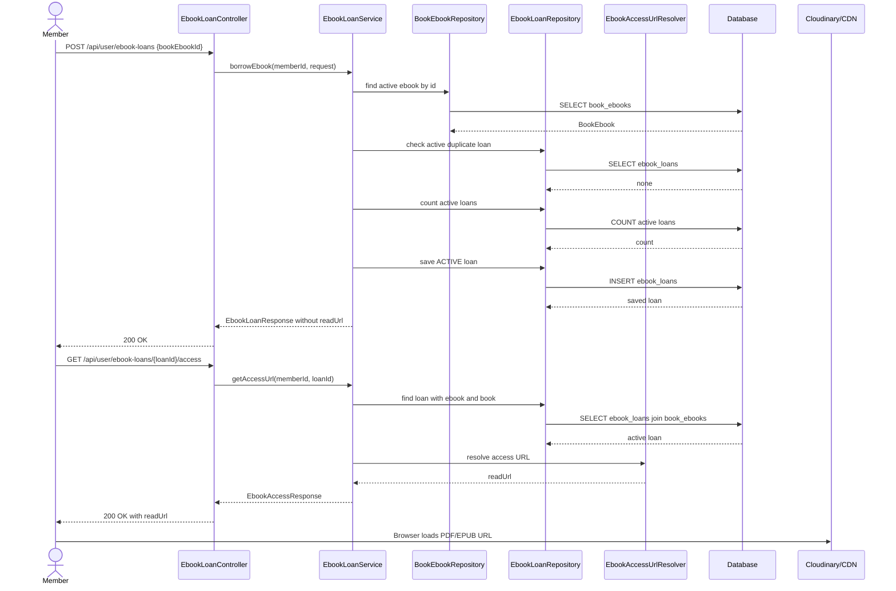

# Ebook Feature Review And Redesign

Tài liệu này review phần code ebook được đề xuất trong PR `Ebooks #1` và đối chiếu với code hiện tại của project `QuanLyThuVien`.

Mục tiêu không phải merge nguyên PR, mà là chốt lại hướng thiết kế đúng hơn trước khi implement:

- Không lưu `ebook_url` trực tiếp trong bảng `books`.
- Tách metadata ebook vào bảng riêng.
- `ebook_loans` phải trỏ tới đúng bản ebook được mượn, không chỉ trỏ tới `book_id`.
- Không expose URL ebook đầy đủ trong public catalog API.
- Tận dụng lại storage abstraction và Cloudinary SDK hiện có.
- Viết Swagger theo pattern `controller/docs/*ApiDocs.java` đang dùng trong project.

## 1. Kết luận nhanh

Không nên merge PR hiện tại theo dạng nguyên trạng.

Các ý tưởng có thể giữ:

- Có API member mượn ebook, trả ebook, gia hạn ebook.
- Có scheduler expire loan quá hạn.
- Có cấu hình `app.ebook.max-concurrent-loans`, `app.ebook.max-renewals`, `app.ebook.expire-cron`.
- Có các error code riêng cho ebook.

Các phần nên bỏ hoặc thiết kế lại:

- Bỏ `books.ebook_url`.
- Bỏ `BookSummaryResponse.ebookUrl` và `BookDetailResponse.ebookUrl`.
- Không để `EbookLoan` trỏ trực tiếp tới `Book` làm nguồn ebook.
- Không trả `ebookReadUrl` trực tiếp trong list/history loan.
- Không dùng migration version `V22`/`V23`, vì project hiện tại đã có tới `V27`.
- Không đưa seed data lớn chung vào migration ebook feature.

Thiết kế nên dùng:

```text
books
book_ebooks
ebook_loans
```

Trong đó:

- `books`: chỉ lưu metadata sách.
- `book_ebooks`: lưu metadata file ebook, ví dụ PDF/EPUB/Gutenberg/Cloudinary.
- `ebook_loans`: lưu lịch sử mượn của member với một ebook cụ thể.

## 2. Vấn đề trong PR hiện tại

### 2.1. Schema đang gắn ebook vào `books`

PR thêm:

```sql
ALTER TABLE books
    ADD COLUMN ebook_url VARCHAR(500) NULL;
```

Cách này chạy demo được, nhưng không tốt khi cần mở rộng:

- Một sách chỉ có một URL ebook.
- Không phân biệt PDF, EPUB, MOBI, preview PDF, audiobook.
- Không lưu được metadata từ Cloudinary như `public_id`, `resource_type`, `version`, `format`, `mime_type`, `size_bytes`.
- Không quản lý được trạng thái file: `ACTIVE`, `DISABLED`, `DELETED`.
- Không quản lý được license theo từng file.
- Không biết loan đang mượn đúng file ebook nào nếu sau này sách có nhiều định dạng.

Trong project hiện tại, `Book` entity cũng chưa có `ebookUrl`, nhưng `BookSummaryResponse` và `BookDetailResponse` đang có `String ebookUrl`. Đây là trạng thái không nhất quán và có thể làm build lỗi vì `BookMapper` hiện không truyền field này vào constructor record.

### 2.2. Public response đang có nguy cơ expose URL ebook

PR thêm `ebookUrl` vào:

```text
BookSummaryResponse
BookDetailResponse
```

Đây là vấn đề bảo mật. Catalog API như `GET /api/books` và `GET /api/books/{id}` là API public. Nếu trả URL PDF đầy đủ ở đây, member chưa mượn vẫn có thể lấy link.

Catalog response chỉ nên trả metadata an toàn:

```json
{
  "id": 1,
  "title": "1984",
  "hasEbook": true,
  "ebookFormats": ["PDF", "EPUB"]
}
```

Không trả:

```json
{
  "ebookUrl": "https://..."
}
```

URL đọc ebook chỉ nên trả ở endpoint kiểm tra quyền, ví dụ:

```http
GET /api/user/ebook-loans/{loanId}/access
```

### 2.3. `ebook_loans` đang trỏ tới `book_id`

PR thiết kế:

```text
ebook_loans.book_id -> books.id
```

Vấn đề là một `book` có thể có nhiều ebook:

```text
Book A
- PDF full
- EPUB full
- PDF preview
- Gutenberg external link
```

Nếu loan chỉ trỏ tới `book_id`, hệ thống không biết member đang mượn bản nào. Thiết kế tốt hơn:

```text
ebook_loans.book_ebook_id -> book_ebooks.id
```

Như vậy loan gắn với đúng file và đúng license tại thời điểm mượn.

### 2.4. Migration version sai

Project hiện tại đã có migration:

```text
V22__normalize_book_isbns.sql
V23__add_book_image_url.sql
V24__create_book_images_table.sql
V25__seed_cloudinary_book_images_from_isbn.sql
V26__make_cloudinary_book_image_urls_versionless.sql
V27__book_cover_upload_lifecycle.sql
```

PR lại thêm:

```text
V22__add_ebook_feature.sql
V23__seed_data.sql
```

Nếu merge vào nhánh hiện tại sẽ bị conflict Flyway version. Migration ebook mới nên bắt đầu từ version kế tiếp:

```text
V28__create_book_ebooks_and_ebook_loans.sql
V29__seed_demo_ebooks.sql
```

Nếu migration `V22`/`V23` của PR đã lỡ chạy trong database local, nên reset database dev hoặc tạo migration sửa chữa ở version mới. Không sửa nội dung migration đã chạy trong môi trường shared.

### 2.5. DTO chưa theo pattern project

Project hiện tại dùng nhiều `record` cho request/response DTO.

PR dùng class Lombok:

```java
@Getter
@Setter
public class BorrowEbookRequest {
    @NotNull
    private Long bookId;
}
```

Nên đổi sang record:

```java
public record BorrowEbookRequest(
        @NotNull(message = "bookEbookId không được để trống")
        Long bookEbookId
) {
}
```

Lý do:

- Request immutable hơn.
- Ngắn hơn.
- Khớp style hiện tại của project.
- Dễ đọc trong Swagger schema.

### 2.6. Paging chưa giới hạn size

PR nhận:

```java
@RequestParam(defaultValue = "10") int size
```

Nhưng không giới hạn max. Nên giới hạn giống các API search khác:

```text
size tối đa 100
```

Hoặc với ebook loan của member, có thể nhỏ hơn:

```text
size tối đa 50
```

### 2.7. Query ACTIVE loan đang sai

Trong PR, `getMyEbookLoans` nói là chỉ lấy ACTIVE, nhưng lại gọi:

```java
findByMemberIdOrderByCreatedAtDesc(memberId, pageable)
```

Query này trả tất cả status. Cần có repository method riêng:

```java
Page<EbookLoan> findByMemberIdAndStatusOrderByCreatedAtDesc(
        Long memberId,
        EbookLoanStatus status,
        Pageable pageable
);
```

### 2.8. Bulk update nên dùng enum param và transaction rõ ràng

PR có JPQL hardcode string:

```java
@Query("UPDATE EbookLoan e SET e.status = 'EXPIRED' WHERE e.status = 'ACTIVE'")
```

Nên đổi thành:

```java
@Modifying
@Query("""
        update EbookLoan loan
        set loan.status = :expiredStatus,
            loan.updatedAt = :now
        where loan.status = :activeStatus
          and loan.expiresAt < :now
        """)
int bulkExpireLoans(
        @Param("activeStatus") EbookLoanStatus activeStatus,
        @Param("expiredStatus") EbookLoanStatus expiredStatus,
        @Param("now") Instant now
);
```

Service gọi method này trong `@Transactional`.

### 2.9. Pageable query không nên dùng `JOIN FETCH` tùy tiện

PR có:

```java
@Query("SELECT e FROM EbookLoan e JOIN FETCH e.member m JOIN FETCH e.book b ...")
Page<EbookLoan> findAllWithFilters(...)
```

`JOIN FETCH` với `Page` dễ gây lỗi count query hoặc pagination sai. Nên dùng một trong hai hướng:

- Dùng `@EntityGraph` cho quan hệ cần load.
- Hoặc viết `value` và `countQuery` riêng.

## 3. Thiết kế schema đề xuất

### 3.1. `book_ebooks`

Bảng này lưu metadata file ebook của sách. File thật có thể nằm trên Cloudinary, Gutenberg hoặc provider khác.

```sql
CREATE TABLE book_ebooks (
    id BIGSERIAL PRIMARY KEY,

    book_id BIGINT NOT NULL,

    provider VARCHAR(50) NOT NULL DEFAULT 'CLOUDINARY',
    source_type VARCHAR(30) NOT NULL DEFAULT 'UPLOADED',
    resource_type VARCHAR(20) NOT NULL DEFAULT 'raw',

    public_id VARCHAR(512),
    secure_url TEXT,
    external_url TEXT,

    format VARCHAR(20) NOT NULL,
    mime_type VARCHAR(100),
    original_filename VARCHAR(255),
    version BIGINT,
    size_bytes BIGINT,
    checksum_sha256 CHAR(64),

    access_level VARCHAR(30) NOT NULL DEFAULT 'PRIVATE_FULL',
    status VARCHAR(30) NOT NULL DEFAULT 'ACTIVE',

    is_primary BOOLEAN NOT NULL DEFAULT FALSE,
    sort_order INT NOT NULL DEFAULT 0,

    loan_duration_days INT NOT NULL DEFAULT 14,
    max_renewals INT NOT NULL DEFAULT 1,

    created_at TIMESTAMP NOT NULL DEFAULT CURRENT_TIMESTAMP,
    updated_at TIMESTAMP NOT NULL DEFAULT CURRENT_TIMESTAMP,
    deleted_at TIMESTAMP NULL,

    CONSTRAINT fk_book_ebooks_book
        FOREIGN KEY (book_id)
        REFERENCES books(id)
        ON DELETE CASCADE,

    CONSTRAINT ck_book_ebooks_provider
        CHECK (provider IN ('CLOUDINARY', 'GUTENBERG', 'EXTERNAL')),

    CONSTRAINT ck_book_ebooks_source_type
        CHECK (source_type IN ('UPLOADED', 'REMOTE_REFERENCE')),

    CONSTRAINT ck_book_ebooks_resource_type
        CHECK (resource_type IN ('raw', 'image', 'video', 'auto')),

    CONSTRAINT ck_book_ebooks_format
        CHECK (format IN ('PDF', 'EPUB')),

    CONSTRAINT ck_book_ebooks_access_level
        CHECK (access_level IN ('PUBLIC_PREVIEW', 'PRIVATE_FULL')),

    CONSTRAINT ck_book_ebooks_status
        CHECK (status IN ('ACTIVE', 'DISABLED', 'DELETED'))
);
```

Index đề xuất:

```sql
CREATE INDEX idx_book_ebooks_book_status
ON book_ebooks(book_id, status);

CREATE INDEX idx_book_ebooks_format_status
ON book_ebooks(format, status);

CREATE UNIQUE INDEX uq_book_ebooks_provider_public_id
ON book_ebooks(provider, public_id)
WHERE public_id IS NOT NULL;

CREATE UNIQUE INDEX uq_book_ebooks_one_primary_format_per_book
ON book_ebooks(book_id, format)
WHERE is_primary = TRUE AND status = 'ACTIVE';
```

Ghi chú:

- `public_id` dùng cho Cloudinary upload.
- `external_url` dùng cho Gutenberg/external reference.
- `secure_url` không nên xem là dữ liệu quyết định quyền đọc. Database quyết định file nào active, loan nào được quyền đọc.
- `loan_duration_days` và `max_renewals` nên lưu snapshot config theo ebook để sau này từng ebook có policy khác nhau.

### 3.2. `ebook_loans`

Bảng này lưu lượt mượn ebook của member.

```sql
CREATE TABLE ebook_loans (
    id BIGSERIAL PRIMARY KEY,

    member_id BIGINT NOT NULL,
    book_ebook_id BIGINT NOT NULL,

    status VARCHAR(20) NOT NULL DEFAULT 'ACTIVE',

    borrowed_at TIMESTAMP NOT NULL,
    expires_at TIMESTAMP NOT NULL,
    returned_at TIMESTAMP NULL,

    renew_count INT NOT NULL DEFAULT 0,
    max_renewals INT NOT NULL DEFAULT 1,

    created_at TIMESTAMP NOT NULL DEFAULT CURRENT_TIMESTAMP,
    updated_at TIMESTAMP NOT NULL DEFAULT CURRENT_TIMESTAMP,

    CONSTRAINT fk_ebook_loans_member
        FOREIGN KEY (member_id)
        REFERENCES members(id),

    CONSTRAINT fk_ebook_loans_book_ebook
        FOREIGN KEY (book_ebook_id)
        REFERENCES book_ebooks(id),

    CONSTRAINT ck_ebook_loans_status
        CHECK (status IN ('ACTIVE', 'EXPIRED', 'RETURNED'))
);
```

Index đề xuất:

```sql
CREATE INDEX idx_ebook_loans_member_status_created
ON ebook_loans(member_id, status, created_at DESC);

CREATE INDEX idx_ebook_loans_ebook_status
ON ebook_loans(book_ebook_id, status);

CREATE INDEX idx_ebook_loans_status_expires
ON ebook_loans(status, expires_at);

CREATE UNIQUE INDEX uq_ebook_loans_active_member_ebook
ON ebook_loans(member_id, book_ebook_id)
WHERE status = 'ACTIVE';
```

Vì `book_ebook_id` đã biết được `book_id`, không cần lưu thêm `book_id` trong `ebook_loans` ở thiết kế ban đầu. Nếu sau này có vấn đề performance thực tế, có thể denormalize thêm `book_id` bằng migration riêng.

## 4. Entity và enum đề xuất

Enum nên rõ nghĩa:

```java
public enum EbookProvider {
    CLOUDINARY,
    GUTENBERG,
    EXTERNAL
}

public enum EbookFormat {
    PDF,
    EPUB
}

public enum EbookAccessLevel {
    PUBLIC_PREVIEW,
    PRIVATE_FULL
}

public enum EbookStatus {
    ACTIVE,
    DISABLED,
    DELETED
}

public enum EbookLoanStatus {
    ACTIVE,
    EXPIRED,
    RETURNED
}
```

Entity chính:

```text
BookEbook
- id
- book
- provider
- sourceType
- resourceType
- publicId
- secureUrl
- externalUrl
- format
- mimeType
- originalFilename
- version
- sizeBytes
- checksumSha256
- accessLevel
- status
- primary
- sortOrder
- loanDurationDays
- maxRenewals
- createdAt
- updatedAt
- deletedAt
```

```text
EbookLoan
- id
- member
- bookEbook
- status
- borrowedAt
- expiresAt
- returnedAt
- renewCount
- maxRenewals
- createdAt
- updatedAt
```

## 5. DTO đề xuất

### 5.1. Catalog response

Không trả URL ebook trong book summary/detail.

Nên thêm metadata an toàn nếu cần:

```java
public record BookEbookAvailabilityResponse(
        Boolean hasEbook,
        List<String> formats
) {
}
```

`BookSummaryResponse`/`BookDetailResponse` có thể thêm:

```java
BookEbookAvailabilityResponse ebookAvailability
```

Hoặc giai đoạn đầu có thể chỉ dùng:

```java
Boolean hasEbook
```

Không dùng:

```java
String ebookUrl
```

### 5.2. Request mượn ebook

Khuyến nghị mượn theo `bookEbookId`, không phải `bookId`.

```java
public record BorrowEbookRequest(
        @NotNull(message = "bookEbookId không được để trống")
        Long bookEbookId
) {
}
```

Nếu frontend chỉ biết `bookId`, có thể tạo API chọn mặc định:

```http
POST /api/books/{bookId}/ebook-loans
```

Nhưng service bên trong vẫn phải resolve ra một `BookEbook` cụ thể.

### 5.3. Response loan

Không trả URL đọc trong list/history.

```java
public record EbookLoanResponse(
        Long loanId,
        Long bookEbookId,
        Long bookId,
        String bookTitle,
        String isbn,
        String format,
        EbookLoanStatus status,
        Instant borrowedAt,
        Instant expiresAt,
        Instant returnedAt,
        Integer renewCount,
        Integer maxRenewals,
        Boolean canRenew
) {
}
```

### 5.4. Response access URL

Tách URL đọc ra endpoint riêng:

```java
public record EbookAccessResponse(
        Long loanId,
        Long bookEbookId,
        String readUrl,
        Instant readUrlExpiresAt,
        String format,
        String mimeType
) {
}
```

Sau này nếu dùng signed URL ngắn hạn, chỉ cần sửa service access URL, không phải sửa loan list response.

### 5.5. Response quản trị ebook

```java
public record BookEbookResponse(
        Long id,
        Long bookId,
        String provider,
        String sourceType,
        String format,
        String mimeType,
        String originalFilename,
        Long sizeBytes,
        String accessLevel,
        String status,
        Boolean primary,
        Integer sortOrder,
        Integer loanDurationDays,
        Integer maxRenewals,
        Instant createdAt,
        Instant updatedAt
) {
}
```

Không expose `publicId` cho public/member API. `publicId` chỉ nên hiện ở API admin nếu thật sự cần debug/quản trị Cloudinary.

## 6. API đề xuất

### 6.1. Public catalog

```http
GET /api/books
GET /api/books/{bookId}
GET /api/books/{bookId}/ebooks
```

`GET /api/books/{bookId}/ebooks` chỉ trả metadata an toàn:

```json
[
  {
    "id": 10,
    "bookId": 1,
    "format": "PDF",
    "accessLevel": "PRIVATE_FULL",
    "borrowable": true
  }
]
```

Không trả `secureUrl`, `externalUrl`, `publicId`.

### 6.2. Member ebook loan

```http
POST /api/user/ebook-loans
GET /api/user/ebook-loans?status=ACTIVE&page=0&size=10
GET /api/user/ebook-loans/{loanId}
GET /api/user/ebook-loans/{loanId}/access
POST /api/user/ebook-loans/{loanId}/renew
POST /api/user/ebook-loans/{loanId}/return
```

`GET /api/user/ebook-loans/{loanId}/access` kiểm tra:

- Loan thuộc member hiện tại.
- Loan đang `ACTIVE`.
- `expiresAt` chưa quá hạn.
- Ebook vẫn `ACTIVE`.

Sau đó mới trả URL đọc.

### 6.3. Staff/Admin ebook management

```http
POST /api/books/{bookId}/ebooks
GET /api/books/{bookId}/ebooks/manage
PATCH /api/books/{bookId}/ebooks/{ebookId}
DELETE /api/books/{bookId}/ebooks/{ebookId}
```

`POST` dùng `multipart/form-data`:

```text
file: book.pdf
format: PDF
accessLevel: PRIVATE_FULL
primary: true
```

Quyền:

```text
ADMIN, LIBRARIAN
```

## 7. Logic hiện có có thể tái sử dụng

### 7.1. `MediaStorageService`

Project đã có abstraction:

```java
MediaStorageService.upload(MediaUploadCommand command)
MediaStorageService.delete(MediaDeleteCommand command)
```

Ebook upload nên dùng lại class này với:

```java
MediaResourceType.RAW
MediaCategory.BOOK_PDF
```

Nếu thêm EPUB thì nên bổ sung:

```java
BOOK_EPUB
```

hoặc đổi `MediaCategory.BOOK_PDF` thành category rộng hơn như:

```java
BOOK_EBOOK
```

Không nên viết service upload Cloudinary riêng chỉ cho ebook nếu `MediaStorageService` đã đủ dùng.

### 7.2. `CloudinaryStorageService`

Service này đã dùng Cloudinary Java SDK và trả metadata chuẩn hóa:

```java
MediaUploadResult(
    publicId,
    secureUrl,
    version,
    format,
    resourceType,
    originalFilename,
    width,
    height,
    duration,
    sizeBytes,
    mimeType
)
```

Ebook service chỉ cần lưu các field liên quan vào `book_ebooks`.

### 7.3. Lifecycle từ `BookImageServiceImpl`

Luồng upload cover hiện tại có thể học lại cho ebook:

```text
Validate book
Validate file
Upload Cloudinary
Save metadata DB
Nếu DB fail thì cố gắng xóa asset vừa upload
```

Với ebook, không cần image transformation, nhưng cần validate file chặt hơn.

### 7.4. `ApiResponse` và `PageMeta`

Controller ebook nên trả response theo style hiện tại:

```java
ResponseEntity<ApiResponse<List<EbookLoanResponse>>>
```

và khi phân trang:

```java
ApiResponse.success(message, result.getContent(), PageMeta.from(result))
```

### 7.5. `AppException` và `ErrorCode`

Giữ pattern exception hiện tại. Nên bổ sung error code:

```text
EBOOK_NOT_FOUND
EBOOK_NOT_AVAILABLE
EBOOK_UNSUPPORTED_FORMAT
EBOOK_FILE_TOO_LARGE
EBOOK_ALREADY_BORROWED
EBOOK_LOAN_LIMIT_EXCEEDED
EBOOK_LOAN_NOT_FOUND
EBOOK_LOAN_NOT_ACTIVE
EBOOK_LOAN_NOT_RENEWABLE
EBOOK_ACCESS_DENIED
```

### 7.6. Swagger docs interface

Project đang dùng pattern:

```text
controller/docs/*ApiDocs.java
Controller implements *ApiDocs
```

Ebook nên có:

```text
EbookLoanApiDocs
BookEbookManagementApiDocs
```

Không nên để Swagger description rải trong controller implementation.

## 8. Service design đề xuất

### 8.1. `BookEbookService`

Dành cho staff/admin quản lý file ebook.

```java
BookEbookResponse uploadEbook(Long bookId, UploadBookEbookRequest request, MultipartFile file);

List<BookEbookResponse> getManageableBookEbooks(Long bookId);

BookEbookResponse updateEbook(Long bookId, Long ebookId, UpdateBookEbookRequest request);

void deleteEbook(Long bookId, Long ebookId);
```

### 8.2. `EbookLoanService`

Dành cho member mượn/đọc/trả/gia hạn.

```java
EbookLoanResponse borrowEbook(Long memberId, BorrowEbookRequest request);

Page<EbookLoanResponse> getMyLoans(Long memberId, EbookLoanStatus status, Pageable pageable);

EbookLoanResponse getMyLoan(Long memberId, Long loanId);

EbookAccessResponse getAccessUrl(Long memberId, Long loanId);

EbookLoanResponse renewEbook(Long memberId, Long loanId);

EbookLoanResponse returnEbook(Long memberId, Long loanId);

int expireOverdueLoans();
```

### 8.3. Access URL resolver

Nên tách riêng logic tạo URL đọc:

```java
public interface EbookAccessUrlResolver {
    EbookProvider supports();

    EbookAccessResponse resolve(EbookLoan loan);
}
```

Ví dụ:

```text
CloudinaryEbookAccessUrlResolver
GutenbergEbookAccessUrlResolver
ExternalEbookAccessUrlResolver
```

Hiện tại có thể trả `secureUrl` cho Cloudinary nếu file public. Nhưng thiết kế interface giúp sau này đổi sang signed URL/private delivery không đụng `EbookLoanService`.

## 9. Validation file ebook

PDF/EPUB không nên dùng validation giống ảnh bìa.

Đề xuất:

```text
PDF:
- MIME: application/pdf
- extension: .pdf
- max size: 50MB hoặc cấu hình app.ebook.max-file-size

EPUB:
- MIME: application/epub+zip
- extension: .epub
- max size: 100MB hoặc cấu hình riêng
```

Config:

```properties
app.ebook.max-file-size=52428800
app.ebook.allowed-mime-types=application/pdf,application/epub+zip
app.ebook.loan-days=14
app.ebook.max-concurrent-loans=3
app.ebook.max-renewals=1
app.ebook.expire-cron=0 0 * * * *
```

Nếu dùng Cloudinary upload lớn hơn limit của SDK method thường, cần xem xét upload large/chunked flow sau. Giai đoạn đầu nên giới hạn file size rõ ràng.

## 10. Swagger cần viết

### 10.1. Member API docs

Tạo:

```text
src/main/java/com/vn/controller/docs/EbookLoanApiDocs.java
```

Nội dung cần có:

- `@Tag(name = "Ebook Loans", description = "...")`
- `@SecurityRequirement(name = "Bearer Authentication")`
- Mô tả rõ `access` endpoint mới là nơi trả URL đọc.
- Mô tả list/history không trả `readUrl`.
- Mô tả pagination `size` có max.

### 10.2. Admin/Staff API docs

Tạo:

```text
src/main/java/com/vn/controller/docs/BookEbookApiDocs.java
```

Nội dung cần có:

- Upload PDF/EPUB.
- Update metadata.
- Soft delete ebook.
- Supported MIME/size.
- Quyền `ADMIN`, `LIBRARIAN`.

## 11. Migration plan

### Nếu PR chưa từng chạy migration trên database

Không dùng `V22`/`V23` của PR. Tạo migration mới:

```text
V28__create_book_ebooks_and_ebook_loans.sql
V29__seed_demo_ebooks.sql
```

Không thêm `ebook_url` vào `books`.

### Nếu PR đã lỡ chạy trên database local

Vì đây là môi trường dev, có thể reset database/docker volume nếu không cần giữ data.

Nếu không muốn reset, tạo migration sửa ở version mới:

```sql
ALTER TABLE books DROP COLUMN IF EXISTS ebook_url;
DROP TABLE IF EXISTS ebook_loans;
```

Sau đó tạo lại bảng chuẩn. Chỉ làm cách này nếu chắc chắn bảng PR chưa có dữ liệu cần giữ.

### Nếu môi trường shared/production đã chạy migration sai

Không sửa file migration cũ. Tạo migration corrective version mới:

```text
V28__migrate_ebook_url_to_book_ebooks.sql
V29__recreate_ebook_loans_reference.sql
```

Luồng migrate:

```text
books.ebook_url
-> insert vào book_ebooks.external_url hoặc secure_url
-> ebook_loans.book_id resolve sang book_ebooks.id
-> sau khi verify mới drop books.ebook_url
```

## 12. Thứ tự implement đề xuất

1. Sửa trạng thái code hiện tại cho compile ổn:
   - Bỏ `ebookUrl` khỏi `BookSummaryResponse`.
   - Bỏ `ebookUrl` khỏi `BookDetailResponse`.
   - Không thêm `Book.ebookUrl`.

2. Tạo migration `V28`:
   - `book_ebooks`.
   - `ebook_loans` trỏ tới `book_ebooks`.
   - Index và constraint cần thiết.

3. Tạo entity/enum/repository:
   - `BookEbook`.
   - `EbookLoan`.
   - `EbookProvider`, `EbookFormat`, `EbookAccessLevel`, `EbookStatus`, `EbookLoanStatus`.
   - `BookEbookRepository`.
   - `EbookLoanRepository`.

4. Tạo staff/admin upload ebook:
   - Dùng `MediaStorageService`.
   - Validate PDF/EPUB.
   - Lưu metadata vào `book_ebooks`.

5. Tạo member loan API:
   - Borrow bằng `bookEbookId`.
   - List ACTIVE/history có phân trang.
   - Renew/return.
   - Access URL endpoint riêng.

6. Tạo scheduler expire:
   - Bulk update ACTIVE quá hạn sang EXPIRED.
   - Dùng enum params, không hardcode string trong JPQL.

7. Viết Swagger docs:
   - `EbookLoanApiDocs`.
   - `BookEbookApiDocs`.

8. Viết test:
   - Borrow success.
   - Borrow duplicate active bị conflict.
   - Borrow quá max concurrent bị conflict.
   - Loan expired không trả access URL.
   - Return/renew ownership check.
   - Pageable size bị clamp/validate.
   - Repository active filter đúng.

## 13. Response flow mong muốn

### Catalog API

```http
GET /api/books
```

Trả metadata an toàn:

```json
{
  "id": 1,
  "title": "1984",
  "isbn": "9786049345678",
  "coverImage": {
    "thumbnailUrl": "https://res.cloudinary.com/..."
  },
  "ebookAvailability": {
    "hasEbook": true,
    "formats": ["PDF"]
  }
}
```

### Borrow API

```http
POST /api/user/ebook-loans
```

Request:

```json
{
  "bookEbookId": 10
}
```

Response:

```json
{
  "loanId": 99,
  "bookEbookId": 10,
  "bookId": 1,
  "bookTitle": "1984",
  "isbn": "9786049345678",
  "format": "PDF",
  "status": "ACTIVE",
  "borrowedAt": "2026-06-11T10:00:00Z",
  "expiresAt": "2026-06-25T10:00:00Z",
  "renewCount": 0,
  "maxRenewals": 1,
  "canRenew": true
}
```

### Access API

```http
GET /api/user/ebook-loans/99/access
```

Response:

```json
{
  "loanId": 99,
  "bookEbookId": 10,
  "readUrl": "https://...",
  "readUrlExpiresAt": "2026-06-11T10:15:00Z",
  "format": "PDF",
  "mimeType": "application/pdf"
}
```

## 14. Mermaid flow



## 15. Checklist trước khi merge ebook feature

- [ ] Không còn `ebookUrl` trong `Book`, `BookSummaryResponse`, `BookDetailResponse`.
- [ ] Có bảng `book_ebooks`.
- [ ] `ebook_loans` trỏ tới `book_ebooks.id`.
- [ ] Không public API nào trả full ebook URL.
- [ ] URL đọc chỉ trả qua endpoint access có kiểm tra quyền.
- [ ] Migration version bắt đầu từ version mới sau `V27`.
- [ ] DTO request/response dùng `record` nếu không cần mutable class.
- [ ] Paging có max size.
- [ ] Query ACTIVE loan thật sự filter `status = ACTIVE`.
- [ ] Bulk expire dùng transaction và enum params.
- [ ] Swagger tách ra `EbookLoanApiDocs` và `BookEbookApiDocs`.
- [ ] Upload ebook tái sử dụng `MediaStorageService`.
- [ ] Test service/repository/controller chính đã có.
