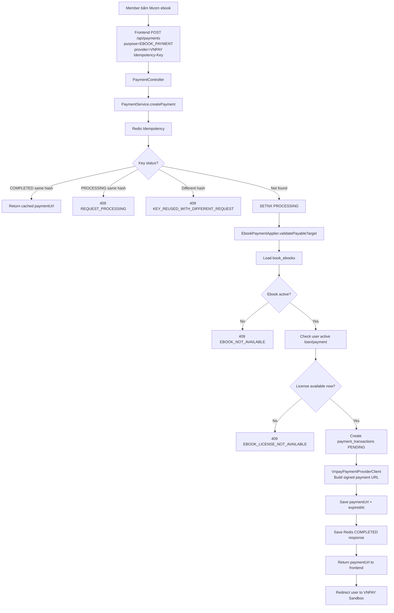
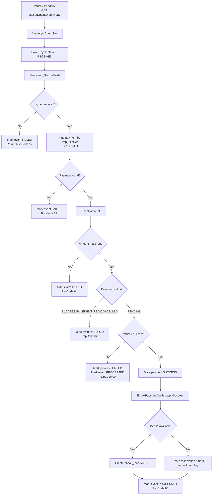
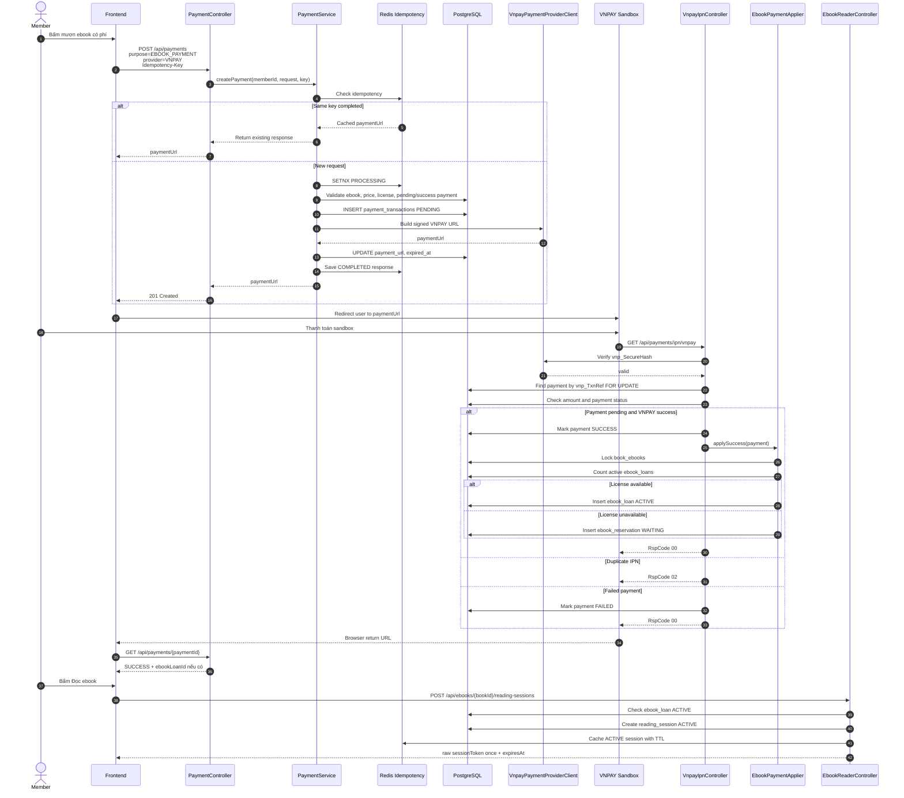

# Thiết kế luồng thanh toán VNPAY và bảo đảm license cho Ebook

## 1. Mục tiêu

Tài liệu này mô tả luồng **thanh toán ebook bằng VNPAY Sandbox** và cách hệ thống bảo đảm rằng **ebook license không bị cấp trùng, không bị double payment, không bị double release** trong hệ thống thư viện online.

Tài liệu chỉ tập trung vào nghiệp vụ:

```text
User chọn ebook
↓
User thanh toán bằng VNPAY
↓
VNPAY IPN xác nhận thanh toán
↓
Backend cấp quyền mượn ebook
↓
Backend giữ/release license an toàn
↓
User mở reader để đọc ebook online
```

Không tập trung vào các luồng khác như tiền phạt, membership, MoMo, hoặc cash payment.

---

## 2. Nguyên tắc thiết kế chính

### 2.1. Không cho frontend quyết định tiền và quyền đọc

Frontend chỉ gửi:

```json
{
  "purpose": "EBOOK_PAYMENT",
  "targetType": "BOOK_EBOOK",
  "targetId": 1001,
  "provider": "VNPAY"
}
```

Frontend **không được gửi amount**.

Backend tự tính amount từ dữ liệu ebook trong database:

```text
book_ebooks.borrow_price
book_ebooks.loan_duration_days
book_ebooks.max_concurrent_loans
```

Lý do:

```text
Nếu frontend gửi amount, user có thể sửa request thành 1 VND.
Backend phải là nơi quyết định giá thật.
```

---

### 2.2. VNPAY IPN là nguồn xác nhận chính

Trong VNPAY có 2 callback quan trọng:

```text
GET /api/payments/ipn/vnpay
GET /api/payments/return/vnpay
```

Trong đó:

```text
IPN URL = server-to-server callback từ VNPAY về backend.
Return URL = browser redirect user về sau khi thanh toán.
```

Quy tắc bắt buộc:

```text
Chỉ IPN mới được update payment_transactions và cấp quyền ebook.
Return URL chỉ dùng để redirect/hiển thị kết quả cho user.
```

Không được làm:

```text
User quay về Return URL
↓
Backend thấy vnp_ResponseCode = 00
↓
Update SUCCESS và cấp ebook loan
```

Vì Return URL đi qua browser, không nên dùng làm nguồn cập nhật nghiệp vụ chính.

---

### 2.3. Redis xử lý dữ liệu ngắn hạn, PostgreSQL mới là source of truth

Redis dùng để xử lý:

```text
User double click nút thanh toán
Frontend retry request
Mạng lag gửi lại cùng request
Cache reading_session ACTIVE đang sống ngắn hạn
TTL cho session token đọc ebook
```

PostgreSQL dùng để lưu dữ liệu thật:

```text
payment_transactions
payment_events
ebook_loans
ebook_reservations
ebook_reading_sessions
```

Nguyên tắc:

```text
Redis = xử lý nhanh dữ liệu tạm thời.
PostgreSQL = bảo đảm dữ liệu đúng, audit được, recover được.
Redis không được là nguồn dữ liệu duy nhất cho quyền đọc ebook.
```

Riêng `ebook_reading_sessions` nên dùng mô hình hybrid:

```text
PostgreSQL = source of truth cho reading session.
Redis = active cache cho session đang đọc, TTL ngắn.
```

Không lưu `ebook_reading_sessions` Redis-only vì reading session là "vé đọc ebook tạm thời", liên quan trực tiếp tới quyền cấp signed URL, revoke khi loan hết hạn, audit và điều tra abuse.

---

### 2.4. Cấp license phải idempotent

Một payment thành công chỉ được cấp ebook loan **một lần duy nhất**.

Webhook/IPN có thể gọi lại nhiều lần, nên logic phải đảm bảo:

```text
IPN lần 1 → payment SUCCESS → tạo ebook_loan ACTIVE
IPN lần 2 → payment đã SUCCESS → bỏ qua, không tạo loan lần nữa
```

---

## 3. Mô hình dữ liệu cần có

## 3.1. Bảng `book_ebooks`

Bảng này lưu metadata ebook và chính sách mượn.

```sql
CREATE TABLE book_ebooks (
    id BIGSERIAL PRIMARY KEY,
    book_id BIGINT NOT NULL,

    provider VARCHAR(50) NOT NULL,
    public_id VARCHAR(500) NOT NULL,
    resource_type VARCHAR(30) NOT NULL,
    delivery_type VARCHAR(30) NOT NULL,

    format VARCHAR(30),
    size_bytes BIGINT,
    checksum VARCHAR(128),

    status VARCHAR(30) NOT NULL,

    borrow_price BIGINT NOT NULL DEFAULT 0,
    max_concurrent_loans INT NOT NULL DEFAULT 5,
    loan_duration_days INT NOT NULL DEFAULT 14,

    created_at TIMESTAMP NOT NULL DEFAULT NOW(),
    updated_at TIMESTAMP NOT NULL DEFAULT NOW(),

    version BIGINT NOT NULL DEFAULT 0,

    CONSTRAINT chk_book_ebook_status
        CHECK (status IN ('ACTIVE', 'INACTIVE', 'DELETED')),

    CONSTRAINT chk_book_ebook_price
        CHECK (borrow_price >= 0),

    CONSTRAINT chk_book_ebook_license
        CHECK (max_concurrent_loans > 0),

    CONSTRAINT chk_book_ebook_loan_duration
        CHECK (loan_duration_days > 0)
);
```

Ý nghĩa:

| Field | Ý nghĩa |
|---|---|
| `public_id` | ID file PDF private/authenticated trên Cloudinary |
| `borrow_price` | Phí user phải trả để mượn ebook |
| `max_concurrent_loans` | Số license đọc đồng thời |
| `loan_duration_days` | Thời hạn mượn, ví dụ 14 ngày |
| `version` | Dùng cho optimistic locking nếu cần |

---

## 3.2. Bảng `payment_transactions`

Dùng để lưu giao dịch VNPAY.

```sql
CREATE TABLE payment_transactions (
    id BIGSERIAL PRIMARY KEY,

    payment_code VARCHAR(100) NOT NULL UNIQUE,
    member_id BIGINT NOT NULL,

    provider VARCHAR(30) NOT NULL,
    provider_order_id VARCHAR(255),
    provider_transaction_id VARCHAR(255),

    purpose VARCHAR(50) NOT NULL,
    target_type VARCHAR(50) NOT NULL,
    target_id BIGINT NOT NULL,

    amount BIGINT NOT NULL,
    currency VARCHAR(10) NOT NULL DEFAULT 'VND',

    status VARCHAR(30) NOT NULL,
    payment_url TEXT,

    idempotency_key VARCHAR(255),

    paid_at TIMESTAMP,
    cancelled_at TIMESTAMP,
    expired_at TIMESTAMP,

    failure_code VARCHAR(100),
    failure_message TEXT,

    provider_bank_code VARCHAR(50),
    provider_bank_tran_no VARCHAR(255),
    provider_card_type VARCHAR(50),
    provider_response_code VARCHAR(20),
    provider_transaction_status VARCHAR(20),
    provider_pay_date TIMESTAMP,

    created_at TIMESTAMP NOT NULL DEFAULT NOW(),
    updated_at TIMESTAMP NOT NULL DEFAULT NOW(),

    version BIGINT NOT NULL DEFAULT 0,

    CONSTRAINT chk_payment_provider
        CHECK (provider IN ('VNPAY')),

    CONSTRAINT chk_payment_status
        CHECK (status IN ('PENDING', 'SUCCESS', 'FAILED', 'EXPIRED', 'CANCELLED')),

    CONSTRAINT chk_payment_purpose
        CHECK (purpose IN ('EBOOK_PAYMENT')),

    CONSTRAINT chk_payment_target_type
        CHECK (target_type IN ('BOOK_EBOOK')),

    CONSTRAINT chk_payment_amount_positive
        CHECK (amount > 0)
);
```

Index đề xuất:

```sql
CREATE INDEX idx_payment_member_id
ON payment_transactions(member_id);

CREATE INDEX idx_payment_status
ON payment_transactions(status);

CREATE INDEX idx_payment_target
ON payment_transactions(target_type, target_id);

CREATE INDEX idx_payment_provider_transaction_id
ON payment_transactions(provider_transaction_id);

CREATE INDEX idx_payment_created_at
ON payment_transactions(created_at);
```

Chống duplicate payment:

```sql
CREATE UNIQUE INDEX ux_payment_pending_ebook_target
ON payment_transactions(member_id, purpose, target_type, target_id)
WHERE status = 'PENDING';

CREATE UNIQUE INDEX ux_payment_success_ebook_target
ON payment_transactions(member_id, purpose, target_type, target_id)
WHERE status = 'SUCCESS';
```

Ý nghĩa:

```text
Một user không được có 2 payment PENDING cho cùng một ebook.
Một user không được có 2 payment SUCCESS cho cùng một ebook.
```

---

## 3.3. Bảng `payment_events`

Lưu toàn bộ IPN/Return payload từ VNPAY để debug.

```sql
CREATE TABLE payment_events (
    id BIGSERIAL PRIMARY KEY,

    payment_transaction_id BIGINT,
    provider VARCHAR(30) NOT NULL,
    event_type VARCHAR(100),

    provider_order_id VARCHAR(255),
    provider_transaction_id VARCHAR(255),

    raw_payload JSONB NOT NULL,
    raw_headers JSONB,

    signature_valid BOOLEAN NOT NULL DEFAULT FALSE,
    processing_status VARCHAR(30) NOT NULL,
    error_message TEXT,

    received_at TIMESTAMP NOT NULL DEFAULT NOW(),
    processed_at TIMESTAMP,

    CONSTRAINT fk_payment_event_transaction
        FOREIGN KEY (payment_transaction_id)
        REFERENCES payment_transactions(id),

    CONSTRAINT chk_payment_event_provider
        CHECK (provider IN ('VNPAY')),

    CONSTRAINT chk_payment_event_status
        CHECK (processing_status IN ('RECEIVED', 'PROCESSED', 'FAILED', 'IGNORED'))
);
```

Index:

```sql
CREATE INDEX idx_payment_events_transaction_id
ON payment_events(payment_transaction_id);

CREATE INDEX idx_payment_events_provider_order_id
ON payment_events(provider_order_id);

CREATE INDEX idx_payment_events_provider_transaction_id
ON payment_events(provider_transaction_id);

CREATE INDEX idx_payment_events_received_at
ON payment_events(received_at);
```

---

## 3.4. Bảng `ebook_loans`

Bảng này lưu quyền mượn ebook sau khi thanh toán thành công.

```sql
CREATE TABLE ebook_loans (
    id BIGSERIAL PRIMARY KEY,

    member_id BIGINT NOT NULL,
    book_id BIGINT NOT NULL,
    book_ebook_id BIGINT NOT NULL,
    payment_id BIGINT,

    status VARCHAR(30) NOT NULL,

    borrowed_at TIMESTAMP NOT NULL,
    expired_at TIMESTAMP NOT NULL,
    returned_at TIMESTAMP,
    revoked_at TIMESTAMP,

    created_at TIMESTAMP NOT NULL DEFAULT NOW(),
    updated_at TIMESTAMP NOT NULL DEFAULT NOW(),

    version BIGINT NOT NULL DEFAULT 0,

    CONSTRAINT fk_ebook_loan_payment
        FOREIGN KEY (payment_id)
        REFERENCES payment_transactions(id),

    CONSTRAINT chk_ebook_loan_status
        CHECK (status IN ('ACTIVE', 'EXPIRED', 'RETURNED', 'REVOKED'))
);
```

Index:

```sql
CREATE INDEX idx_ebook_loans_ebook_status_expired
ON ebook_loans(book_ebook_id, status, expired_at);

CREATE INDEX idx_ebook_loans_member_ebook_status
ON ebook_loans(member_id, book_ebook_id, status);

CREATE INDEX idx_ebook_loans_payment_id
ON ebook_loans(payment_id);
```

Chống tạo loan trùng từ cùng payment:

```sql
CREATE UNIQUE INDEX ux_ebook_loan_payment
ON ebook_loans(payment_id)
WHERE payment_id IS NOT NULL;
```

Chống user mượn trùng cùng ebook khi đang còn ACTIVE:

```sql
CREATE UNIQUE INDEX ux_member_active_ebook_loan
ON ebook_loans(member_id, book_ebook_id)
WHERE status = 'ACTIVE';
```

---

## 3.5. Bảng `ebook_reservations`

Nếu payment thành công nhưng license đã hết tại thời điểm apply business, có 2 cách xử lý:

```text
Cách A: Không cho thanh toán nếu hết license.
Cách B: Cho thanh toán rồi đưa user vào hàng chờ.
```

Với MVP dễ vận hành, nên chọn **Cách A**:

```text
Chỉ cho tạo payment khi tại thời điểm tạo payment còn license.
Tuy nhiên khi IPN về, vẫn phải check lại license lần nữa.
Nếu license bị chiếm mất trong thời gian user thanh toán, có thể tạo reservation READY/WAITING hoặc đánh dấu cần xử lý thủ công.
```

Bảng reservation nếu muốn hỗ trợ hàng chờ:

```sql
CREATE TABLE ebook_reservations (
    id BIGSERIAL PRIMARY KEY,

    member_id BIGINT NOT NULL,
    book_ebook_id BIGINT NOT NULL,
    payment_id BIGINT,

    status VARCHAR(30) NOT NULL,
    queue_position INT,

    reserved_at TIMESTAMP NOT NULL DEFAULT NOW(),
    ready_at TIMESTAMP,
    fulfilled_at TIMESTAMP,
    expired_at TIMESTAMP,
    cancelled_at TIMESTAMP,

    created_at TIMESTAMP NOT NULL DEFAULT NOW(),
    updated_at TIMESTAMP NOT NULL DEFAULT NOW(),

    CONSTRAINT chk_ebook_reservation_status
        CHECK (status IN ('WAITING', 'READY', 'FULFILLED', 'CANCELLED', 'EXPIRED'))
);
```

---

## 3.6. Bảng `ebook_reading_sessions`

Sau khi user đã có `ebook_loan ACTIVE`, user mới được mở reader.

Reading session ở đây không phải session đăng nhập HTTP thông thường.
Nó là **vé đọc ebook tạm thời** dùng để kiểm soát quyền cấp signed URL.

Vì vậy cần lưu database để biết:

```text
Session thuộc member nào?
Đọc ebook nào?
Gắn với loan nào?
Còn ACTIVE không?
Đã CLOSED / EXPIRED / REVOKED chưa?
Loan hết hạn thì revoke session nào?
Có dấu hiệu abuse theo IP / user-agent không?
```

Raw token chỉ trả về cho frontend một lần.
Database chỉ lưu `session_token_hash`, không lưu raw token.

Gợi ý tạo hash:

```text
rawToken = random 256-bit token
session_token_hash = HMAC-SHA256(rawToken, READING_SESSION_SECRET)
```

```sql
CREATE TABLE ebook_reading_sessions (
    id BIGSERIAL PRIMARY KEY,

    session_token_hash VARCHAR(255) NOT NULL UNIQUE,

    member_id BIGINT NOT NULL,
    book_id BIGINT NOT NULL,
    book_ebook_id BIGINT NOT NULL,
    loan_id BIGINT NOT NULL,

    status VARCHAR(30) NOT NULL,
    session_expires_at TIMESTAMP NOT NULL,
    last_heartbeat_at TIMESTAMP,

    closed_at TIMESTAMP,
    expired_at TIMESTAMP,
    revoked_at TIMESTAMP,
    revoke_reason VARCHAR(100),

    ip_address VARCHAR(100),
    user_agent_hash VARCHAR(128),

    version BIGINT NOT NULL DEFAULT 0,

    created_at TIMESTAMP NOT NULL DEFAULT NOW(),
    updated_at TIMESTAMP NOT NULL DEFAULT NOW(),

    CONSTRAINT chk_ebook_reading_session_status
        CHECK (status IN ('ACTIVE', 'EXPIRED', 'CLOSED', 'REVOKED'))
);
```

Index cơ bản:

```sql
CREATE INDEX idx_reading_sessions_status_expires
ON ebook_reading_sessions(status, session_expires_at);

CREATE INDEX idx_reading_sessions_member_status
ON ebook_reading_sessions(member_id, status);

CREATE INDEX idx_reading_sessions_loan_status
ON ebook_reading_sessions(loan_id, status);
```

Index production đề xuất cho workload đọc thường chỉ quan tâm session `ACTIVE`:

```sql
CREATE INDEX idx_reading_sessions_active_expires
ON ebook_reading_sessions(session_expires_at)
WHERE status = 'ACTIVE';

CREATE INDEX idx_reading_sessions_active_member
ON ebook_reading_sessions(member_id, session_expires_at)
WHERE status = 'ACTIVE';

CREATE INDEX idx_reading_sessions_active_loan
ON ebook_reading_sessions(loan_id, session_expires_at)
WHERE status = 'ACTIVE';
```

Mục tiêu của partial index:

```text
Bảng có thể giữ nhiều session cũ.
Nhưng query runtime chủ yếu tìm session ACTIVE.
Index chỉ chứa ACTIVE sẽ nhỏ hơn và nhanh hơn.
```

Redis active cache cho reading session:

```text
Key:
reading_session:{sessionTokenHash}

Value tối thiểu:
sessionId
memberId
bookId
bookEbookId
loanId
sessionExpiresAt
loanExpiresAt
status=ACTIVE

TTL:
min(session_expires_at - now, loan.expired_at - now)
```

Luật dùng Redis:

```text
Tạo session:
- Insert PostgreSQL trước.
- Set Redis key TTL 15 phút sau.

Check session:
- Check Redis trước.
- Nếu Redis hit thì check tiếp JWT + loan.
- Nếu Redis miss thì fallback PostgreSQL.
- Nếu PostgreSQL còn ACTIVE và chưa hết hạn thì nạp lại Redis.
- Nếu PostgreSQL CLOSED / EXPIRED / REVOKED thì từ chối.

Close / revoke:
- Update PostgreSQL trước.
- Delete Redis key sau.
```

Heartbeat không nên update database quá dày:

```text
Frontend có thể refresh mỗi 3 phút.
Redis được EXPIRE lại mỗi lần refresh.
PostgreSQL chỉ update last_heartbeat_at nếu lần update gần nhất đã quá 5-10 phút.
```

Retention để tránh bảng phình vô hạn:

```text
ACTIVE:
- Giữ trong bảng chính.

CLOSED / EXPIRED / REVOKED dưới 30-90 ngày:
- Giữ để audit, debug, support.

CLOSED / EXPIRED / REVOKED quá retention:
- Xóa batch nhỏ hoặc archive.
- Nếu traffic lớn thì partition theo created_at từng tháng và drop/detach partition cũ.
```

Lưu ý khi partition:

```text
Nếu partition theo created_at, không nên áp dụng máy móc UNIQUE(session_token_hash)
trên parent table nếu database không hỗ trợ global unique index.

Với MVP:
- Giữ bảng thường + partial index + cleanup job là đủ.

Khi scale lớn:
- Chuyển sang partition theo tháng.
- Token vẫn phải đủ entropy để collision gần như không xảy ra.
- Có thể enforce unique trong từng partition hoặc lưu token hash registry riêng nếu cần unique toàn cục tuyệt đối.
```

---

# 4. Enum đề xuất

## 4.1. PaymentProvider

```java
public enum PaymentProvider {
    VNPAY
}
```

## 4.2. PaymentPurpose

```java
public enum PaymentPurpose {
    EBOOK_PAYMENT
}
```

## 4.3. PaymentTargetType

```java
public enum PaymentTargetType {
    BOOK_EBOOK
}
```

## 4.4. PaymentStatus

```java
public enum PaymentStatus {
    PENDING,
    SUCCESS,
    FAILED,
    EXPIRED,
    CANCELLED
}
```

## 4.5. EbookLoanStatus

```java
public enum EbookLoanStatus {
    ACTIVE,
    EXPIRED,
    RETURNED,
    REVOKED
}
```

## 4.6. EbookReadingSessionStatus

```java
public enum EbookReadingSessionStatus {
    ACTIVE,
    EXPIRED,
    CLOSED,
    REVOKED
}
```

---

# 5. API contract

## 5.1. Tạo payment VNPAY cho ebook

```http
POST /api/payments
Authorization: Bearer <access_token>
Idempotency-Key: <uuid>
Content-Type: application/json
```

Request:

```json
{
  "purpose": "EBOOK_PAYMENT",
  "targetType": "BOOK_EBOOK",
  "targetId": 1001,
  "provider": "VNPAY",
  "bankCode": "VNBANK",
  "locale": "vn"
}
```

Response `201 Created`:

```json
{
  "paymentId": 9001,
  "paymentCode": "PAY202606120001",
  "provider": "VNPAY",
  "purpose": "EBOOK_PAYMENT",
  "targetType": "BOOK_EBOOK",
  "targetId": 1001,
  "status": "PENDING",
  "amount": 25000,
  "currency": "VND",
  "paymentUrl": "https://sandbox.vnpayment.vn/paymentv2/vpcpay.html?...",
  "expiredAt": "2026-06-12T10:15:00"
}
```

Lỗi quan trọng:

| Case | HTTP | Error code |
|---|---:|---|
| Thiếu Idempotency-Key | 400 | `MISSING_IDEMPOTENCY_KEY` |
| Dùng lại key với body khác | 409 | `IDEMPOTENCY_KEY_REUSED_WITH_DIFFERENT_REQUEST` |
| Request cùng key đang xử lý | 409 | `IDEMPOTENCY_REQUEST_PROCESSING` |
| Ebook không tồn tại | 404 | `EBOOK_NOT_FOUND` |
| Ebook không active | 409 | `EBOOK_NOT_AVAILABLE` |
| Giá ebook bằng 0 | 409 | `EBOOK_DOES_NOT_REQUIRE_PAYMENT` |
| User đã có loan active | 409 | `EBOOK_ALREADY_BORROWED` |
| Đã có payment pending | 409 | `PAYMENT_ALREADY_PENDING` |
| Đã thanh toán thành công | 409 | `PAYMENT_ALREADY_SUCCESS` |
| Hết license tại thời điểm tạo payment | 409 | `EBOOK_LICENSE_NOT_AVAILABLE` |
| Provider lỗi | 502 | `PAYMENT_PROVIDER_ERROR` |

---

## 5.2. VNPAY IPN

```http
GET /api/payments/ipn/vnpay
```

VNPAY gọi server-to-server về backend.

Backend phải:

```text
1. Nhận query params.
2. Verify vnp_SecureHash.
3. Lưu payment_events.
4. Tìm payment bằng vnp_TxnRef = payment_code.
5. Check amount.
6. Lock payment row.
7. Nếu payment PENDING và VNPAY success → mark SUCCESS.
8. Gọi EbookPaymentApplier.applySuccess(payment).
9. Trả RspCode cho VNPAY.
```

Response:

```json
{
  "RspCode": "00",
  "Message": "Confirm Success"
}
```

Mapping response:

| Case | RspCode | Message |
|---|---|---|
| Cập nhật thành công | `00` | `Confirm Success` |
| Payment đã xử lý trước đó | `02` | `Order already confirmed` |
| Không tìm thấy payment | `01` | `Order not found` |
| Sai amount | `04` | `Invalid amount` |
| Sai checksum | `97` | `Invalid signature` |
| Lỗi không xác định | `99` | `Unknown error` |

---

## 5.3. VNPAY Return URL

```http
GET /api/payments/return/vnpay
```

Return URL chỉ làm:

```text
1. Verify checksum nếu muốn.
2. Không update payment_transactions.
3. Redirect về frontend result page.
```

Ví dụ redirect:

```http
302 Found
Location: https://frontend.example.com/payment/result?paymentCode=PAY202606120001&provider=VNPAY
```

Frontend sau đó gọi:

```http
GET /api/payments/{paymentId}
```

hoặc:

```http
GET /api/payments/by-code/{paymentCode}
```

để lấy trạng thái thật từ backend.

---

## 5.4. Xem chi tiết payment

```http
GET /api/payments/{paymentId}
Authorization: Bearer <access_token>
```

Member chỉ được xem payment của chính mình.

Response:

```json
{
  "paymentId": 9001,
  "paymentCode": "PAY202606120001",
  "status": "SUCCESS",
  "provider": "VNPAY",
  "purpose": "EBOOK_PAYMENT",
  "targetType": "BOOK_EBOOK",
  "targetId": 1001,
  "amount": 25000,
  "currency": "VND",
  "paidAt": "2026-06-12T10:03:00",
  "ebookLoanId": 7001
}
```

---

## 5.5. Tạo reading session sau khi đã thanh toán và có loan

```http
POST /api/ebooks/{bookId}/reading-sessions
Authorization: Bearer <access_token>
```

Backend check:

```text
User có ebook_loan ACTIVE không?
Loan còn hạn không?
Book ebook có ACTIVE không?
```

Response:

```json
{
  "sessionId": 501,
  "sessionToken": "raw-token-only-return-once",
  "bookId": 123,
  "bookEbookId": 1001,
  "loanId": 7001,
  "loanExpiresAt": "2026-06-26T10:03:00",
  "sessionExpiresAt": "2026-06-12T10:18:00",
  "serverNow": "2026-06-12T10:03:00",
  "watermark": {
    "displayText": "Member: M00021 | Loan: L7001 | Session: RS501",
    "opacity": 0.1,
    "rotation": -25
  }
}
```

Ghi chú:

```text
Raw sessionToken chỉ trả về một lần ở response tạo session.
Backend chỉ lưu session_token_hash.
Các request đọc PDF sau đó gửi token qua header X-Reading-Session, không đưa token lên query string.
```

---

# 6. Redis idempotency cho tạo payment

## 6.1. Redis key

```text
idem:payment:ebook:vnpay:{memberId}:{idempotencyKey}
```

Ví dụ:

```text
idem:payment:ebook:vnpay:21:550e8400-e29b-41d4-a716-446655440000
```

## 6.2. PROCESSING value

```json
{
  "status": "PROCESSING",
  "requestHash": "sha256(method|path|canonicalBody)",
  "createdAt": "2026-06-12T10:00:00Z"
}
```

## 6.3. COMPLETED value

```json
{
  "status": "COMPLETED",
  "requestHash": "sha256(method|path|canonicalBody)",
  "response": {
    "paymentId": 9001,
    "paymentCode": "PAY202606120001",
    "status": "PENDING",
    "provider": "VNPAY",
    "amount": 25000,
    "currency": "VND",
    "paymentUrl": "https://sandbox.vnpayment.vn/..."
  },
  "createdAt": "2026-06-12T10:00:00Z"
}
```

## 6.4. TTL đề xuất

```text
PROCESSING: 10 phút
COMPLETED: 24 giờ
FAILED: 10 phút
```

MVP có thể đơn giản hóa:

```text
Tất cả key TTL = 24 giờ
```

---

# 7. Flow tạo payment VNPAY cho ebook



---

# 8. Validate target và tính amount

`EbookPaymentApplier.validatePayableTarget(...)` chịu trách nhiệm kiểm tra ebook có thể thanh toán không.

Pseudo logic:

```java
public PayableTarget validatePayableTarget(
        Long memberId,
        PaymentTargetType targetType,
        Long targetId
) {
    if (targetType != PaymentTargetType.BOOK_EBOOK) {
        throw new BusinessException("INVALID_TARGET_TYPE");
    }

    BookEbook ebook = bookEbookRepository.findById(targetId)
            .orElseThrow(() -> new BusinessException("EBOOK_NOT_FOUND"));

    if (ebook.getStatus() != BookEbookStatus.ACTIVE) {
        throw new BusinessException("EBOOK_NOT_AVAILABLE");
    }

    if (ebook.getBorrowPrice() <= 0) {
        throw new BusinessException("EBOOK_DOES_NOT_REQUIRE_PAYMENT");
    }

    boolean alreadyBorrowed = ebookLoanRepository.existsActiveLoan(
            memberId,
            ebook.getId(),
            Instant.now()
    );

    if (alreadyBorrowed) {
        throw new BusinessException("EBOOK_ALREADY_BORROWED");
    }

    boolean alreadyPaid = paymentRepository.existsSuccessPayment(
            memberId,
            PaymentPurpose.EBOOK_PAYMENT,
            PaymentTargetType.BOOK_EBOOK,
            ebook.getId()
    );

    if (alreadyPaid) {
        throw new BusinessException("PAYMENT_ALREADY_SUCCESS");
    }

    int activeLoanCount = ebookLoanRepository.countActiveLoansForUpdateOrUnderLock(
            ebook.getId(),
            Instant.now()
    );

    if (activeLoanCount >= ebook.getMaxConcurrentLoans()) {
        throw new BusinessException("EBOOK_LICENSE_NOT_AVAILABLE");
    }

    return new PayableTarget(
            memberId,
            PaymentTargetType.BOOK_EBOOK,
            ebook.getId(),
            ebook.getBorrowPrice(),
            "Ebook payment for bookEbookId=" + ebook.getId()
    );
}
```

Lưu ý quan trọng:

```text
Check license ở bước tạo payment chỉ là check sớm để user không trả tiền khi rõ ràng đã hết slot.
Nhưng vẫn phải check lại license trong IPN khi payment thật sự SUCCESS.
```

---

# 9. Build VNPAY payment URL

## 9.1. Config

```yaml
payment:
  vnpay:
    enabled: true
    pay-url: https://sandbox.vnpayment.vn/paymentv2/vpcpay.html
    transaction-url: https://sandbox.vnpayment.vn/merchant_webapi/api/transaction
    tmn-code: ${VNPAY_TMN_CODE}
    hash-secret: ${VNPAY_HASH_SECRET}
    return-url: ${APP_BASE_URL}/api/payments/return/vnpay
    ipn-url: ${APP_BASE_URL}/api/payments/ipn/vnpay
    version: 2.1.0
    command: pay
    order-type: other
    locale: vn
    expire-minutes: 15
    request-timeout-ms: 5000
```

Environment variables:

```text
VNPAY_TMN_CODE
VNPAY_HASH_SECRET
APP_BASE_URL
FRONTEND_BASE_URL
```

Khi test sandbox local, `APP_BASE_URL` cần public URL như ngrok/cloudflared để VNPAY gọi IPN về được.

---

## 9.2. Mapping field

| Field nội bộ | VNPAY param | Ghi chú |
|---|---|---|
| `payment.paymentCode` | `vnp_TxnRef` | Mã giao dịch merchant |
| `payment.amount` | `vnp_Amount` | Phải nhân 100 |
| `VND` | `vnp_CurrCode` | Tiền tệ |
| description | `vnp_OrderInfo` | Nội dung thanh toán |
| config | `vnp_OrderType` | MVP dùng `other` |
| client IP | `vnp_IpAddr` | IP user |
| `vn` / `en` | `vnp_Locale` | Ngôn ngữ |
| config | `vnp_TmnCode` | Merchant code |
| config | `vnp_ReturnUrl` | Return URL |
| now | `vnp_CreateDate` | Format `yyyyMMddHHmmss` |
| now + 15 phút | `vnp_ExpireDate` | Format `yyyyMMddHHmmss` |
| optional | `vnp_BankCode` | VNBANK/VNPAYQR/INTCARD |
| signed hash | `vnp_SecureHash` | HMAC SHA512 |

Ví dụ:

```text
payment.amount = 25000 VND
vnp_Amount = 25000 * 100 = 2500000
```

---

## 9.3. Quy tắc ký `vnp_SecureHash`

```text
1. Tạo map tham số vnp_*, chưa có vnp_SecureHash.
2. Bỏ param null/empty.
3. Sort tăng dần theo tên param.
4. Build query string key=value&key=value.
5. HMAC SHA512 bằng VNPAY_HASH_SECRET.
6. Append vnp_SecureHash vào payment URL.
```

Pseudo:

```java
public String buildSecureHash(Map<String, String> params, String hashSecret) {
    String hashData = params.entrySet().stream()
            .filter(e -> e.getValue() != null && !e.getValue().isBlank())
            .sorted(Map.Entry.comparingByKey())
            .map(e -> urlEncode(e.getKey()) + "=" + urlEncode(e.getValue()))
            .collect(Collectors.joining("&"));

    return hmacSha512(hashSecret, hashData);
}
```

---

# 10. VNPAY IPN xử lý payment success và cấp license

## 10.1. IPN flow tổng quan



---

## 10.2. Điều kiện VNPAY success

Chỉ xem là thành công khi:

```text
vnp_ResponseCode == "00"
vnp_TransactionStatus == "00"
```

Nếu thiếu một trong hai, payment không được xem là success.

---

## 10.3. IPN pseudo code

```java
@Transactional
public VnpayIpnResponse handleIpn(Map<String, String> params) {
    PaymentEvent event = paymentEventRepository.save(
            PaymentEvent.received(
                    PaymentProvider.VNPAY,
                    "VNPAY_IPN",
                    params.get("vnp_TxnRef"),
                    params.get("vnp_TransactionNo"),
                    params
            )
    );

    boolean validSignature = vnpayClient.verifySecureHash(params);
    event.setSignatureValid(validSignature);

    if (!validSignature) {
        event.markFailed("INVALID_SIGNATURE");
        return new VnpayIpnResponse("97", "Invalid signature");
    }

    String paymentCode = params.get("vnp_TxnRef");

    PaymentTransaction payment = paymentRepository
            .findByPaymentCodeForUpdate(paymentCode)
            .orElse(null);

    if (payment == null) {
        event.markFailed("PAYMENT_NOT_FOUND");
        return new VnpayIpnResponse("01", "Order not found");
    }

    event.attachPayment(payment.getId());

    long vnpayAmount = Long.parseLong(params.get("vnp_Amount")) / 100;
    if (vnpayAmount != payment.getAmount()) {
        event.markFailed("AMOUNT_MISMATCH");
        return new VnpayIpnResponse("04", "Invalid amount");
    }

    if (payment.getStatus() != PaymentStatus.PENDING) {
        event.markIgnored("ORDER_ALREADY_CONFIRMED");
        return new VnpayIpnResponse("02", "Order already confirmed");
    }

    boolean success = "00".equals(params.get("vnp_ResponseCode"))
            && "00".equals(params.get("vnp_TransactionStatus"));

    if (!success) {
        payment.markFailed(
                params.get("vnp_ResponseCode"),
                "VNPAY payment failed"
        );
        event.markProcessed();
        return new VnpayIpnResponse("00", "Confirm Success");
    }

    payment.markSuccess(
            params.get("vnp_TransactionNo"),
            parseVnpayPayDate(params.get("vnp_PayDate"))
    );

    payment.attachVnpayProviderInfo(
            params.get("vnp_BankCode"),
            params.get("vnp_BankTranNo"),
            params.get("vnp_CardType"),
            params.get("vnp_ResponseCode"),
            params.get("vnp_TransactionStatus"),
            parseVnpayPayDate(params.get("vnp_PayDate"))
    );

    ebookPaymentApplier.applySuccess(payment);

    event.markProcessed();
    return new VnpayIpnResponse("00", "Confirm Success");
}
```

Repository cần lock:

```java
@Lock(LockModeType.PESSIMISTIC_WRITE)
@Query("select p from PaymentTransaction p where p.paymentCode = :paymentCode")
Optional<PaymentTransaction> findByPaymentCodeForUpdate(String paymentCode);
```

---

# 11. EbookPaymentApplier: cấp ebook loan sau khi thanh toán thành công

## 11.1. Trách nhiệm

`EbookPaymentApplier` là nơi nối payment với nghiệp vụ ebook.

Nó làm 2 việc:

```text
1. validatePayableTarget: kiểm tra ebook có thể thanh toán không và tính amount.
2. applySuccess: sau khi VNPAY xác nhận SUCCESS, cấp ebook_loan hoặc reservation.
```

Interface:

```java
public interface PaymentBusinessApplier {
    PaymentPurpose supports();

    PayableTarget validatePayableTarget(
            Long memberId,
            PaymentTargetType targetType,
            Long targetId
    );

    void applySuccess(PaymentTransaction payment);
}
```

---

## 11.2. applySuccess phải idempotent

Pseudo code:

```java
@Transactional
public void applySuccess(PaymentTransaction payment) {
    if (payment.getPurpose() != PaymentPurpose.EBOOK_PAYMENT) {
        throw new BusinessException("INVALID_PAYMENT_PURPOSE");
    }

    BookEbook ebook = bookEbookRepository
            .findByIdForUpdate(payment.getTargetId())
            .orElseThrow(() -> new BusinessException("EBOOK_NOT_FOUND"));

    Optional<EbookLoan> existingLoan = ebookLoanRepository
            .findByPaymentId(payment.getId());

    if (existingLoan.isPresent()) {
        return;
    }

    Optional<EbookLoan> activeLoan = ebookLoanRepository
            .findActiveLoan(payment.getMemberId(), ebook.getId(), Instant.now());

    if (activeLoan.isPresent()) {
        return;
    }

    int activeCount = ebookLoanRepository.countActiveLoans(
            ebook.getId(),
            Instant.now()
    );

    if (activeCount < ebook.getMaxConcurrentLoans()) {
        EbookLoan loan = EbookLoan.createActive(
                payment.getMemberId(),
                ebook.getBookId(),
                ebook.getId(),
                payment.getId(),
                Instant.now(),
                Instant.now().plus(ebook.getLoanDurationDays(), ChronoUnit.DAYS)
        );

        ebookLoanRepository.save(loan);
        return;
    }

    EbookReservation reservation = EbookReservation.createWaiting(
            payment.getMemberId(),
            ebook.getId(),
            payment.getId()
    );

    ebookReservationRepository.save(reservation);
}
```

Điểm quan trọng:

```text
findByPaymentId(payment.id) giúp IPN duplicate không tạo loan lần 2.
findByIdForUpdate(book_ebook_id) giúp lock ebook khi cấp license.
countActiveLoans dưới lock giúp tránh cấp quá max_concurrent_loans.
```

---

## 11.3. Có nên tạo reservation sau khi đã thanh toán nhưng hết license không?

Có 2 chiến lược.

### Chiến lược A: MVP đơn giản nhất

Không cho user thanh toán nếu hết license tại thời điểm tạo payment.

Nhưng nếu race condition xảy ra trong lúc user đang thanh toán:

```text
Tạo payment lúc còn 1 license
User thanh toán trong 3 phút
Trong lúc đó user khác cũng chiếm license
IPN về thì hết license
```

MVP có thể xử lý:

```text
Tạo reservation WAITING cho user đã thanh toán.
Admin có thể xem trạng thái nếu cần.
```

Ưu điểm:

```text
Không mất tiền user.
Không cấp quá license.
Không cần refund ngay trong MVP.
```

Nhược điểm:

```text
User trả tiền nhưng có thể phải chờ.
```

### Chiến lược B: Giữ license tạm thời khi tạo payment

Khi tạo payment PENDING, hệ thống giữ một slot license trong 15 phút.

Cần thêm bảng `ebook_license_holds`.

```sql
CREATE TABLE ebook_license_holds (
    id BIGSERIAL PRIMARY KEY,
    member_id BIGINT NOT NULL,
    book_ebook_id BIGINT NOT NULL,
    payment_id BIGINT NOT NULL,
    status VARCHAR(30) NOT NULL,
    held_at TIMESTAMP NOT NULL,
    expired_at TIMESTAMP NOT NULL,
    released_at TIMESTAMP,

    CONSTRAINT chk_ebook_license_hold_status
        CHECK (status IN ('HELD', 'CONVERTED', 'EXPIRED', 'RELEASED'))
);
```

Flow:

```text
Create payment
↓
Lock book_ebooks
↓
Check active loans + active holds < max_concurrent_loans
↓
Create payment PENDING
↓
Create license_hold HELD 15 phút
↓
User thanh toán
↓
IPN success
↓
Convert hold → ebook_loan ACTIVE
```

Ưu điểm:

```text
User đã vào cổng thanh toán thì gần như chắc có slot.
```

Nhược điểm:

```text
Phức tạp hơn.
Cần job expire hold.
User có thể giữ slot rồi không thanh toán.
```

### Khuyến nghị cho đồ án

Chọn chiến lược A cho MVP:

```text
Không tạo bảng hold ngay.
Check license khi tạo payment.
Check lại khi IPN success.
Nếu hết license do race condition, tạo reservation WAITING.
```

Nếu muốn production hơn ở phase sau, thêm `ebook_license_holds`.

---

# 12. License concurrency: cách chống cấp quá số license

## 12.1. Cách dễ hiểu cho MVP

Khi apply payment success:

```text
Lock row book_ebooks bằng SELECT FOR UPDATE.
Đếm active loans còn hạn.
Nếu active_count < max_concurrent_loans → tạo loan.
Nếu không → tạo reservation.
```

Repository:

```java
@Lock(LockModeType.PESSIMISTIC_WRITE)
@Query("select e from BookEbook e where e.id = :id")
Optional<BookEbook> findByIdForUpdate(Long id);
```

Query đếm:

```sql
SELECT COUNT(*)
FROM ebook_loans
WHERE book_ebook_id = :bookEbookId
  AND status = 'ACTIVE'
  AND expired_at > CURRENT_TIMESTAMP;
```

Tại sao lock `book_ebooks`?

```text
Vì nhiều IPN có thể cùng về một lúc.
Lock ebook giúp mỗi transaction cấp license lần lượt.
```

---

## 12.2. Ví dụ race condition nếu không lock

Giả sử ebook còn 1 license:

```text
max_concurrent_loans = 5
active_count = 4
```

Hai payment success cùng lúc:

```text
IPN A đếm active_count = 4
IPN B đếm active_count = 4
A tạo loan
B tạo loan
```

Kết quả:

```text
active_count = 6
Vượt quá license cho phép
```

Nếu có lock:

```text
IPN A lock ebook → đếm 4 → tạo loan → commit
IPN B chờ → lock ebook → đếm 5 → tạo reservation
```

Kết quả đúng:

```text
Chỉ 5 user có loan active.
User thứ 6 vào hàng chờ.
```

---

# 13. Luồng sau khi user thanh toán thành công



---

# 14. Payment state machine

Payment chỉ đi theo các hướng sau:

```text
PENDING -> SUCCESS
PENDING -> FAILED
PENDING -> EXPIRED
PENDING -> CANCELLED
```

Không cho:

```text
SUCCESS -> CANCELLED
SUCCESS -> FAILED
FAILED -> SUCCESS nếu không có reconciliation riêng
EXPIRED -> SUCCESS nếu không có rule riêng
```

Entity method:

```java
public void markSuccess(String providerTransactionId, Instant paidAt) {
    if (this.status == PaymentStatus.SUCCESS) {
        return;
    }

    if (this.status != PaymentStatus.PENDING) {
        throw new BusinessException("INVALID_PAYMENT_STATE_TRANSITION");
    }

    this.status = PaymentStatus.SUCCESS;
    this.providerTransactionId = providerTransactionId;
    this.paidAt = paidAt;
}
```

---

# 15. Ebook loan state machine

```text
ACTIVE -> RETURNED
ACTIVE -> EXPIRED
ACTIVE -> REVOKED
```

Không nên xóa loan.

Lý do:

```text
Cần audit user đã từng mượn ebook nào.
Cần biết payment nào đã tạo loan.
Cần debug khi user phản ánh không đọc được ebook.
```

---

# 16. PaymentExpireJob

Payment PENDING quá hạn cần chuyển sang EXPIRED.

```java
@Scheduled(fixedDelay = 300000)
public void expirePendingPayments() {
    List<PaymentTransaction> payments = paymentRepository
            .findPendingExpiredPayments(Instant.now());

    for (PaymentTransaction payment : payments) {
        payment.markExpired();
    }
}
```

Query:

```sql
SELECT *
FROM payment_transactions
WHERE status = 'PENDING'
  AND expired_at < CURRENT_TIMESTAMP;
```

Lưu ý:

```text
Expire payment chỉ xử lý payment chưa thanh toán.
Không được release ebook loan ở đây vì loan chưa được tạo.
```

Nếu phase sau có `ebook_license_holds`, job này cần expire hold tương ứng.

---

# 17. EbookLoanExpirationJob

Loan hết hạn 14 ngày cần được chuyển trạng thái.

```text
ACTIVE -> EXPIRED
```

Flow:

```text
1. Tìm ebook_loans ACTIVE nhưng expired_at <= now.
2. Lock batch.
3. Mark EXPIRED.
4. Revoke reading sessions ACTIVE liên quan.
5. Nếu có reservation WAITING thì cấp cho người tiếp theo.
```

SQL pattern:

```sql
SELECT id
FROM ebook_loans
WHERE status = 'ACTIVE'
  AND expired_at <= CURRENT_TIMESTAMP
ORDER BY expired_at
LIMIT 100
FOR UPDATE SKIP LOCKED;
```

Sau đó:

```sql
UPDATE ebook_loans
SET status = 'EXPIRED',
    updated_at = CURRENT_TIMESTAMP
WHERE id = :loanId
  AND status = 'ACTIVE';
```

---

# 18. Reading session sau khi có ebook loan

Payment không trực tiếp cho user đọc PDF.

Payment success chỉ tạo:

```text
ebook_loan ACTIVE
```

Khi user mở reader mới tạo:

```text
ebook_reading_session ACTIVE
```

Flow đọc:

```text
User bấm Đọc
↓
Backend check ebook_loan ACTIVE
↓
Backend insert reading_session vào PostgreSQL
↓
Backend set Redis active cache TTL 15 phút
↓
Frontend xin signed URL đọc PDF
↓
Backend check Redis trước, miss thì fallback PostgreSQL
↓
Backend check session + loan
↓
Backend cấp signed URL Cloudinary 3-5 phút
↓
Frontend render PDF bằng PDF.js canvas
```

Điểm quan trọng:

```text
Không cấp signed URL ngay sau payment nếu user chưa mở reader.
Payment chỉ cấp quyền mượn.
Reader API mới cấp quyền đọc tạm thời.
PostgreSQL giữ source of truth cho reading session.
Redis chỉ tăng tốc check session ACTIVE đang sống ngắn hạn.
Không truyền raw session token trên query string trong production.
```

---

# 19. API đọc ebook sau payment

## 19.1. Tạo reading session

```http
POST /api/ebooks/{bookId}/reading-sessions
Authorization: Bearer <access_token>
```

Check:

```text
User có ebook_loan ACTIVE không?
Loan chưa hết hạn không?
BookEbook ACTIVE không?
```

---

## 19.2. Lấy signed URL đọc PDF

```http
GET /api/ebooks/{bookId}/reader/content
Authorization: Bearer <access_token>
X-Reading-Session: <raw-session-token>
```

Backend:

```text
Check JWT
Hash raw session token
Check Redis reading_session:{sessionTokenHash}
Nếu Redis miss thì fallback PostgreSQL
Check session ACTIVE
Check loan ACTIVE
Check loan.expired_at > now
Generate Cloudinary signed URL sống 3-5 phút
```

Không dùng:

```http
GET /api/ebooks/{bookId}/reader/content?sessionToken=...
```

Lý do:

```text
Session token trong URL dễ lọt vào access log, browser history, Referer header.
Raw token nên đi qua header hoặc body, không đi qua query string.
```

Response:

```json
{
  "signedUrl": "https://res.cloudinary.com/...",
  "expiresAt": "2026-06-12T10:08:00Z",
  "serverNow": "2026-06-12T10:03:00Z"
}
```

---

## 19.3. Refresh reading session

```http
POST /api/ebooks/reading-sessions/{sessionId}/refresh
Authorization: Bearer <access_token>
X-Reading-Session: <raw-session-token>
```

Mỗi 3 phút frontend gọi một lần.

Backend:

```text
Hash raw session token
Check JWT + member_id khớp session
Check loan ACTIVE
sessionExpiresAt = min(now + 15 phút, loan.expired_at)
Redis EXPIRE reading_session:{sessionTokenHash}
PostgreSQL chỉ update last_heartbeat_at nếu đã quá throttle window 5-10 phút
```

Response:

```json
{
  "sessionId": 501,
  "sessionExpiresAt": "2026-06-12T10:21:00",
  "serverNow": "2026-06-12T10:06:00"
}
```

---

## 19.4. Đóng reading session

```http
POST /api/ebooks/reading-sessions/{sessionId}/close
Authorization: Bearer <access_token>
X-Reading-Session: <raw-session-token>
```

Backend:

```text
Hash raw session token
Check JWT + member_id khớp session
Update PostgreSQL status = CLOSED, closed_at = now
Delete Redis reading_session:{sessionTokenHash}
```

Khi loan hết hạn hoặc bị revoke:

```text
Update ebook_loans status = EXPIRED / REVOKED
Update ebook_reading_sessions ACTIVE liên quan thành REVOKED
Delete Redis keys liên quan
```

---

# 20. Package structure đề xuất

```text
com.vn.payment
├── controller
│   ├── PaymentController.java
│   ├── VnpayIpnController.java
│   └── VnpayReturnController.java
│
├── service
│   ├── PaymentService.java
│   ├── PaymentQueryService.java
│   ├── PaymentExpireJob.java
│   └── PaymentCodeGenerator.java
│
├── provider
│   ├── PaymentProviderClient.java
│   ├── VnpayPaymentProviderClient.java
│   └── VnpayProperties.java
│
├── business
│   ├── PaymentBusinessApplier.java
│   ├── PaymentBusinessApplierFactory.java
│   └── EbookPaymentApplier.java
│
├── idempotency
│   ├── RedisIdempotencyService.java
│   ├── IdempotencyStatus.java
│   └── IdempotencyValue.java
│
├── entity
│   ├── PaymentTransaction.java
│   └── PaymentEvent.java
│
├── repository
│   ├── PaymentTransactionRepository.java
│   └── PaymentEventRepository.java
│
├── dto
│   ├── request
│   │   └── CreatePaymentRequest.java
│   └── response
│       ├── PaymentResponse.java
│       ├── PaymentDetailResponse.java
│       └── VnpayIpnResponse.java
│
└── enums
    ├── PaymentProvider.java
    ├── PaymentStatus.java
    ├── PaymentPurpose.java
    ├── PaymentTargetType.java
    └── PaymentEventProcessingStatus.java
```

Ebook module:

```text
com.vn.ebook
├── service
│   ├── EbookLoanService.java
│   ├── EbookLicenseService.java
│   ├── EbookReadingSessionService.java
│   └── EbookReaderService.java
│
├── job
│   ├── EbookLoanExpirationJob.java
│   └── ReadingSessionExpirationWorker.java
│
├── entity
│   ├── BookEbook.java
│   ├── EbookLoan.java
│   ├── EbookReservation.java
│   └── EbookReadingSession.java
│
└── repository
    ├── BookEbookRepository.java
    ├── EbookLoanRepository.java
    ├── EbookReservationRepository.java
    └── EbookReadingSessionRepository.java
```

---

# 21. Implementation order

## Step 1: Migration ebook core

Tạo/cập nhật:

```text
book_ebooks
ebook_loans
ebook_reservations
ebook_reading_sessions
```

Thêm field quan trọng:

```text
book_ebooks.borrow_price
book_ebooks.max_concurrent_loans
book_ebooks.loan_duration_days
ebook_loans.payment_id
```

---

## Step 2: Migration payment VNPAY

Tạo:

```text
payment_transactions
payment_events
```

Thêm partial unique index:

```text
ux_payment_pending_ebook_target
ux_payment_success_ebook_target
```

---

## Step 3: Redis idempotency

Implement:

```text
RedisIdempotencyService
RequestHashGenerator
IdempotencyValue
IdempotencyStatus
```

---

## Step 4: EbookPaymentApplier

Implement:

```text
validatePayableTarget
applySuccess
```

Đảm bảo:

```text
Không tạo loan trùng payment.
Không cấp quá max_concurrent_loans.
Không tạo loan nếu user đã có active loan.
```

---

## Step 5: VnpayPaymentProviderClient

Implement:

```text
buildPaymentUrl
buildHashData
hmacSha512
verifySecureHash
parsePayDate
```

---

## Step 6: POST /api/payments

Implement flow:

```text
Idempotency
Validate ebook target
Create payment PENDING
Build VNPAY URL
Return paymentUrl
```

---

## Step 7: GET /api/payments/ipn/vnpay

Implement flow:

```text
Save event
Verify hash
Find payment FOR UPDATE
Check amount
Mark SUCCESS/FAILED
Apply ebook business
Return RspCode
```

---

## Step 8: GET /api/payments/return/vnpay

Implement:

```text
Verify hash nếu cần
Redirect frontend result page
Không update DB
```

---

## Step 9: Reader flow

Implement:

```text
POST /api/ebooks/{bookId}/reading-sessions
GET /api/ebooks/{bookId}/reader/content
POST /api/ebooks/reading-sessions/{sessionId}/refresh
POST /api/ebooks/reading-sessions/{sessionId}/close
```

Lưu ý:

```text
reader/content, refresh, close dùng header X-Reading-Session.
Không dùng sessionToken trên query string.
ReadingSessionService insert DB trước, set Redis TTL sau.
Runtime check Redis trước, miss thì fallback DB.
```

---

## Step 10: Jobs

Implement:

```text
PaymentExpireJob
EbookLoanExpirationJob
ReadingSessionExpirationWorker
ReadingSessionRetentionCleanupJob
```

`ReadingSessionRetentionCleanupJob`:

```text
Chạy theo batch nhỏ.
Xóa hoặc archive CLOSED / EXPIRED / REVOKED quá retention.
Nếu dùng partition thì detach/drop partition cũ thay vì bulk delete lớn.
```

---

# 22. Test cases bắt buộc

## Payment create

```text
1. Tạo VNPAY payment thành công cho ebook có phí.
2. Frontend không truyền amount, backend tự tính amount.
3. Ebook không ACTIVE thì không tạo payment.
4. User đã có active loan thì không tạo payment.
5. Hết license thì không tạo payment.
6. Double click cùng Idempotency-Key trả lại response cũ.
7. Cùng Idempotency-Key nhưng body khác trả 409.
8. Một user không tạo được 2 payment PENDING cho cùng ebook.
9. Một user không tạo được 2 payment SUCCESS cho cùng ebook.
```

## VNPAY URL

```text
1. URL có đủ vnp_Version, vnp_Command, vnp_TmnCode, vnp_Amount, vnp_TxnRef, vnp_ReturnUrl, vnp_ExpireDate, vnp_SecureHash.
2. Amount 25,000 VND gửi sang VNPAY thành 2,500,000.
3. Params được sort đúng trước khi ký HMAC SHA512.
4. vnp_SecureHash verify đúng với cùng params.
```

## VNPAY IPN

```text
1. IPN checksum invalid trả RspCode 97, không update payment.
2. IPN payment không tồn tại trả RspCode 01.
3. IPN amount mismatch trả RspCode 04.
4. IPN success update payment SUCCESS.
5. IPN success tạo ebook_loan ACTIVE nếu còn license.
6. IPN success tạo reservation nếu hết license tại thời điểm apply.
7. IPN duplicate sau SUCCESS trả RspCode 02.
8. IPN duplicate không tạo loan lần 2.
9. IPN failed update payment FAILED.
```

## License concurrency

```text
1. Hai IPN cùng lúc cho license cuối cùng chỉ một payment được tạo loan ACTIVE.
2. Payment còn lại phải vào reservation hoặc trạng thái xử lý phù hợp.
3. active loan count không bao giờ vượt max_concurrent_loans.
4. User không thể có 2 active loan cho cùng một ebook.
```

## Return URL

```text
1. Return URL checksum valid chỉ redirect frontend.
2. Return URL không update payment_transactions.
3. Frontend sau Return URL gọi GET payment detail để lấy status thật.
```

## Reader sau payment

```text
1. User chưa có loan ACTIVE không tạo được reading session.
2. User có loan ACTIVE tạo được reading session.
3. Loan hết hạn không tạo được reading session.
4. Signed URL chỉ được cấp khi session ACTIVE và loan ACTIVE.
5. Refresh session không vượt quá loan.expired_at.
6. reader/content không nhận sessionToken qua query string trong production.
7. reader/content nhận token qua X-Reading-Session.
8. Redis hit thì không cần query ebook_reading_sessions cho mỗi request đọc.
9. Redis miss thì fallback PostgreSQL và nạp lại Redis nếu DB còn ACTIVE.
10. Session CLOSED / EXPIRED / REVOKED trong DB không được nạp lại Redis.
11. Refresh update Redis TTL mỗi lần nhưng throttle update last_heartbeat_at trong DB.
12. Loan hết hạn revoke toàn bộ reading sessions ACTIVE liên quan và delete Redis keys.
```

---

# 23. Checklist production-minded

```text
[ ] Không nhận amount từ frontend.
[ ] Backend tự tính borrow_price từ book_ebooks.
[ ] Có Idempotency-Key cho POST /api/payments.
[ ] Redis SETNX chống double click.
[ ] PostgreSQL có unique index chống duplicate payment.
[ ] VNPAY IPN verify vnp_SecureHash.
[ ] VNPAY IPN check amount.
[ ] VNPAY IPN lock payment row FOR UPDATE.
[ ] Return URL không update database.
[ ] PaymentBusinessApplier idempotent.
[ ] EbookPaymentApplier không tạo loan trùng payment.
[ ] Cấp license có lock book_ebooks.
[ ] active loan không vượt max_concurrent_loans.
[ ] Payment event lưu raw payload.
[ ] Payment PENDING có expire job.
[ ] Loan ACTIVE có expire job.
[ ] Reading session có timeout và heartbeat.
[ ] Signed URL chỉ cấp sau khi check loan + session.
[ ] Raw reading session token không lưu database.
[ ] session_token_hash được hash bằng thuật toán đủ mạnh.
[ ] Reader API không truyền sessionToken trên query string.
[ ] Reader API dùng X-Reading-Session header.
[ ] Redis cache reading session ACTIVE với TTL ngắn.
[ ] Redis miss fallback PostgreSQL.
[ ] PostgreSQL là source of truth cho reading session.
[ ] Heartbeat refresh Redis thường xuyên nhưng throttle update DB.
[ ] Có partial index cho reading sessions ACTIVE.
[ ] Có retention cleanup hoặc archive cho reading sessions cũ.
[ ] Khi traffic lớn, cân nhắc partition ebook_reading_sessions theo created_at.
```

---

# 24. Scope chưa làm ở MVP

Không làm ngay:

```text
Refund tự động
Reconciliation với VNPAY transaction API
Revenue dashboard
Settlement report
Kafka/RabbitMQ payment event
License hold nâng cao
DRM thật cấp hệ điều hành
Offline reading
```

Có thể để phase sau:

```text
ebook_license_holds
PaymentReconciliationJob
Refund flow
Admin manual resolve for paid-but-waiting cases
```

---

# 25. Kết luận

Luồng chốt cho hệ thống:

```text
User không mua trực tiếp file PDF.
User thanh toán để lấy quyền mượn ebook.
VNPAY IPN xác nhận thanh toán thành công.
Backend tạo ebook_loan ACTIVE nếu còn license.
Nếu không còn license thì đưa vào reservation hoặc xử lý phase sau.
Khi user mở reader, backend mới tạo reading_session trong PostgreSQL và Redis active cache.
Reader chỉ nhận signed URL ngắn hạn sau khi backend check quyền.
PostgreSQL là source of truth cho reading session.
Redis chỉ cache phiên ACTIVE ngắn hạn để giảm tải runtime.
```

Một câu tổng kết:

```text
Payment tạo quyền mượn.
Loan giữ license.
Reading session giữ phiên đọc và audit.
Redis giữ bản active cache ngắn hạn.
Signed URL chỉ phục vụ hiển thị PDF tạm thời.
```
