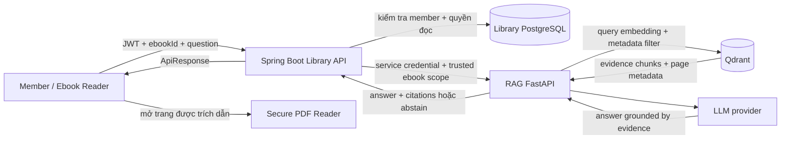

# Secure AI Ebook Reader - định hướng sản phẩm và roadmap

> Trạng thái: định hướng chính thức cho MVP RAG
>
> Cập nhật: 2026-10-05
>
> Phạm vi: hệ thống Library Spring Boot và `rag-service`

## 1. Quyết định sản phẩm

Hướng ưu tiên của project là **Secure AI Ebook Reader**: người dùng đọc ebook
đang được cấp quyền, tìm kiếm theo ngữ nghĩa và đặt câu hỏi trực tiếp trên nội
dung cuốn sách. Câu trả lời phải dựa trên các đoạn đã truy xuất và luôn kèm vị
trí nguồn để người dùng mở đúng trang PDF kiểm chứng.

Pitch ngắn:

```text
Một trình đọc ebook có AI nhưng vẫn tôn trọng quyền mượn sách:
Spring Boot kiểm tra quyền đọc, RAG chỉ tìm và trả lời trong cuốn sách được phép,
mọi câu trả lời đều có citation theo trang và từ chối khi không đủ bằng chứng.
```

Đây là hướng chính cần hoàn thiện trước. Các ý tưởng full multi-book GraphRAG, tìm kiếm toàn thư
viện, trợ lý học tập, recommendation và cataloging AI được giữ lại cho giai đoạn
sau, không nằm trong MVP hiện tại.

## 2. Giá trị chính

- Giúp người đọc tìm đúng nội dung dù không nhớ chính xác từ khóa.
- Cho phép hỏi một cuốn sách thay vì phải đọc tuần tự để tìm một chi tiết.
- Citation dẫn về trang PDF giúp câu trả lời có thể kiểm chứng.
- Quyền hỏi AI dùng cùng luật mượn/đọc ebook của hệ thống thư viện.
- Giảm hallucination bằng giới hạn phạm vi tài liệu và cơ chế từ chối trả lời.

## 3. Phạm vi MVP

MVP chỉ tập trung vào **một ebook tại một thời điểm**:

1. Member mở ebook mà mình đang có quyền đọc.
2. Tìm kiếm câu hoặc chủ đề bằng ngôn ngữ tự nhiên trong ebook đó.
3. Đặt câu hỏi bằng chức năng **Ask This Book**.
4. Nhận câu trả lời có citation gồm ebook, trang và đoạn nguồn.
5. Bấm citation để trình đọc mở đúng trang PDF.
6. Nhận phản hồi “không đủ bằng chứng trong sách” khi retrieval không đạt ngưỡng.

### Không thuộc MVP

- Hỏi đồng thời nhiều sách hoặc nhiều nguồn Internet.
- Full GraphRAG với community summaries hoặc truy vấn toàn thư viện. Nhánh
  document-local graph hiện có là extension thử nghiệm tùy chọn, không đổi
  ranh giới một ebook của MVP.
- Recommendation cá nhân hóa.
- Tự động phân loại/cataloging cho thủ thư.
- Tóm tắt audio, agent tự hành hoặc web search.
- Flashcard, quiz, glossary và learning path.

Các mục này không bị loại bỏ; chúng chỉ được hoãn để MVP có ranh giới rõ và có
thể đo chất lượng.

## 4. Kiến trúc trách nhiệm



Ranh giới bắt buộc:

| Thành phần | Trách nhiệm |
| --- | --- |
| Frontend | Giao diện đọc PDF, nhập câu hỏi, hiển thị answer/citation và chuyển trang. |
| Spring Boot | Xác thực người dùng, kiểm tra quyền ebook, rate limit, public API và audit nghiệp vụ. |
| RAG service | Ingestion, retrieval có scope, sinh câu trả lời grounded và quyết định abstain. |
| Qdrant | Vector và metadata chunk; không quyết định quyền người dùng. |
| SeaweedFS | Lưu PDF gốc và artifact của pipeline. |

Frontend không gọi trực tiếp RAG. RAG không lưu user/password/loan và không tự
quyết định member nào được đọc sách.

## 5. Trạng thái code hiện tại

### Đã có trong source

- Hybrid retrieval: PostgreSQL BM25 + Gemini/Qdrant + weighted RRF, rewrite và
  heuristic rerank; score cosine được giữ riêng khỏi điểm xếp hạng.
- Context expansion/compression giữ citation độc lập cho từng chunk.
- Dataset 20 câu có source labels, evaluation runner với retrieval/citation/
  abstention metrics, reports và optional LLM faithfulness judge.
- Document-local graph là extension thử nghiệm có scope/version/provenance;
  mặc định sản phẩm dùng hybrid. Full multi-book/community GraphRAG vẫn backlog.
  Chi tiết: [implementation](../rag-service/docs/retrieval-evaluation-implementation.md).

- Spring Boot upload ebook và lưu metadata object storage.
- Spring Boot trigger ingestion bất đồng bộ sau upload.
- RAG nhận job, tải PDF, parse, clean, chunk và lưu artifact.
- Embedding và Qdrant upsert đã nằm trong ingestion pipeline.
- Trạng thái pipeline đến `INDEXED`; Spring polling endpoint trạng thái RAG để
  đồng bộ tiến độ về `book_ebooks`.
- RAG có `POST /internal/retrieval/search`, yêu cầu ít nhất một scope
  `bookId`, `ebookId` hoặc `documentId` và trả evidence chunks cùng citation.
- Spring có `POST /api/ebooks/{bookId}/reader/semantic-search` dành cho member.
- Public search yêu cầu JWT và `X-Reading-Session`, kiểm tra lại reading session,
  active loan, ebook `ACTIVE` và ingestion status `INDEXED` trước khi gọi RAG.
- Spring chỉ gửi trusted `ebookId` lấy từ reading session; response RAG có
  citation lệch scope sẽ bị từ chối toàn bộ để tránh lộ dữ liệu sách khác.
- Request/response DTO, validation và error `EBOOK_AI_NOT_READY` đã được chuẩn hóa.
- RAG có `POST /internal/answers`: retrieval theo `ebookId`, ngưỡng evidence,
  bounded context, structured LLM output, citation allow-list và abstention.
- Spring có `POST /api/ebooks/{bookId}/reader/ask`; response citation lệch scope
  hoặc câu trả lời khẳng định không có citation đều bị từ chối.
- Frontend reader có hai mode `Ask this book` và `Find passages`, hiển thị trạng
  thái grounded/abstain/error, giữ kết quả khi đóng panel và mở citation đúng
  trang PDF.
- Spring giới hạn request AI theo member + ebook + operation bằng Redis, trả
  `429 Retry-After`, đặt timeout cho kết nối RAG và ghi metrics/log không chứa
  câu hỏi hoặc nội dung chunk.

### Chưa có, cần làm để hoàn thành MVP

- Kiểm chứng public end-to-end qua JWT/reading session trên nhiều ebook. Test
  pipeline nội bộ và evaluation runner đã có; không đánh đồng chúng với public E2E.
- Dashboard/cảnh báo vận hành dựa trên metrics AI đã phát ra.

Endpoint retrieval trả các đoạn chứng cứ; `/internal/answers` đã sinh câu trả
lời dựa trên evidence. Hai endpoint có vai trò riêng.

## 6. Luồng Ask This Book mục tiêu

```mermaid
sequenceDiagram
    participant User as Member
    participant UI as Ebook Reader
    participant Library as Spring Boot
    participant DB as Library DB
    participant RAG as RAG Service
    participant Vector as Qdrant
    participant LLM

    User->>UI: Nhập câu hỏi trong ebook đang mở
    UI->>Library: POST /api/ebooks/{bookId}/reader/ask + question + JWT + reading session
    Library->>DB: Kiểm tra member, loan/quyền đọc và ingestionStatus
    alt Không có quyền hoặc ebook chưa INDEXED
        Library-->>UI: 403 hoặc trạng thái chưa sẵn sàng
    else Được phép
        Library->>RAG: Internal ask request + trusted ebookId scope
        RAG->>Vector: Search với filter ebookId
        Vector-->>RAG: Evidence chunks + page metadata
        alt Evidence không đủ mạnh
            RAG-->>Library: abstained=true + citations rỗng
        else Evidence đủ
            RAG->>LLM: Question + bounded evidence context
            LLM-->>RAG: Grounded answer
            RAG-->>Library: answer + citations
        end
        Library-->>UI: ApiResponse
        UI->>UI: Hiển thị answer; click citation mở trang PDF
    end
```

## 7. Contract mục tiêu cho câu trả lời

Contract này đã được triển khai qua Spring `ApiResponse` tại
`POST /api/ebooks/{bookId}/reader/ask`:

```json
{
  "answer": "Dependency inversion giúp module cấp cao không phụ thuộc trực tiếp vào module cấp thấp...",
  "grounded": true,
  "abstained": false,
  "citations": [
    {
      "ebookId": 55,
      "pageStart": 42,
      "pageEnd": 43,
      "chunkId": "...",
      "excerpt": "..."
    }
  ]
}
```

Quy tắc:

- Không có citation hợp lệ thì không trả một câu trả lời khẳng định.
- Citation chỉ được lấy từ kết quả retrieval đúng `ebookId` đã được Spring xác
  thực.
- `pageStart/pageEnd` hiện là vị trí trang do parser ghi nhận. Nếu số trang in
  trên sách khác số trang PDF, cần thêm mapping riêng thay vì tự cộng/trừ offset.
- Không gửi JWT hoặc dữ liệu member vào RAG nếu không cần cho retrieval.

## 8. Thứ tự triển khai

### Phase 0 - nền ingestion và retrieval

Trạng thái: phần lớn đã có.

- Upload một lần vào object storage.
- Ingestion bất đồng bộ, embedding và Qdrant indexing.
- Đồng bộ trạng thái RAG về Spring.
- Internal scoped vector retrieval.

### Phase 1A - semantic search có bảo vệ

Trạng thái: backend đã triển khai; live end-to-end cần một ebook đã `INDEXED` và
các service RAG/provider đang chạy.

- [x] Spring endpoint dành cho member.
- [x] Kiểm tra JWT, reading session, active loan và trạng thái `INDEXED`.
- [x] Spring gọi `/internal/retrieval/search` với trusted `ebookId` bắt buộc.
- [x] Chuẩn hóa DTO evidence/citation và lỗi RAG unavailable/not ready.
- [x] Test denied access, ebook chưa index và response lệch scope.
- [ ] Chạy live end-to-end trên một PDF đã ingest bằng provider thật.

Public request hiện tại:

```http
POST /api/ebooks/{bookId}/reader/semantic-search
Authorization: Bearer <member-jwt>
X-Reading-Session: <raw-reading-session-token>
Content-Type: application/json
```

```json
{
  "query": "Dependency inversion là gì?",
  "topK": 5,
  "scoreThreshold": 0.7
}
```

Endpoint trả evidence chunks/citations trong `ApiResponse`; nó chưa trả câu trả
lời do LLM tạo.

### Phase 1B - Ask This Book có citation

Trạng thái: backend đã triển khai; cần provider thật và ebook `INDEXED` để chạy
live end-to-end.

- [x] Internal answer orchestration trong RAG.
- [x] Prompt chỉ dùng bounded evidence context và coi nội dung chunk là dữ liệu
  không đáng tin, không phải instruction.
- [x] Score threshold tối thiểu, giới hạn `topK` và abstention.
- [x] LLM trả JSON có source ID; citation metadata luôn được dựng lại từ evidence
  retrieval, không tin metadata do model sinh.
- [x] Spring trả answer/citations qua `ApiResponse` sau khi kiểm tra lại scope.
- [x] Unit test happy path, insufficient evidence, citation bịa và citation lệch
  ebook.
- [ ] Live end-to-end bằng provider thật và một ebook đã `INDEXED`.

Public request:

```http
POST /api/ebooks/{bookId}/reader/ask
Authorization: Bearer <member-jwt>
X-Reading-Session: <raw-reading-session-token>
Content-Type: application/json
```

```json
{
  "question": "Dependency inversion là gì?",
  "topK": 5,
  "scoreThreshold": 0.7
}
```

### Phase 1C - reader UX và production hardening

- [x] Click citation mở đúng trang.
- [x] Loading, indexing, abstain và service-unavailable states.
- [x] Rate limit theo member/ebook; giới hạn độ dài câu hỏi và `topK`.
- [x] Connect/read timeout cho Spring → RAG. Không tự retry `Ask` để tránh tạo
  hai lượt gọi LLM; UI cung cấp retry có chủ đích.
- [x] Structured logs/metrics không ghi nội dung ebook hoặc câu hỏi nhạy cảm.
- [ ] End-to-end test với một bộ câu hỏi có đáp án chuẩn.

### Backlog sau MVP

1. Selected-text explanation, key insights, glossary, flashcard và quiz.
2. Multi-book research workspace.
3. Semantic catalog search và recommendation.
4. AI-assisted metadata/cataloging có thủ thư duyệt.
5. Graph-enhanced RAG rồi mới cân nhắc full GraphRAG.

## 9. Tiêu chí hoàn thành MVP

- Member không có quyền không thể search hoặc hỏi ebook, kể cả biết `ebookId`.
- Mỗi truy vấn vector luôn có scope ebook/document bắt buộc.
- Câu trả lời có ít nhất một citation hợp lệ hoặc chủ động abstain.
- Citation mở đúng trang/chunk đã dùng làm evidence.
- Khi RAG/LLM lỗi, API trả lỗi chuẩn và không làm ảnh hưởng chức năng đọc ebook.
- Không log API key, JWT, toàn bộ câu hỏi hoặc toàn bộ nội dung chunk ở production.
- Có test cho happy path, denied access, ebook chưa index, no evidence, timeout
  và provider failure.
- Có tập đánh giá nhỏ kiểm tra retrieval recall, citation correctness và
  groundedness trước khi demo.

## 10. Nguyên tắc an toàn và bản quyền

- AI chỉ được truy cập ebook mà Spring xác nhận người dùng đang được phép đọc.
- Không dùng toàn bộ PDF làm prompt; chỉ gửi số lượng chunk tối thiểu cần thiết.
- Không dùng lịch sử đọc/câu hỏi để train hoặc profiling nếu chưa có consent và
  chính sách retention rõ ràng.
- Không trả đoạn trích dài hơn mức cần thiết cho citation.
- Tách secret theo môi trường; không đưa API key xuống browser.
- Tính năng AI phải thất bại độc lập: RAG down không được làm mất khả năng đọc
  ebook hoặc ảnh hưởng transaction mượn/trả.

## 11. Tài liệu liên quan

- [Kiến trúc toàn hệ thống](architecture-overview.md)
- [Phân tích RAG/GraphRAG - tài liệu tham khảo dài hạn](implements/rag-graphrag-analysis.md)
- [RAG service architecture](../rag-service/docs/platform/architecture.md)
- [Internal RAG API](../rag-service/docs/reference/api.md)
- [Spring Boot - RAG ingestion contract](../rag-service/docs/integration/springboot-rag-ingestion-contract.md)
