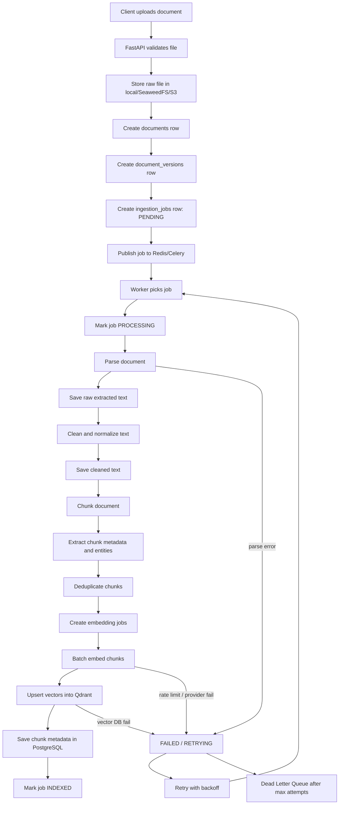

# 02. Ingestion Pipeline

Chương này đi sâu vào **offline ingestion pipeline**, tức đường xử lý tài liệu trước khi user đặt câu hỏi.

Trong hệ thống RAG production-grade, ingestion không phải là một đoạn code phụ kiểu "đọc file rồi embed". Nó là một pipeline quan trọng ngang với query pipeline, vì chất lượng retrieval sau này phụ thuộc trực tiếp vào dữ liệu đã parse, clean, chunk, embed và index ở giai đoạn này.

Use case xuyên suốt:

> Internal Knowledge Base RAG cho công ty, gồm HR policies, technical documentation, product documents, FAQ, meeting notes, support tickets và internal wiki.

Trong project hiện tại, chương này map vào:

- `app/api/v1/routes_ingestion.py`
- `app/jobs/ingestion_jobs.py`
- `app/jobs/celery_app.py`
- `app/jobs/beat_schedule.py`
- `app/ingestion/pipeline.py`
- `app/ingestion/loaders/`
- `app/ingestion/cleaners/`
- `app/ingestion/chunkers/`
- `app/ingestion/metadata/`
- `app/indexing/`
- `app/documents/`
- `compose.yml` với `worker`, `beat`, `redis`, `qdrant`, `postgres`, `seaweedfs`
- `compose.observability.yml` với Prometheus/Grafana để quan sát ingestion infrastructure

## 1. Ingestion Pipeline Là Gì?

Ingestion pipeline là chuỗi xử lý biến dữ liệu thô thành dạng có thể retrieve.

Flow cơ bản:

```text
User uploads document
  ↓
Store raw file
  ↓
Create ingestion job
  ↓
Parse document
  ↓
Clean text
  ↓
Chunk
  ↓
Embed
  ↓
Store vector
  ↓
Mark job completed
```

Trong RAG, user không hỏi trực tiếp trên PDF/DOCX/HTML. Hệ thống cần biến các file đó thành:

- raw file đã lưu
- raw extracted text
- cleaned text
- chunks
- chunk metadata
- embeddings
- vector index
- document/job status

Nếu ingestion làm kém, retrieval sẽ kém. Nếu retrieval kém, LLM sẽ không có context đúng. Khi đó prompt hay model mạnh cũng khó cứu.

## 2. Vì Sao Ingestion Quan Trọng?

### 2.1. Nó quyết định dữ liệu LLM có thể nhìn thấy

LLM chỉ trả lời dựa trên context được retrieve. Context đó đến từ chunks. Chunks đến từ ingestion.

Nếu ingestion làm mất heading "Chính sách nghỉ phép 2026", sau này câu hỏi:

```text
Chính sách nghỉ phép năm nay là gì?
```

có thể retrieve nhầm policy cũ hoặc đoạn chung chung.

### 2.2. Nó là nơi gắn metadata và permission

Metadata không nên được nghĩ đến ở query-time mới làm. Metadata tốt phải được tạo từ ingestion-time.

Ví dụ chunk metadata:

```json
{
  "tenant_id": "company-alpha",
  "workspace_id": "hr",
  "document_id": "hr-policy-2026",
  "document_version": "v3",
  "chunk_id": "hr-policy-2026-v3-c012",
  "source_type": "pdf",
  "file_name": "HR Policy 2026.pdf",
  "page_number": 5,
  "section": "Annual Leave",
  "department": "HR",
  "visibility": "department",
  "allowed_roles": ["employee", "hr"],
  "created_at": "2026-05-27T10:00:00+07:00"
}
```

Metadata này giúp:

- filter theo tenant/workspace
- filter theo permission
- filter theo document type
- trả citation theo page/section
- debug retrieval
- re-index khi document update

### 2.3. Nó ảnh hưởng trực tiếp đến cost

Ingestion sai có thể làm tăng chi phí:

- duplicate chunks → embed tốn tiền
- overlap quá cao → nhiều vector thừa
- không deduplicate document → index lặp
- không cache embedding → embed lại text giống nhau
- không incremental indexing → mỗi update nhỏ phải re-index toàn bộ

### 2.4. Nó là nơi dễ fail nhất

Ingestion thường phải xử lý:

- file corrupt
- PDF scan cần OCR
- file quá lớn
- API embedding rate limit
- vector DB unavailable
- duplicate upload
- document update out-of-order
- worker bị restart giữa job

Vì vậy production ingestion cần job status, retry, DLQ, idempotency và cleanup.

## 3. Ingestion Nằm Ở Đâu Trong RAG Pipeline?

Ingestion nằm ở **offline/write path**.

```text
Write path:
Data source → Parser → Cleaner → Chunker → Embedder → Vector DB + Metadata DB

Read path:
User query → Query processing → Retrieval → Reranking → Prompt → LLM → Answer
```

Write path không cần trả kết quả ngay cho user. Nó có thể chạy async bằng worker.

Trong project hiện tại:

```text
routes_ingestion.py
  ↓
documents/service.py
  ↓
documents/storage.py
  ↓
jobs/ingestion_jobs.py
  ↓
ingestion/pipeline.py
  ↓
loaders / cleaners / chunkers / metadata
  ↓
indexing/indexer.py
  ↓
qdrant_store.py + documents/repository.py
```

## 4. Production Flow Chi Tiết



## 5. Data Source Connectors

Data source connector là component lấy tài liệu từ nguồn khác nhau đưa vào ingestion pipeline.

### 5.1. File upload

**Nó là gì?**  
Người dùng upload file trực tiếp qua UI/API.

**Vì sao cần?**  
Đây là cách đơn giản nhất để bắt đầu Internal Knowledge Base.

**Nằm ở đâu?**  
Đầu ingestion pipeline, thường là endpoint:

```text
POST /api/v1/ingestion/upload
```

**Triển khai thực tế**:

- Validate file extension.
- Validate file size.
- Scan virus nếu production enterprise.
- Store raw file.
- Create document and ingestion job.
- Return `job_id`.

**Pseudo-code**:

```python
async def upload_document(file, workspace_id, current_user):
    validate_file(file)
    raw_path = await storage.save(file)

    document = await document_repository.create(
        workspace_id=workspace_id,
        filename=file.filename,
        storage_path=raw_path,
        uploaded_by=current_user.id,
    )

    version = await document_version_repository.create(
        document_id=document.id,
        content_hash=hash_file(raw_path),
        version_number=1,
    )

    job = await ingestion_job_repository.create(
        document_id=document.id,
        document_version_id=version.id,
        status="PENDING",
    )

    process_document.delay(job.id)
    return {"job_id": job.id, "status": "PENDING"}
```

**Lỗi thường gặp**:

- Cho parse ngay trong request upload gây timeout.
- Không lưu raw file nên retry không được.
- Không hash file nên upload trùng tạo duplicate.
- Không tạo job status nên user không biết xử lý đến đâu.

**Checklist production-grade**:

- Validate extension/MIME type.
- Validate size.
- Store raw file trước khi tạo job.
- Có checksum.
- Có document version.
- Có upload owner.
- Có tenant/workspace.
- Return job ID ngay.

### 5.2. Web crawler

**Nó là gì?**  
Connector crawl trang web/internal wiki thành tài liệu.

**Vì sao cần?**  
Nhiều knowledge base nằm ở website nội bộ hoặc docs portal.

**Triển khai thực tế**:

- Start từ seed URLs.
- Respect robots/internal allowlist.
- Extract page title, headings, canonical URL.
- Detect content changes bằng ETag/Last-Modified/checksum.
- Store HTML raw và cleaned markdown/text.

**Trade-off**:

- Dễ ingest nhiều tài liệu nhanh.
- Nhưng dễ crawl duplicate, menu/sidebar/footer.
- Cần change detection tốt để không re-index toàn bộ.

**Lỗi thường gặp**:

- Index cả navigation/sidebar.
- Không xử lý canonical URL.
- Crawl infinite calendar/search pages.
- Không lưu URL version.

### 5.3. Database connector

**Nó là gì?**  
Connector lấy dữ liệu từ database như FAQ, support tickets, product records.

**Ví dụ Internal KB**:

- Support tickets từ table `support_tickets`.
- FAQ từ table `faqs`.
- Product docs từ CMS database.

**Triển khai thực tế**:

```sql
SELECT id, title, body, updated_at, visibility
FROM support_tickets
WHERE updated_at > :last_sync_at
```

Mỗi row có thể trở thành một document hoặc một chunk tùy dữ liệu.

**Production concern**:

- Cần checkpoint `last_sync_at`.
- Cần xử lý delete.
- Cần mapping permission từ source DB.
- Cần tránh query nặng lên production DB.

### 5.4. Google Drive / Notion / Confluence connector

**Nó là gì?**  
Connector đồng bộ tài liệu từ SaaS tools.

**Vì sao cần?**  
Doanh nghiệp thường lưu knowledge trong nhiều công cụ.

**Triển khai thực tế**:

- OAuth/service account.
- Pull documents theo folder/space.
- Lưu `external_id`.
- Lưu `source_uri`.
- Lưu `last_modified_at`.
- Sync incremental theo change API nếu có.

**Production concern**:

- API rate limit.
- Permission mapping phức tạp.
- Deleted/archived documents.
- Rich content như table, image, comment.

**Checklist**:

- Có source connector config theo tenant.
- Có sync cursor.
- Có retry riêng cho connector.
- Có audit log tài liệu nào được sync.
- Có cách pause/resume connector.

## 6. Change Detection

Change detection là cơ chế biết tài liệu có thay đổi hay không.

### Vì sao cần?

Không thể re-index toàn bộ KB mỗi lần sync. Với 100.000 docs, làm vậy tốn:

- embedding cost
- vector DB write cost
- worker time
- downtime/risk

### Cách phát hiện thay đổi

| Cách | Dùng khi nào | Ghi chú |
|---|---|---|
| File checksum | File upload, object storage | Hash bytes raw file |
| Text checksum | Sau parsing/cleaning | Bỏ qua metadata không ảnh hưởng nội dung |
| `updated_at` | Database/SaaS connector | Nhanh nhưng có thể không chính xác |
| ETag/Last-Modified | Web/HTTP source | Tốt cho crawler |
| Source version ID | Notion/Confluence/Drive | Tốt nếu provider hỗ trợ |

### Content hash

Ví dụ:

```python
def compute_content_hash(text: str) -> str:
    normalized = normalize_for_hash(text)
    return sha256(normalized.encode("utf-8")).hexdigest()
```

Nếu hash không đổi:

```text
Skip parsing/chunking/embedding
Mark job completed as NO_CHANGE
```

### Lỗi thường gặp

- Hash raw file nhưng parser output thay đổi do parser version đổi.
- Hash cleaned text nhưng cleaning strategy đổi mà không versioning.
- Không lưu hash từng chunk nên không biết chunk nào thay đổi.

## 7. Incremental Indexing Vs Full Re-index

### Full re-index

Full re-index nghĩa là xoá hoặc thay toàn bộ chunks/vectors của một document hoặc toàn bộ corpus rồi index lại.

**Dùng khi**:

- Đổi embedding model.
- Đổi chunking strategy lớn.
- Parser/cleaner bug fix làm output thay đổi nhiều.
- Index bị corrupt.

**Ưu điểm**:

- Đơn giản.
- Dữ liệu nhất quán.

**Nhược điểm**:

- Tốn cost.
- Tốn thời gian.
- Có thể ảnh hưởng retrieval trong lúc rebuild nếu không làm blue/green index.

### Incremental indexing

Incremental indexing chỉ xử lý phần thay đổi.

**Dùng khi**:

- Document update nhỏ.
- Connector sync theo `updated_at`.
- Support tickets thêm mới hằng ngày.

**Flow**:

```text
Detect changed document
  ↓
Parse and clean
  ↓
Chunk
  ↓
Compare chunk hashes with previous version
  ↓
Embed only new/changed chunks
  ↓
Soft delete removed chunks
  ↓
Upsert changed vectors
```

**Production checklist**:

- Có `document_version`.
- Có `chunk_hash`.
- Có `embedding_model_version`.
- Có soft delete.
- Có transaction hoặc compensation nếu vector DB update fail.

## 8. Job Queue

### Vì sao cần queue?

Ingestion chậm và dễ fail. Nếu xử lý trong API request:

- request timeout
- user phải chờ lâu
- retry khó
- worker scale khó
- API bị nghẽn

Queue giúp:

- API trả `job_id` nhanh.
- Worker xử lý nền.
- Có retry.
- Scale worker ngang.
- Theo dõi backlog.

Trong project hiện tại:

- Redis là broker.
- Celery là worker.
- `app/jobs/celery_app.py` cấu hình Celery.
- `app/jobs/ingestion_jobs.py` là task xử lý document.

### Queue flow

```text
API creates ingestion_job row
  ↓
API publishes task process_document(job_id)
  ↓
Redis stores task
  ↓
Celery worker consumes task
  ↓
Worker updates job status
```

### Queue metrics cần monitor

- queue length
- oldest job age
- jobs per minute
- failure rate
- retry count
- DLQ count
- average processing time
- worker concurrency

## 9. Ingestion Job Status

Không nên chỉ có `SUCCESS` và `FAILED`. Production cần biết fail ở bước nào.

| Status | Ý nghĩa | Khi nào set |
|---|---|---|
| `PENDING` | Job mới tạo, chưa worker nào nhận | Sau upload/sync |
| `PROCESSING` | Worker đã nhận job | Khi task bắt đầu |
| `PARSED` | Parse file thành raw text xong | Sau loader |
| `CLEANED` | Clean/normalize text xong | Sau cleaner |
| `CHUNKED` | Chunking xong | Sau chunker |
| `EMBEDDED` | Embedding xong | Sau embedding provider |
| `INDEXED` | Vector và metadata đã lưu | Sau Qdrant/Postgres write |
| `FAILED` | Job fail và không retry nữa | Sau max retries hoặc lỗi fatal |
| `RETRYING` | Job đang chờ retry | Sau lỗi recoverable |
| `CANCELLED` | User/admin hủy job | Khi cancel |
| `NO_CHANGE` | Source không đổi, bỏ qua index | Khi content hash không đổi |

### Vì sao status chi tiết quan trọng?

Ví dụ job fail. Nếu chỉ thấy `FAILED`, bạn không biết:

- parser lỗi vì PDF corrupt
- embedding API rate limit
- Qdrant down
- DB transaction fail

Status chi tiết giúp:

- debug nhanh
- retry đúng bước
- show progress cho UI
- đo bottleneck

## 10. Retry

Retry là chạy lại job hoặc bước bị lỗi.

### Lỗi nên retry

- embedding API timeout
- embedding API rate limit
- vector DB temporary unavailable
- network error
- database deadlock
- object storage temporary fail

### Lỗi không nên retry nhiều

- unsupported file type
- corrupted file
- password-protected PDF không có password
- file quá lớn vượt limit
- permission denied từ source
- invalid document format

### Exponential backoff

Không retry ngay lập tức liên tục. Dùng backoff:

```text
Attempt 1: retry after 10s
Attempt 2: retry after 30s
Attempt 3: retry after 2m
Attempt 4: retry after 10m
Attempt 5: move to DLQ
```

### Pseudo-code

```python
MAX_RETRIES = 5

def should_retry(error: Exception) -> bool:
    return isinstance(error, (
        TimeoutError,
        RateLimitError,
        TemporaryVectorDbError,
        DatabaseDeadlockError,
    ))

async def handle_job_error(job, error):
    if should_retry(error) and job.retry_count < MAX_RETRIES:
        job.status = "RETRYING"
        job.retry_count += 1
        job.next_retry_at = calculate_backoff(job.retry_count)
        await save(job)
        schedule_retry(job.id, eta=job.next_retry_at)
    else:
        job.status = "FAILED"
        job.error_message = str(error)
        await save(job)
        await move_to_dlq(job, error)
```

## 11. Dead Letter Queue

DLQ là nơi giữ các job fail sau khi retry quá số lần hoặc fail do lỗi không recoverable.

### Vì sao cần DLQ?

Nếu không có DLQ:

- job fail biến mất
- không biết tài liệu nào chưa index
- worker có thể retry mãi gây retry storm
- khó audit lỗi ingestion

### DLQ record nên lưu

```json
{
  "job_id": "job_123",
  "document_id": "doc_456",
  "document_version_id": "ver_3",
  "tenant_id": "company-alpha",
  "failed_step": "EMBEDDING",
  "error_type": "RateLimitError",
  "error_message": "Embedding provider rate limit exceeded",
  "retry_count": 5,
  "created_at": "2026-05-27T10:00:00+07:00",
  "last_failed_at": "2026-05-27T10:30:00+07:00"
}
```

### DLQ operations

Admin cần có khả năng:

- list failed jobs
- inspect error
- retry manually
- mark ignored
- cancel
- download raw file
- rerun from a specific step nếu hệ thống hỗ trợ

## 12. Idempotency

Idempotency nghĩa là chạy lại cùng một operation nhiều lần vẫn cho kết quả cuối như nhau, không tạo duplicate hoặc corrupt state.

### Vì sao ingestion phải idempotent?

Worker có thể:

- crash giữa job
- retry sau timeout
- nhận duplicate task
- xử lý lại document do connector gửi lại event

Nếu không idempotent:

- duplicate chunks
- duplicate vectors
- duplicate documents
- citation sai
- retrieval bị nhiễu

### Idempotency key

Với file upload:

```text
tenant_id + workspace_id + source_type + content_hash
```

Với connector:

```text
tenant_id + connector_id + external_id + external_version
```

Với vector:

```text
tenant_id:document_id:document_version_id:chunk_index:chunk_hash:embedding_version
```

### Upsert thay vì insert mù

Vector DB nên dùng upsert với stable vector ID:

```python
vector_id = build_vector_id(
    tenant_id=tenant_id,
    document_id=document_id,
    version_id=version_id,
    chunk_index=chunk_index,
    chunk_hash=chunk_hash,
    embedding_version=embedding_version,
)

await vector_store.upsert([
    VectorChunk(
        id=vector_id,
        text=chunk.text,
        vector=embedding,
        metadata=chunk.metadata,
    )
])
```

### Checklist idempotency

- Job có unique idempotency key.
- Document version có content hash.
- Chunk có chunk hash.
- Vector ID stable.
- DB insert dùng unique constraints.
- Retry không tạo duplicate.
- Partial failure có cleanup hoặc resume.

## 13. Deduplication

Deduplication là tránh lưu/index nội dung trùng.

### Các tầng dedup

| Tầng | Cách làm | Ví dụ |
|---|---|---|
| File-level | hash raw file | Upload cùng PDF hai lần |
| Document-level | hash cleaned text | PDF khác metadata nhưng cùng nội dung |
| Chunk-level | hash chunk text | Header/footer lặp |
| Embedding-level | cache text hash | Cùng text dùng lại vector |

### Vì sao cần dedup?

- giảm embedding cost
- giảm vector storage
- giảm retrieval noise
- tránh câu trả lời cite nhiều nguồn duplicate

### Lỗi thường gặp

- Dedup quá mạnh làm mất tài liệu khác nguồn nhưng cùng nội dung cần citation riêng.
- Dedup header/footer sau chunking quá muộn.
- Không phân biệt duplicate trong cùng document và duplicate cross-document.

### Khuyến nghị

Với Internal KB:

- Dedup file-level để tránh upload trùng.
- Dedup chunk-level trong cùng document.
- Cross-document dedup nên cẩn thận, vì hai phòng ban có thể có bản copy nhưng permission khác nhau.

## 14. Document Versioning

Document versioning là lưu lịch sử phiên bản tài liệu.

### Vì sao cần?

Internal docs thay đổi liên tục:

- HR policy cập nhật năm 2026.
- Technical runbook sửa sau incident.
- Product docs đổi theo release.

Nếu chỉ update document tại chỗ:

- Không audit được câu trả lời cũ dựa vào version nào.
- Không rollback được.
- Không biết vector nào thuộc version nào.
- Không compare policy cũ/mới được.

### Version model

```text
documents
  id
  tenant_id
  workspace_id
  source_type
  source_uri
  title
  current_version_id

document_versions
  id
  document_id
  version_number
  content_hash
  parser_version
  cleaner_version
  chunking_strategy_version
  embedding_model
  embedding_version
  status
  created_at
```

### Query theo version

Thông thường retrieval chỉ lấy `current_version`. Nhưng có use case cần hỏi:

```text
Chính sách nghỉ phép năm ngoái thay đổi gì?
```

Khi đó hệ thống cần retrieve cả version 2025 và 2026 hoặc documents có metadata year tương ứng.

### Soft delete old version

Không nên hard delete ngay:

- Chat history cũ có citation đến old chunk.
- Evaluation có thể cần replay.
- Audit cần biết câu trả lời dựa trên nguồn nào.

Khuyến nghị:

```text
old chunks: active=false, replaced_by_version_id=...
new chunks: active=true
```

## 15. Schema Database Gợi Ý

Phần này là schema concept, không nhất thiết copy nguyên vào migration ngay. Nhưng nó là hướng production để mở rộng project hiện tại.

### 15.1. `documents`

```sql
CREATE TABLE documents (
    id UUID PRIMARY KEY,
    tenant_id UUID NOT NULL,
    workspace_id UUID NOT NULL,
    source_type TEXT NOT NULL,
    source_uri TEXT,
    title TEXT NOT NULL,
    filename TEXT,
    storage_path TEXT,
    current_version_id UUID,
    visibility TEXT NOT NULL DEFAULT 'private',
    created_by UUID,
    created_at TIMESTAMPTZ NOT NULL DEFAULT now(),
    updated_at TIMESTAMPTZ NOT NULL DEFAULT now(),
    deleted_at TIMESTAMPTZ
);
```

### 15.2. `document_versions`

```sql
CREATE TABLE document_versions (
    id UUID PRIMARY KEY,
    document_id UUID NOT NULL REFERENCES documents(id),
    version_number INTEGER NOT NULL,
    raw_file_hash TEXT,
    cleaned_text_hash TEXT,
    parser_version TEXT NOT NULL,
    cleaner_version TEXT NOT NULL,
    chunking_strategy TEXT NOT NULL,
    chunking_strategy_version TEXT NOT NULL,
    embedding_model TEXT NOT NULL,
    embedding_version TEXT NOT NULL,
    status TEXT NOT NULL,
    created_at TIMESTAMPTZ NOT NULL DEFAULT now(),
    UNIQUE(document_id, version_number)
);
```

### 15.3. `ingestion_jobs`

```sql
CREATE TABLE ingestion_jobs (
    id UUID PRIMARY KEY,
    tenant_id UUID NOT NULL,
    workspace_id UUID NOT NULL,
    document_id UUID NOT NULL REFERENCES documents(id),
    document_version_id UUID NOT NULL REFERENCES document_versions(id),
    status TEXT NOT NULL,
    current_step TEXT,
    retry_count INTEGER NOT NULL DEFAULT 0,
    max_retries INTEGER NOT NULL DEFAULT 5,
    idempotency_key TEXT NOT NULL,
    error_type TEXT,
    error_message TEXT,
    started_at TIMESTAMPTZ,
    completed_at TIMESTAMPTZ,
    next_retry_at TIMESTAMPTZ,
    created_at TIMESTAMPTZ NOT NULL DEFAULT now(),
    updated_at TIMESTAMPTZ NOT NULL DEFAULT now(),
    UNIQUE(idempotency_key)
);
```

### 15.4. `chunks`

```sql
CREATE TABLE chunks (
    id UUID PRIMARY KEY,
    tenant_id UUID NOT NULL,
    workspace_id UUID NOT NULL,
    document_id UUID NOT NULL REFERENCES documents(id),
    document_version_id UUID NOT NULL REFERENCES document_versions(id),
    chunk_index INTEGER NOT NULL,
    chunk_hash TEXT NOT NULL,
    content TEXT NOT NULL,
    token_count INTEGER,
    section_title TEXT,
    page_number INTEGER,
    metadata JSONB NOT NULL DEFAULT '{}',
    vector_id TEXT,
    active BOOLEAN NOT NULL DEFAULT true,
    created_at TIMESTAMPTZ NOT NULL DEFAULT now(),
    deleted_at TIMESTAMPTZ,
    UNIQUE(document_version_id, chunk_index, chunk_hash)
);
```

### 15.5. `embedding_jobs`

```sql
CREATE TABLE embedding_jobs (
    id UUID PRIMARY KEY,
    chunk_id UUID NOT NULL REFERENCES chunks(id),
    embedding_model TEXT NOT NULL,
    embedding_version TEXT NOT NULL,
    dimension INTEGER NOT NULL,
    status TEXT NOT NULL,
    retry_count INTEGER NOT NULL DEFAULT 0,
    error_message TEXT,
    created_at TIMESTAMPTZ NOT NULL DEFAULT now(),
    completed_at TIMESTAMPTZ
);
```

## 16. Pseudo-code Ingestion Worker

Đây là pseudo-code production-oriented, map với project hiện tại nhưng chưa phụ thuộc framework cụ thể.

```python
async def process_ingestion_job(job_id: str) -> None:
    job = await ingestion_jobs.get_for_update(job_id)

    if job.status in {"INDEXED", "CANCELLED"}:
        return

    try:
        await mark_job(job, status="PROCESSING", step="START")

        document = await documents.get(job.document_id)
        version = await document_versions.get(job.document_version_id)

        if await is_duplicate_version(version):
            await mark_job(job, status="NO_CHANGE", step="CHANGE_DETECTION")
            return

        await mark_job(job, status="PROCESSING", step="PARSE")
        raw_pages = loader_factory.get_loader(document.storage_path).load(document.storage_path)
        await save_raw_text(version.id, raw_pages)
        await mark_job(job, status="PARSED", step="PARSE")

        await mark_job(job, status="PROCESSING", step="CLEAN")
        cleaned_docs = [
            clean_document(raw_page)
            for raw_page in raw_pages
        ]
        await save_cleaned_text(version.id, cleaned_docs)
        await mark_job(job, status="CLEANED", step="CLEAN")

        await mark_job(job, status="PROCESSING", step="CHUNK")
        chunks = chunker.chunk_many(cleaned_docs)
        chunks = attach_metadata(chunks, document=document, version=version)
        chunks = deduplicate_chunks(chunks)
        await chunk_repository.replace_version_chunks(version.id, chunks)
        await mark_job(job, status="CHUNKED", step="CHUNK")

        await mark_job(job, status="PROCESSING", step="EMBED")
        changed_chunks = await chunk_repository.get_chunks_needing_embedding(
            version_id=version.id,
            embedding_model=settings.embedding_model,
            embedding_version=settings.embedding_version,
        )
        embeddings = await embedding_provider.embed_batch(
            [chunk.content for chunk in changed_chunks]
        )
        await mark_job(job, status="EMBEDDED", step="EMBED")

        await mark_job(job, status="PROCESSING", step="INDEX")
        vector_chunks = build_vector_chunks(changed_chunks, embeddings)
        await vector_store.upsert(vector_chunks)
        await chunk_repository.mark_vectors_indexed(vector_chunks)
        await document_versions.mark_active(version.id)
        await mark_job(job, status="INDEXED", step="INDEX")

    except Exception as exc:
        await handle_job_error(job, exc)
        raise
```

## 17. Transaction Boundary Và Consistency

Ingestion ghi vào nhiều nơi:

- object storage
- PostgreSQL
- vector DB
- Redis/Celery

Không có distributed transaction đơn giản giữa tất cả. Vì vậy cần thiết kế consistency bằng idempotency và compensation.

### Ví dụ partial failure

Trường hợp:

```text
Vector upsert vào Qdrant thành công
  ↓
PostgreSQL update vector_id fail
```

Nếu retry không idempotent, có thể tạo duplicate vector.

Giải pháp:

- vector ID stable
- upsert thay vì insert
- retry bước index an toàn
- job status vẫn ở `RETRYING`
- có cleanup job tìm orphan vectors

Trong project hiện tại có `app/jobs/cleanup_jobs.py`, sau này có thể mở rộng thành:

- cleanup orphan chunks
- cleanup orphan vectors
- expire old document versions
- verify vector/count consistency

## 18. Batch Embedding Trong Ingestion

Embedding từng chunk một là chậm và tốn overhead.

Nên batch:

```python
BATCH_SIZE = 64

for batch in batched(chunks, BATCH_SIZE):
    vectors = await embedding_provider.embed([c.content for c in batch])
    await vector_store.upsert(build_vector_chunks(batch, vectors))
```

### Trade-off batch size

| Batch size | Ưu điểm | Nhược điểm |
|---|---|---|
| Nhỏ | Ít timeout, dễ retry | Chậm, nhiều request |
| Lớn | Throughput tốt | Dễ timeout, dễ vượt rate limit |

Production nên:

- có configurable batch size
- retry theo batch
- lưu embedding job status
- monitor embedding latency và rate limit

## 19. Permission Metadata Trong Ingestion

Permission không nên chỉ lưu ở document table. Nó cần được copy xuống chunk metadata/vector payload để vector DB filter được.

Ví dụ:

```json
{
  "tenant_id": "company-alpha",
  "workspace_id": "hr",
  "visibility": "department",
  "allowed_roles": ["employee", "hr"],
  "allowed_user_ids": [],
  "source_acl_version": "drive-acl-v12"
}
```

### Vì sao phải copy xuống chunk?

Vector DB retrieval cần filter trực tiếp:

```text
search vector
where tenant_id = current_tenant
and allowed_roles contains user_role
```

Nếu không có permission metadata ở vector payload, bạn buộc phải retrieve trước rồi join/filter sau. Đây là rủi ro data leakage.

## 20. Observability Cho Ingestion

### Logs cần có

Mỗi job nên log:

- job_id
- document_id
- document_version_id
- tenant_id
- current_step
- status
- retry_count
- error_type
- duration_ms
- chunks_count
- embedded_chunks_count

Ví dụ structured log:

```json
{
  "event": "ingestion_step_completed",
  "job_id": "job_123",
  "document_id": "doc_hr_policy",
  "step": "CHUNK",
  "status": "CHUNKED",
  "chunks_count": 84,
  "duration_ms": 430,
  "request_id": "req_upload_abc"
}
```

### Metrics cần có

- `ingestion_jobs_total`
- `ingestion_jobs_failed_total`
- `ingestion_job_duration_ms`
- `documents_parsed_total`
- `chunks_created_total`
- `embedding_requests_total`
- `embedding_latency_ms`
- `vector_upsert_latency_ms`
- `dlq_jobs_total`
- `queue_backlog`

### Debug checklist khi ingestion lỗi

- Job fail ở step nào?
- File raw còn không?
- Parser support extension này không?
- Cleaned text có empty không?
- Chunk count có bất thường không?
- Embedding provider có rate limit không?
- Vector DB upsert có lỗi dimension không?
- Chunk metadata có tenant/workspace/permission không?

## 21. Common Failure Cases

| Failure | Impact | Detection | Recovery | Prevention |
|---|---|---|---|---|
| Unsupported file type | Không parse được | LoaderFactory error | Mark failed | Validate extension trước upload |
| Corrupted PDF | Job fail | Parser exception | DLQ/manual review | Pre-validate file |
| Empty parsed text | Retrieval không có data | `raw_text_length=0` | OCR/manual check | Detect scanned PDF |
| Embedding rate limit | Job chậm/fail | Provider 429 | Retry backoff | Batch/rate limiter |
| Vector dimension mismatch | Upsert fail | Qdrant error | Recreate collection/re-embed | Validate dimension at startup |
| Worker crash | Job stuck | heartbeat/old PROCESSING | Requeue job | Lock timeout, idempotency |
| Duplicate upload | Duplicate retrieval | same hash | Skip or new version | content hash unique |
| Permission metadata missing | Data leakage risk | validation check | block indexing | schema validation |

## 22. Implementation Guidance Cho Project Hiện Tại

### Bước 1: Mở rộng models

Hiện project đã có:

- `Document`
- `DocumentChunk`

Nên mở rộng thêm sau:

- `DocumentVersion`
- `IngestionJob`
- `EmbeddingJob`

### Bước 2: Hoàn thiện route upload

`routes_ingestion.py` nên:

- nhận file
- validate
- gọi `documents.storage`
- tạo document/version/job
- enqueue Celery task
- return job_id

### Bước 3: Hoàn thiện Celery task

`app/jobs/ingestion_jobs.py` hiện là placeholder. Sau này task nên gọi:

```python
pipeline = IngestionPipeline(...)
pipeline.run(job_id)
```

Không nên viết toàn bộ business logic trong Celery task.

### Bước 4: Hoàn thiện pipeline

`app/ingestion/pipeline.py` nên orchestrate:

```text
loader -> cleaner -> chunker -> metadata extractor -> embedder -> vector store -> repository
```

### Bước 5: Thêm job status endpoint

Ví dụ:

```text
GET /api/v1/ingestion/jobs/{job_id}
```

Response:

```json
{
  "job_id": "job_123",
  "status": "CHUNKED",
  "current_step": "EMBED",
  "retry_count": 0,
  "chunks_count": 84,
  "created_at": "...",
  "updated_at": "..."
}
```

## 23. Production Checklist

- Raw file được lưu trước khi tạo job.
- Có `documents` và `document_versions`.
- Có `ingestion_jobs` với status chi tiết.
- Upload trả `job_id`, không chờ ingest xong.
- Worker xử lý async qua queue.
- Job idempotent.
- Có content hash.
- Có chunk hash.
- Có embedding model/version.
- Vector ID stable.
- Có retry với exponential backoff.
- Có DLQ.
- Có cleanup orphan chunks/vectors.
- Có permission metadata ở chunk/vector payload.
- Có structured logs theo job_id.
- Có metrics queue/latency/failure.
- Có endpoint xem job status.
- Có cách retry manual từ DLQ.
- Có test duplicate upload.
- Có test partial failure.
- Có test permission metadata.

## 24. Tóm Tắt Chương

Ingestion pipeline là nền móng của RAG. Nó quyết định tài liệu được hiểu, chia nhỏ, gắn metadata, phân quyền và index như thế nào.

Một ingestion pipeline production-grade cần nhiều hơn parser và embedding:

- connector
- change detection
- document versioning
- job queue
- retry
- DLQ
- idempotency
- deduplication
- permission metadata
- observability
- cleanup

Trong project hiện tại, hướng đúng là giữ ingestion thành một pipeline riêng dưới `app/ingestion/`, được worker gọi từ `app/jobs/ingestion_jobs.py`, lưu metadata vào PostgreSQL và vectors vào Qdrant.

Chương tiếp theo sẽ đi sâu vào parsing và cleaning: làm sao đọc PDF/DOCX/HTML/Markdown/CSV/OCR mà vẫn giữ được cấu trúc đủ tốt cho retrieval.
