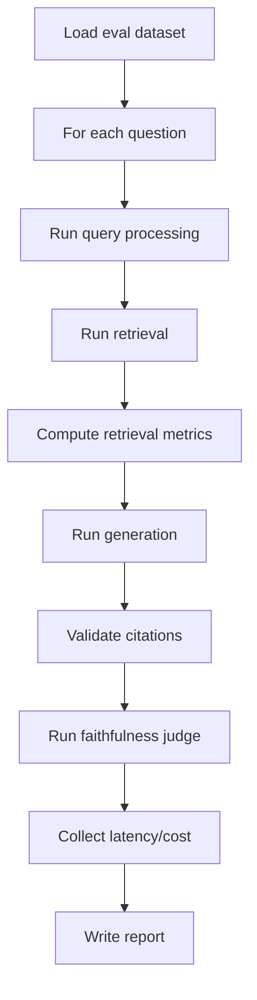

# 11. Evaluation And Benchmarking

Evaluation là phần phân biệt một RAG demo với một RAG system nghiêm túc. Nếu không có evaluation, bạn chỉ đang nhìn vài câu trả lời có vẻ đúng rồi hy vọng hệ thống ổn.

Trong production, RAG phải được đo ở nhiều tầng:

- retrieval có lấy đúng tài liệu không?
- reranker có đẩy đúng chunk lên trên không?
- LLM có trả lời đúng context không?
- citation có đúng nguồn không?
- latency/cost có chấp nhận được không?
- bản deploy mới có làm quality giảm không?

Use case xuyên suốt:

> Internal Knowledge Base RAG cho công ty, gồm HR policies, technical documentation, product documents, FAQ, meeting notes, support tickets và internal wiki.

Trong project hiện tại, chương này map vào:

- `app/evaluation/datasets/sample_eval_set.json`
- `app/evaluation/retrieval_metrics.py`
- `app/evaluation/answer_metrics.py`
- `app/evaluation/hallucination_checker.py`
- `app/evaluation/run_eval.py`
- `app/feedback/`
- `tests/unit/test_retrieval.py`
- `tests/integration/test_chat_flow.py`

## 1. Vì Sao RAG Cần Evaluation Riêng?

RAG không chỉ là LLM. RAG là pipeline gồm nhiều bước:

```text
query processing
  ↓
retrieval
  ↓
reranking
  ↓
context compression
  ↓
prompting
  ↓
generation
  ↓
citation
```

Nếu câu trả lời sai, nguyên nhân có thể ở bất kỳ bước nào.

Ví dụ user hỏi:

```text
Nhân viên thử việc có được nghỉ phép không?
```

Answer sai có thể do:

- parser bỏ mất đoạn "probation employees"
- chunking cắt mất heading "Annual Leave"
- embedding model không match tiếng Việt/Anh tốt
- metadata filter lấy nhầm policy năm cũ
- vector search retrieve sai
- reranker đẩy chunk đúng xuống dưới
- prompt không bắt model bám context
- LLM hallucinate
- citation builder map sai chunk

Evaluation riêng giúp bóc tách lỗi theo tầng.

## 2. Các Loại Evaluation Trong RAG

### 2.1. Retrieval evaluation

Đo hệ thống có retrieve đúng chunks/documents không.

Câu hỏi:

```text
Expected source chunk có nằm trong top-k không?
```

Metrics:

- Recall@k
- Precision@k
- MRR
- nDCG
- Hit rate

### 2.2. Generation evaluation

Đo answer có đúng, đủ, grounded không.

Câu hỏi:

```text
Answer có dựa trên context không?
Answer có trả lời đúng câu hỏi không?
Có hallucination không?
```

Metrics:

- faithfulness
- answer relevance
- factual correctness
- hallucination rate
- citation accuracy

### 2.3. End-to-end evaluation

Đo toàn bộ pipeline từ question đến answer.

Flow:

```text
question
  ↓
retrieve
  ↓
generate
  ↓
judge
  ↓
report
```

Metrics:

- final answer correctness
- groundedness
- citation accuracy
- latency
- cost
- user satisfaction

## 3. Golden Dataset

Golden dataset là tập câu hỏi kiểm thử có expected answer/source được con người xác nhận.

Ví dụ:

```json
{
  "question": "Nhân viên chính thức được nghỉ phép bao nhiêu ngày trong năm 2026?",
  "expected_answer": "Nhân viên chính thức có 14 ngày nghỉ phép mỗi năm.",
  "expected_source_ids": ["hr-policy-2026-v3-c012"],
  "tags": ["hr", "policy", "annual_leave"],
  "difficulty": "easy"
}
```

### Vì sao cần golden dataset?

Để:

- đo baseline
- so sánh trước/sau khi đổi chunking
- so sánh embedding model
- kiểm tra deploy mới có làm quality giảm không
- debug query cụ thể

Không có golden dataset, bạn không biết thay đổi của mình tốt hơn hay chỉ "có vẻ ổn".

## 4. Cách Tạo Golden Dataset

### 4.1. Chọn nguồn câu hỏi

Nguồn câu hỏi tốt:

- câu hỏi user thật
- FAQ nội bộ
- support ticket phổ biến
- policy questions
- runbook troubleshooting
- interview với domain experts

Ví dụ cho Internal KB:

```text
HR:
- Nhân viên chính thức có bao nhiêu ngày nghỉ phép?
- Nhân viên thử việc có được ứng trước ngày phép không?

Engineering:
- ERR_PAYMENT_TIMEOUT xử lý thế nào?
- Order service gọi payment gateway ở bước nào?

Onboarding:
- Nhân viên mới cần làm gì trong tuần đầu?

Support:
- Lỗi deploy backend thường gặp là gì?
```

### 4.2. Gắn expected source

Mỗi câu hỏi nên có:

- expected document IDs
- expected chunk IDs nếu có
- expected answer
- acceptable alternative sources

Example:

```json
{
  "question": "ERR_PAYMENT_TIMEOUT xử lý thế nào?",
  "expected_source_ids": [
    "payment-runbook-v2-c003",
    "order-service-doc-v4-c021"
  ],
  "expected_answer_points": [
    "retry payment callback",
    "check payment gateway status",
    "mark order pending if timeout persists"
  ],
  "tags": ["engineering", "troubleshooting", "payment"]
}
```

### 4.3. Chia độ khó

| Difficulty | Ví dụ |
|---|---|
| easy | câu hỏi match trực tiếp một chunk |
| medium | cần paraphrase/query rewrite |
| hard | cần nhiều nguồn hoặc version/time filter |
| adversarial | prompt injection, permission, no-answer |

### 4.4. Dataset nên version

```text
eval_set_internal_kb_v1.json
eval_set_internal_kb_v2.json
```

Khi docs thay đổi, expected sources có thể thay đổi.

## 5. Synthetic Test Set

Synthetic test set là câu hỏi do LLM hoặc script tạo từ documents.

### Vì sao cần?

Golden dataset human-made chất lượng cao nhưng tốn công. Synthetic giúp tạo coverage nhanh.

Flow:

```text
Select document chunks
  ↓
Ask LLM to generate question-answer-source triples
  ↓
Human review sample
  ↓
Add to eval set as synthetic
```

### Cẩn thận

Synthetic questions có thể:

- quá dễ
- giống wording trong document
- không phản ánh user thật
- expected answer bị LLM bịa

Nên tag:

```json
{
  "source": "synthetic",
  "reviewed": false
}
```

Không nên dùng synthetic chưa review làm gate cứng cho production.

## 6. Human Evaluation

Human evaluation là người thật đánh giá answer.

### Khi nào cần?

- policy/legal/HR quan trọng
- answer nuanced
- citation cần kiểm chứng
- LLM-as-judge không đáng tin hoàn toàn

### Rubric ví dụ

| Score | Ý nghĩa |
|---:|---|
| 5 | đúng, đủ, cite chuẩn |
| 4 | đúng chính, thiếu chi tiết nhỏ |
| 3 | một phần đúng nhưng thiếu/cite yếu |
| 2 | nhiều lỗi |
| 1 | sai hoặc hallucinate |

Fields:

- correctness
- completeness
- faithfulness
- citation quality
- tone/readability

## 7. LLM-As-Judge

LLM-as-judge dùng một LLM khác hoặc cùng model để đánh giá answer.

### Dùng để đo gì?

- faithfulness
- answer relevance
- completeness
- groundedness
- style compliance

### Prompt judge example

```text
You are evaluating a RAG answer.

Question:
{question}

Context:
{context}

Answer:
{answer}

Evaluate:
1. Is the answer supported by the context?
2. Does it answer the question?
3. Are there unsupported claims?

Return JSON:
{
  "faithfulness_score": 0-5,
  "answer_relevance_score": 0-5,
  "unsupported_claims": [],
  "reason": "..."
}
```

### Trade-off

| Ưu điểm | Nhược điểm |
|---|---|
| Scale nhanh | Judge cũng có thể sai |
| Có reasoning | Có bias theo model |
| Hữu ích cho regression | Tốn cost |

Production nên kết hợp:

- rule-based checks
- LLM judge
- human review sample

## 8. Tools: RAGAS, TruLens, DeepEval, LangSmith, LlamaIndex Evaluation

### RAGAS

RAGAS cung cấp metrics như:

- faithfulness
- answer relevancy
- context precision
- context recall

Phù hợp để đánh giá RAG pipeline end-to-end.

### TruLens

Tập trung vào feedback functions và tracing evaluation.

### DeepEval

Hữu ích cho test/eval kiểu CI, có metric và assertion.

### LangSmith

Mạnh nếu dùng LangChain ecosystem:

- traces
- datasets
- evaluations
- prompt/version compare

### LlamaIndex evaluation

Nếu dùng LlamaIndex, có evaluator cho:

- response evaluation
- retrieval evaluation
- faithfulness
- relevancy

Project hiện tại có thể dùng tools này sau, nhưng nên hiểu metrics trước khi phụ thuộc framework.

## 9. Retrieval Metrics

### 9.1. Recall@k

Recall@k đo expected source có nằm trong top-k không.

Ví dụ:

```text
Expected source: chunk_12
Retrieved top 5: chunk_3, chunk_12, chunk_8
Recall@5 = 1
```

Nếu expected có nhiều chunks:

```text
Recall@k = relevant retrieved / total relevant
```

### 9.2. Precision@k

Precision@k đo trong top-k có bao nhiêu chunks relevant.

```text
Precision@5 = relevant chunks in top 5 / 5
```

### 9.3. MRR

MRR là Mean Reciprocal Rank.

Nếu expected chunk đầu tiên nằm rank 1:

```text
RR = 1/1 = 1.0
```

Nếu rank 4:

```text
RR = 1/4 = 0.25
```

MRR trung bình trên nhiều questions.

MRR tốt để đo chunk đúng có lên cao không.

### 9.4. nDCG

nDCG đo ranking quality khi có relevance nhiều mức:

- 3: rất relevant
- 2: relevant
- 1: hơi relevant
- 0: không relevant

Hữu ích khi nhiều chunks có độ liên quan khác nhau.

## 10. Generation Metrics

### 10.1. Context relevance

Context có liên quan đến question không?

Nếu context không liên quan, answer khó đúng.

### 10.2. Faithfulness

Answer có được hỗ trợ bởi context không?

Ví dụ context:

```text
Full-time employees receive 14 days of annual leave.
```

Answer:

```text
Nhân viên chính thức có 20 ngày nghỉ phép.
```

Faithfulness thấp.

### 10.3. Answer relevance

Answer có trả lời đúng câu hỏi không?

Context đúng nhưng answer lan man vẫn score thấp.

### 10.4. Citation accuracy

Citation có trỏ đúng nguồn hỗ trợ claim không?

Checks:

- citation ID tồn tại trong retrieved context
- cited chunk chứa claim
- answer không cite chunk không liên quan

### 10.5. Hallucination rate

Tỷ lệ answer có unsupported claims.

```text
hallucination_rate = hallucinated_answers / total_answers
```

## 11. Latency And Cost Metrics

RAG production không chỉ đo quality.

### Latency

- p50
- p95
- p99

Breakdown:

- query processing latency
- embedding latency
- vector search latency
- BM25 latency
- reranking latency
- LLM latency
- total latency

### Cost

- embedding cost per document
- embedding cost per query
- LLM prompt token cost
- LLM completion token cost
- reranking cost
- vector DB cost

Example:

```json
{
  "request_id": "req_123",
  "prompt_tokens": 1800,
  "completion_tokens": 320,
  "embedding_tokens": 24,
  "llm_cost_usd": 0.0012,
  "embedding_cost_usd": 0.00001,
  "total_cost_usd": 0.00121
}
```

## 12. Evaluation Dataset Format

File example:

```json
[
  {
    "id": "hr_annual_leave_001",
    "question": "Nhân viên chính thức được nghỉ phép bao nhiêu ngày trong năm 2026?",
    "expected_answer": "Nhân viên chính thức có 14 ngày nghỉ phép mỗi năm.",
    "expected_source_ids": ["hr-policy-2026-v3-c012"],
    "tags": ["hr", "policy", "annual_leave"],
    "difficulty": "easy"
  },
  {
    "id": "eng_payment_timeout_001",
    "question": "ERR_PAYMENT_TIMEOUT trong order-service xử lý thế nào?",
    "expected_answer_points": [
      "check payment gateway status",
      "retry callback or reconciliation",
      "keep order pending before final failure"
    ],
    "expected_source_ids": ["payment-runbook-v2-c003"],
    "tags": ["engineering", "runbook", "payment"],
    "difficulty": "medium"
  }
]
```

## 13. Evaluation Pipeline

Flow bắt buộc:

```text
Run test questions
  ↓
Retrieve
  ↓
Compare retrieved chunks with expected chunks
  ↓
Generate answer
  ↓
Judge faithfulness
  ↓
Report metrics
```

Expanded:



## 14. Pseudo-code `run_eval.py`

```python
async def run_eval(dataset_path: str):
    dataset = load_dataset(dataset_path)
    results = []

    for item in dataset:
        start = time.perf_counter()

        retrieved = await retrieval_pipeline.retrieve(
            query=item["question"],
            user_context=eval_user_context(),
        )

        retrieval_scores = compute_retrieval_metrics(
            retrieved_ids=[r.chunk_id for r in retrieved],
            expected_ids=item["expected_source_ids"],
            k_values=[1, 3, 5, 10],
        )

        answer = await answer_generator.generate_non_streaming(
            question=item["question"],
            contexts=retrieved,
            user_context=eval_user_context(),
        )

        citation_score = compute_citation_accuracy(
            citations=answer.citations,
            expected_ids=item["expected_source_ids"],
        )

        faithfulness = await judge_faithfulness(
            question=item["question"],
            contexts=retrieved,
            answer=answer.text,
        )

        results.append({
            "id": item["id"],
            "retrieval": retrieval_scores,
            "citation_accuracy": citation_score,
            "faithfulness": faithfulness,
            "latency_ms": (time.perf_counter() - start) * 1000,
        })

    report = aggregate_results(results)
    save_report(report)
```

## 15. Report Format

Example:

```json
{
  "run_id": "eval_2026_05_27_001",
  "pipeline_version": "rag-v1.4.0",
  "embedding_model": "text-embedding-3-small",
  "embedding_version": "v1",
  "chunking_strategy": "heading_aware_recursive_v2",
  "prompt_version": "internal-kb-rag-v1",
  "metrics": {
    "recall_at_5": 0.86,
    "mrr": 0.71,
    "faithfulness": 0.88,
    "citation_accuracy": 0.82,
    "hallucination_rate": 0.07,
    "latency_p95_ms": 3200,
    "cost_per_query_usd": 0.0014
  },
  "failures": [
    {
      "question_id": "eng_payment_timeout_001",
      "reason": "expected source missing from top 10"
    }
  ]
}
```

## 16. Regression Testing

Regression testing kiểm tra thay đổi mới có làm chất lượng giảm không.

Thay đổi có thể là:

- đổi chunking strategy
- đổi embedding model
- đổi reranker
- đổi prompt
- đổi query rewriting
- đổi metadata filters

### CI/CD gate example

Không deploy nếu:

```text
Recall@5 giảm > 3%
Faithfulness giảm > 5%
Hallucination rate tăng > 2%
Citation accuracy < 80%
Latency p95 tăng > 30%
```

### Baseline compare

```text
main branch eval report
vs
current PR eval report
```

## 17. Online Evaluation And Feedback

Offline eval không đủ. Cần feedback từ user thật.

Project hiện tại có:

- `app/feedback/models.py`
- `app/feedback/service.py`
- `app/feedback/repository.py`

Feedback nên lưu:

- message_id
- rating
- comment
- retrieved chunk ids
- model/prompt version
- user role/tenant
- timestamp

Example:

```json
{
  "message_id": "msg_123",
  "rating": -1,
  "comment": "Câu trả lời dùng policy cũ",
  "retrieved_chunk_ids": ["hr-policy-2024-c007"],
  "prompt_version": "internal-kb-rag-v1",
  "retrieval_pipeline_version": "hybrid-v2"
}
```

Feedback giúp:

- tạo eval cases mới
- tìm query fail nhiều
- ưu tiên cải thiện retrieval
- phát hiện stale docs

## 18. Benchmarking Experiments

Khi cải thiện RAG, cần benchmark có kiểm soát.

### Example experiment: chunking

Compare:

- recursive 512/64
- heading-aware 700/100
- parent-child

Metrics:

- Recall@5
- MRR
- final answer faithfulness
- avg chunks per document
- embedding cost

### Example experiment: embedding model

Compare:

- OpenAI small
- OpenAI large
- BGE-M3 local

Metrics:

- multilingual query recall
- latency
- cost
- dimension/storage

### Example experiment: reranker

Compare:

- no reranker
- bge-reranker
- Cohere rerank
- LLM reranker

Metrics:

- MRR
- citation accuracy
- rerank latency
- cost

## 19. Error Analysis

Sau eval, không chỉ nhìn aggregate score. Cần xem failures.

Failure categories:

- parse failure
- chunking issue
- embedding miss
- metadata filter issue
- permission filter issue
- query rewrite issue
- reranker issue
- prompt issue
- citation issue
- stale document

Example:

```json
{
  "question_id": "hr_leave_probation_001",
  "failure_category": "chunking_issue",
  "detail": "Expected clause was split without section heading, retrieval ranked it low."
}
```

Error analysis giúp biết sửa gì.

## 20. Production Evaluation Checklist

- Có golden dataset.
- Dataset có expected source IDs.
- Dataset có tags/difficulty.
- Có retrieval metrics: Recall@k, Precision@k, MRR, nDCG.
- Có generation metrics: faithfulness, answer relevance, citation accuracy.
- Có latency/cost metrics.
- Có evaluation report versioned.
- Có pipeline/model/prompt/chunking version trong report.
- Có regression comparison.
- Có CI gate cho quality.
- Có human review cho cases quan trọng.
- Có user feedback loop.
- Có failure categorization.
- Có eval cases cho permission và prompt injection.
- Có no-answer test cases.

## 21. Gợi Ý Mở Rộng Project Hiện Tại

### 21.1. `sample_eval_set.json`

Mở rộng từ placeholder thành:

```json
[
  {
    "id": "hr_001",
    "question": "Nhân viên chính thức được nghỉ phép bao nhiêu ngày?",
    "expected_answer": "14 ngày",
    "expected_source_ids": ["hr-policy-2026-v3-c012"],
    "tags": ["hr", "policy"]
  }
]
```

### 21.2. `retrieval_metrics.py`

Thêm:

- recall_at_k
- precision_at_k
- mrr
- ndcg

### 21.3. `answer_metrics.py`

Thêm:

- citation_accuracy
- exact/semantic answer checks
- LLM judge wrapper

### 21.4. `run_eval.py`

Biến thành CLI:

```powershell
poetry run python -m app.evaluation.run_eval --dataset app/evaluation/datasets/internal_kb_eval.json
```

### 21.5. CI

Sau này thêm GitHub Actions:

```text
run unit tests
run eval subset
fail if metrics below threshold
```

## 22. Tóm Tắt Chương

Evaluation là feedback loop kỹ thuật của RAG. Không có evaluation, bạn không biết hệ thống tốt hay xấu, và mỗi lần đổi chunking/model/prompt đều là đánh bạc.

RAG production cần đo:

- retrieval quality
- generation faithfulness
- citation accuracy
- hallucination rate
- latency
- cost
- regression before deploy

Chương tiếp theo sẽ đi vào observability và monitoring: làm sao log, trace, đo token/cost/latency cho từng request RAG.
