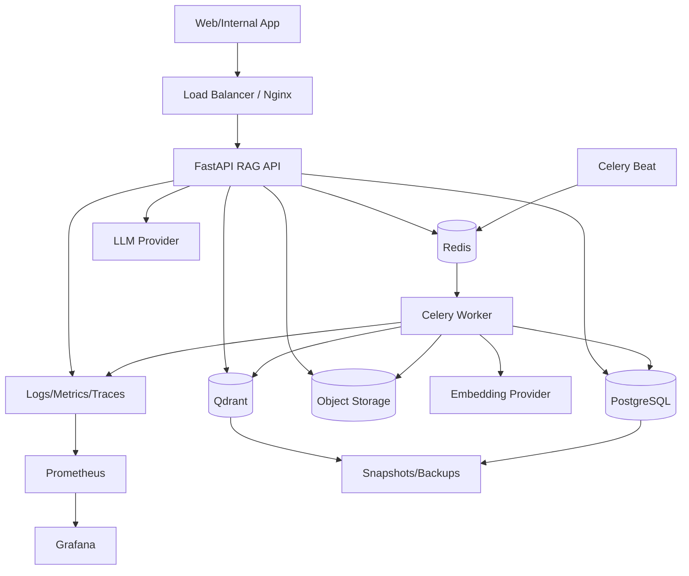

# 16. Production Deployment

Deployment của RAG khác một API CRUD thông thường vì nó có nhiều thành phần stateful và workload khác nhau: API realtime, worker ingestion, PostgreSQL metadata, Redis queue/cache, vector database, object storage, LLM provider và monitoring.

Use case xuyên suốt:

> Internal Knowledge Base RAG cho công ty, gồm HR policies, technical documentation, product documents, FAQ, meeting notes, support tickets và internal wiki.

Trong project hiện tại, chương này map vào:

- `compose.yml`
- `compose.observability.yml`
- `infra/docker/Dockerfile.api` (shared runtime image for API and workers)
- `infra/nginx/nginx.conf`
- `app/main.py`
- `app/jobs/celery_app.py`
- `app/api/v1/routes_health.py`

## 1. Deployment Architecture

Production RAG deployment thường có:

```text
FastAPI RAG API
Celery/RQ ingestion worker
PostgreSQL metadata DB
Redis queue/cache
Qdrant vector DB
Object Storage
Message Queue
Prometheus/Grafana monitoring
External LLM/Embedding provider
```

Sơ đồ:



## 2. Local Docker Compose

Local Docker Compose phù hợp:

- học
- dev
- demo
- integration test nhỏ

Project hiện tại đã có:

```yaml
services:
  api:
  worker:
  beat:
  postgres:
  redis:
  qdrant:
  seaweedfs:
  prometheus: # via compose.observability.yml
  grafana:    # via compose.observability.yml
```

### Concept compose

```yaml
services:
  api:
    build:
      context: .
      dockerfile: infra/docker/Dockerfile.api
    ports:
      - "8000:8000"
    env_file: .env
    depends_on:
      - postgres
      - redis
      - qdrant
    command: uvicorn app.main:app --host 0.0.0.0 --port 8000

  worker:
    build:
      context: .
      dockerfile: infra/docker/Dockerfile.api
    env_file: .env
    depends_on:
      - redis
      - postgres
      - qdrant
    command: celery -A app.jobs.celery_app worker --loglevel=info

  postgres:
    image: postgres:16

  redis:
    image: redis:7-alpine

  qdrant:
    image: qdrant/qdrant:latest

  seaweedfs:
    image: chrislusf/seaweedfs:latest
```

Trong project này, `postgres:16` là metadata DB. Qdrant là vector DB chính. Không dùng `pgvector/pgvector:pg16` mặc định để tránh mơ hồ embeddings nằm ở đâu.

### Local checklist

- `.env` không commit.
- Volumes persistent cho Postgres/Qdrant.
- SeaweedFS/S3-compatible object storage sẵn sàng cho raw PDFs.
- Prometheus/Grafana overlay chạy được khi cần quan sát.
- Health endpoint chạy.
- Migrations chạy được.
- Worker connect Redis được.
- Qdrant reachable.

## 3. Single VM Deployment

Single VM phù hợp:

- MVP production nhỏ
- internal company tool ít traffic
- team nhỏ
- muốn vận hành đơn giản

Architecture:

```text
1 VM
  Docker Compose
  Nginx
  API container
  worker container
  beat container
  PostgreSQL container or managed DB
  Redis container
  Qdrant container
```

### Ưu điểm

- đơn giản
- rẻ
- dễ debug

### Nhược điểm

- scale hạn chế
- single point of failure
- backup phải làm kỹ
- VM down là service down

### Khuyến nghị

Nếu dùng single VM production:

- dùng managed PostgreSQL nếu có thể
- backup Qdrant snapshot ra object storage
- monitor disk/memory
- TLS với Nginx
- restart policy

## 4. Cloud Managed Services

Managed services giảm vận hành.

Options:

- Managed PostgreSQL
- Managed Redis
- Qdrant Cloud / Pinecone / Weaviate Cloud
- S3/GCS object storage
- Cloud Run/ECS/App Service for API
- Managed Kubernetes

### Ưu điểm

- backup/replication dễ hơn
- scale tốt hơn
- ít maintenance

### Nhược điểm

- cost cao hơn
- vendor lock-in
- network/security config phức tạp

## 5. Kubernetes

Kubernetes phù hợp khi:

- traffic lớn
- cần autoscaling
- nhiều workers
- nhiều environments
- team có DevOps/SRE

### Components

```text
Deployment: rag-api
Deployment: rag-worker
Deployment: rag-beat
StatefulSet or managed: postgres
StatefulSet or managed: redis
StatefulSet or managed: qdrant
Ingress: nginx/controller
ConfigMap: non-secret config
Secret: API keys/passwords
HPA: API/worker autoscaling
CronJob: backups/evals
```

### Liveness/readiness

API readiness:

- app started
- DB reachable
- Redis reachable
- Qdrant reachable

Worker readiness:

- Redis reachable
- DB reachable
- can import app

## 6. Serverless

Serverless can work for parts:

- API lightweight
- scheduled eval jobs
- document upload trigger

But RAG has challenges:

- long-running ingestion
- large file parsing
- model warmup
- vector DB connections
- streaming responses

Use serverless carefully. For production RAG, containerized API + workers is often easier.

## 7. Horizontal Scaling API

FastAPI API can scale horizontally:

```text
api replica 1
api replica 2
api replica 3
```

Requirements:

- stateless API
- sessions/chat stored in DB
- cache in Redis
- shared vector DB
- shared object storage

Do not store request state in local memory if multiple replicas.

## 8. Worker Scaling

Workers scale by adding replicas:

```text
worker replica 1
worker replica 2
worker replica 3
```

Useful for:

- embedding many chunks
- parsing documents
- OCR
- indexing

### Controls

- concurrency limit
- provider rate limit
- queue priority
- max job retries
- memory limits

Do not scale workers blindly. Too many workers can hit LLM/embedding rate limits or overload Qdrant.

## 9. Vector DB Scaling

Qdrant scaling concerns:

- collection size
- memory
- HNSW index overhead
- query QPS
- metadata filtering
- replication/sharding

Start:

- one Qdrant instance for dev/small prod

Scale:

- more resources
- snapshots
- replication
- sharding
- managed Qdrant if team is small

## 10. Queue-Based Ingestion

Ingestion should be queue-based:

```text
Upload endpoint returns job_id
  ↓
Redis queue
  ↓
Celery worker
  ↓
job status endpoint
```

Benefits:

- no request timeout
- retry
- backpressure
- worker scaling
- DLQ

## 11. Health Checks

### Basic health

```text
GET /api/v1/health
```

Return:

```json
{"status": "ok"}
```

### Readiness health

Should check:

- PostgreSQL
- Redis
- Qdrant
- config loaded

Example:

```json
{
  "status": "ready",
  "checks": {
    "postgres": "ok",
    "redis": "ok",
    "qdrant": "ok"
  }
}
```

### Liveness

Checks process alive. Do not make liveness too strict or Kubernetes will restart healthy-but-dependent services unnecessarily.

## 12. Backup/Restore

### PostgreSQL

Backup:

- documents metadata
- users/workspaces
- chat history
- feedback
- job status
- evaluation reports

### Qdrant

Backup:

- vectors
- payload metadata
- collection config

Use snapshots.

### Object storage

Backup:

- raw files
- extracted text
- cleaned text

### Restore drill

Production backup is not real until tested.

Monthly restore test:

```text
restore Postgres snapshot
restore Qdrant snapshot
restore object storage sample
run smoke retrieval query
verify citations
```

## 13. Environment Configuration

Use `.env` for local only.

Production:

- secret manager
- environment variables
- config maps
- no hardcoded secrets

Important config:

```text
POSTGRES_URL
REDIS_URL
QDRANT_URL
QDRANT_COLLECTION_NAME
EMBEDDING_MODEL
EMBEDDING_DIM
LLM_PROVIDER
LLM_MODEL
SECRET_KEY
```

Startup should validate config.

## 14. Deployment Strategy

### Rolling deploy

Deploy new API replicas gradually.

Works for:

- API changes
- prompt changes
- retrieval logic changes if backward compatible

### Blue/green

Useful for:

- embedding model change
- vector collection re-index
- major retrieval pipeline change

### Canary

Route small traffic percentage to new pipeline:

```text
5% traffic -> rag-v2
95% traffic -> rag-v1
```

Compare:

- latency
- feedback
- eval
- error rate

## 15. Migrations

Project uses Alembic.

Deployment flow:

```text
build image
run tests
run alembic upgrade head
deploy API/worker
```

Migration safety:

- backward compatible DB changes
- avoid dropping columns before old code gone
- large migrations outside peak hours
- backup before migration

## 16. Production Dockerfile Notes

Current Dockerfiles are fine for scaffold, but production can improve:

- pin Poetry version
- use lock file
- install without dev dependencies
- run as non-root
- add healthcheck
- smaller image
- avoid installing build tools in final image

## 17. Monitoring Stack

Minimum:

- structured logs
- metrics
- uptime checks

Better:

- OpenTelemetry traces
- Prometheus
- Grafana
- Loki/ELK
- Sentry or error tracker
- RAG-specific trace dashboard

## 18. Production Checklist

- API and worker containers separate.
- Ingestion async via queue.
- PostgreSQL persistent/managed.
- Redis persistent enough for queue/cache.
- Qdrant persistent volume or managed.
- Object storage for raw files.
- `.env` not used as production secret storage.
- Health/readiness checks.
- Alembic migrations in deploy flow.
- Backups for Postgres/Qdrant/object storage.
- Restore drill tested.
- API horizontally scalable.
- Worker concurrency controlled.
- Rate limits configured.
- Monitoring and alerts configured.
- TLS enabled.
- Rollback plan exists.

## 19. Tóm Tắt Chương

Production deployment của RAG cần xem hệ thống như nhiều service phối hợp:

```text
API realtime
workers async
metadata DB
vector DB
queue/cache
object storage
LLM providers
monitoring
```

Hãy bắt đầu bằng Docker Compose, lên single VM/managed services cho MVP, rồi Kubernetes khi thật sự cần scale và team đủ khả năng vận hành.

Chương tiếp theo sẽ đi vào CI/CD và DevOps: làm sao kiểm tra code, eval RAG, build image, deploy staging/production và rollback.
