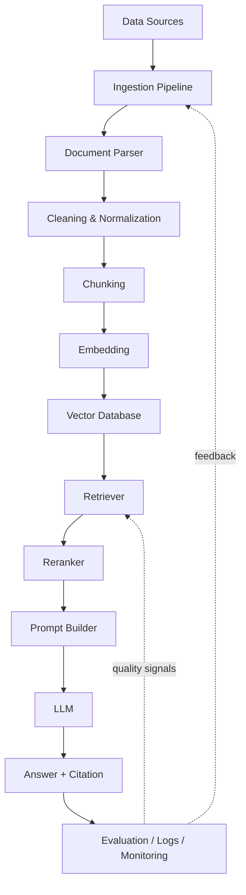

# Advanced RAG Production Guide

Bộ tài liệu này dùng để học và triển khai một hệ thống **Advanced RAG System Production-Grade** dựa trên project hiện tại: `professional-rag-platform`.

Project hiện tại đã có nền móng phù hợp để học theo tài liệu này:

- `app/ingestion/`: pipeline đọc, làm sạch, chunk tài liệu.
- `app/indexing/`: embedding provider, vector store, indexer.
- `app/retrieval/`: vector retrieval, keyword retrieval, hybrid retrieval, reranking.
- `app/generation/`: prompt builder, LLM client, streaming, citation.
- `app/jobs/`: Celery worker, ingestion job, cleanup job.
- `app/core/`: config, security, logging, exception, middleware.
- `app/db/`: SQLAlchemy async session, model base, Alembic migration.
- `compose.yml`: PostgreSQL metadata DB, Redis, Qdrant, SeaweedFS, API, worker, beat.
- `compose.observability.yml`: Prometheus, Grafana, Postgres exporter, Redis exporter.

Use case xuyên suốt toàn bộ guide là:

> **Internal Knowledge Base RAG cho công ty**

Dữ liệu ví dụ:

- HR policies
- Technical documentation
- Product documents
- FAQ
- Meeting notes
- Support tickets
- Internal wiki

Ví dụ câu hỏi người dùng:

- "Chính sách nghỉ phép năm nay là gì?"
- "Service order xử lý payment như thế nào?"
- "Quy trình onboarding nhân viên mới ra sao?"
- "Có lỗi nào thường gặp khi deploy backend không?"

Mục tiêu của guide không phải là biết vài khái niệm RAG trên bề mặt. Mục tiêu là hiểu cách một backend engineer có thể thiết kế, debug, vận hành, đo chất lượng và scale một hệ thống RAG thật.

## Cây Thư Mục Tài Liệu

```text
advanced-rag-production-guide/
|-- README.md
|   Bản đồ tổng quan của toàn bộ guide, giải thích RAG là gì, vì sao cần RAG,
|   kiến trúc tổng quan, stack đề xuất và cách học theo từng phần.
|
|-- 01-rag-overview-and-architecture.md
|   Kiến trúc RAG end-to-end: offline ingestion, online query, read path,
|   write path, data plane, control plane, monolith, microservices,
|   event-driven ingestion và multi-tenant RAG.
|
|-- 02-ingestion-pipeline.md
|   Data connectors, file upload, job queue, retry, DLQ, idempotency,
|   deduplication, document versioning, incremental indexing.
|
|-- 03-document-parsing-and-cleaning.md
|   Parse PDF, DOCX, HTML, Markdown, CSV, Excel, PowerPoint, OCR;
|   xử lý layout, table, header/footer, encoding, corrupted files.
|
|-- ../chunking/04-chunking-strategy.md
|   Chunking đã được tách sang docs/chunking để gom riêng toàn bộ tài liệu
|   về chunk size, overlap, sentence/paragraph/heading-aware chunking,
|   semantic chunking, parent-child, small-to-big retrieval, late chunking.
|
|-- 05-embedding-and-vectorization.md
|   Embedding, vector representation, similarity metrics, model selection,
|   batch embedding, embedding cache, versioning, re-index strategy.
|
|-- 06-vector-database-and-indexing.md
|   Vector DB, ANN search, HNSW, IVF, PQ, metadata filtering, pgvector,
|   Qdrant, Weaviate, Milvus, Pinecone, Chroma, backup, sharding.
|
|-- 07-retrieval-strategies.md
|   Similarity search, top-k, metadata filtering, BM25, hybrid search,
|   dense/sparse retrieval, parent retriever, graph retrieval, permission-aware retrieval.
|
|-- 08-query-processing-and-rewriting.md
|   Query normalization, language detection, spell correction, query expansion,
|   multi-query, HyDE, intent classification, metadata/time filter extraction.
|
|-- 09-reranking-and-context-compression.md
|   Cross-encoder reranker, LLM reranker, Cohere rerank, bge-reranker,
|   ColBERT, context compression, MMR, lost in the middle.
|
|-- 10-generation-pipeline.md
|   Prompt builder, context injection, citation format, refusal policy,
|   source-grounded answer, structured output, post-generation validation.
|
|-- 11-evaluation-and-benchmarking.md
|   Golden dataset, retrieval metrics, generation metrics, RAGAS,
|   LLM-as-judge, latency, cost, regression evaluation.
|
|-- 12-observability-and-monitoring.md
|   Logs, metrics, traces, prompt logs, retrieval logs, token usage,
|   cost tracking, feedback, OpenTelemetry, Prometheus, Grafana.
|
|-- 13-security-and-permission-control.md
|   Document permission, chunk metadata ACL, tenant isolation, PII masking,
|   prompt injection defense, audit log, encryption.
|
|-- 14-caching-and-performance-optimization.md
|   Query cache, embedding cache, retrieval cache, rerank cache,
|   semantic cache, invalidation, Redis key design.
|
|-- 15-cost-optimization.md
|   Embedding cost, LLM token cost, reranking cost, vector DB cost,
|   batch processing, deduplication, smaller models, context limit.
|
|-- 16-production-deployment.md
|   Docker Compose, single VM, managed cloud, Kubernetes, health checks,
|   scaling, backup/restore, deployment architecture.
|
|-- 17-ci-cd-and-devops.md
|   Lint, tests, RAG evaluation gate, Docker build, security scan,
|   deploy staging, smoke test, production, rollback.
|
|-- 18-testing-strategy.md
|   Unit, integration, parser, chunking, embedding, retrieval, prompt,
|   golden answer, load, security, prompt injection tests.
|
|-- 19-failure-handling-and-reliability.md
|   Embedding failure, LLM timeout, vector DB unavailable, parse failure,
|   queue backlog, retry storm, circuit breaker, DLQ.
|
|-- 20-advanced-rag-patterns.md
|   Hybrid RAG, Corrective RAG, Self-RAG, Adaptive RAG, Graph RAG,
|   multi-hop, multi-vector, parent-child, RAG + SQL, RAG + tools.
|
|-- 21-agentic-rag-and-tool-use.md
|   Agentic RAG, planner, tool calling, retriever as tool, SQL tool,
|   human approval, guardrails, cost and latency warning.
|
|-- 22-project-implementation-roadmap.md
|   Roadmap triển khai theo phase từ Basic RAG đến production deployment.
|
`-- 23-checklists-and-interview-notes.md
    Checklist tổng hợp, production readiness, câu hỏi phỏng vấn và lỗi thường gặp.
```

## Cách Học Theo Từng Phần

Guide này nên học theo thứ tự, vì mỗi chương xây trên chương trước:

1. **Nắm kiến trúc**: đọc `README.md` và `01`.
2. **Hiểu write path**: đọc ingestion, parsing, rồi sang `../chunking/` để đọc chunking.
3. **Hiểu index layer**: đọc embedding và vector DB.
4. **Hiểu read path**: đọc retrieval, query rewriting, reranking, generation.
5. **Làm production**: đọc evaluation, observability, security, caching, cost, deployment.
6. **Nâng cấp hệ thống**: đọc advanced patterns, agentic RAG, roadmap, checklist.

Trong project hiện tại, mỗi phần sẽ map vào code như sau:

| Chủ đề | Module trong project hiện tại | Vai trò |
|---|---|---|
| Ingestion | `app/ingestion/`, `app/jobs/ingestion_jobs.py` | Xử lý tài liệu bất đồng bộ |
| Parsing | `app/ingestion/loaders/` | Đọc PDF, DOCX, HTML, Markdown |
| Chunking | `app/ingestion/chunkers/` | Cắt tài liệu thành chunk phù hợp |
| Embedding | `app/indexing/embedding_provider.py` | Biến text thành vector |
| Vector DB | `app/indexing/qdrant_store.py` | Qdrant là vector DB chính và mặc định |
| Retrieval | `app/retrieval/` | Tìm context liên quan |
| Generation | `app/generation/` | Prompt, LLM streaming, citation |
| Chat API | `app/chat/`, `app/api/v1/routes_chat.py` | Giao diện hỏi đáp |
| Observability | `app/core/logger.py`, `app/core/middlewares/` | Log, request ID, timing |
| Security | `app/auth/`, `app/core/security.py` | JWT, user, permission nền tảng |
| Background jobs | `app/jobs/` | Celery worker, retry, cleanup |

Architecture decision của project hiện tại:

```text
PostgreSQL = metadata database
Qdrant     = primary vector database
Redis      = queue/cache
SeaweedFS/S3 = object storage
Prometheus + Grafana = observability
```

Vì vậy compose mặc định dùng `postgres:16`. `pgvector` chỉ còn là kiến thức so sánh trong guide, không phải foundation của project.

## RAG Là Gì?

RAG là viết tắt của **Retrieval-Augmented Generation**.

Hiểu đơn giản, RAG là cách làm cho LLM trả lời dựa trên tài liệu thật thay vì chỉ dựa vào trí nhớ đã được huấn luyện sẵn.

Flow cơ bản:

```text
User question
  ↓
Retrieve relevant knowledge
  ↓
Inject context into prompt
  ↓
LLM generates grounded answer
```

Ví dụ:

Người dùng hỏi:

```text
Chính sách nghỉ phép năm nay là gì?
```

Nếu chỉ gọi LLM API thông thường, LLM không biết tài liệu nội bộ của công ty bạn. Nó có thể trả lời kiểu chung chung:

```text
Thông thường nhân viên có 12 ngày nghỉ phép mỗi năm...
```

Nhưng câu trả lời đó có thể sai với công ty bạn.

Với RAG, hệ thống sẽ:

1. Tìm trong kho tài liệu nội bộ các chunk liên quan đến "nghỉ phép".
2. Lấy đúng đoạn trong HR policy năm hiện tại.
3. Đưa đoạn đó vào prompt.
4. Yêu cầu LLM chỉ trả lời dựa trên context.
5. Trả lời kèm citation đến tài liệu nguồn.

Kết quả mong muốn:

```text
Theo tài liệu HR Policy 2026, nhân viên chính thức có 14 ngày nghỉ phép/năm.
Nhân viên thử việc không được ứng trước phép năm. [Source: hr-policy-2026, chunk-12]
```

Điểm cốt lõi: **RAG không làm LLM thông minh hơn bằng cách huấn luyện lại model. RAG làm LLM có dữ liệu đúng vào đúng thời điểm trả lời.**

## RAG Khác Gì Với Chỉ Gọi LLM API?

| Tiêu chí | Chỉ gọi LLM API | RAG |
|---|---|---|
| Dữ liệu nội bộ | Không biết nếu chưa nằm trong training data | Có thể dùng tài liệu private/internal |
| Knowledge cutoff | Bị giới hạn bởi model | Có thể cập nhật bằng index tài liệu mới |
| Citation | Thường không có nguồn thật | Có thể trích dẫn document/chunk |
| Hallucination | Dễ xảy ra khi thiếu context | Giảm nếu retrieval và prompt grounding tốt |
| Cập nhật tri thức | Khó, thường cần fine-tune hoặc prompt dài | Re-index tài liệu là đủ trong nhiều trường hợp |
| Permission | Không có sẵn | Có thể filter theo tenant/user/role/document |
| Debug | Khó biết model dựa vào đâu | Có thể xem retrieved chunks, score, prompt, citation |

Ví dụ trong Internal Knowledge Base:

- Không RAG: "Service order xử lý payment như thế nào?" → LLM đoán theo kiến thức chung.
- Có RAG: hệ thống retrieve `technical-docs/order-service-payment.md`, lấy đúng section payment state machine, rồi mới sinh câu trả lời.

## Vì Sao Cần RAG?

### 1. LLM không biết dữ liệu private/internal

LLM public không tự biết:

- HR policy của công ty bạn.
- Internal wiki.
- Meeting notes.
- Support ticket nội bộ.
- Runbook deploy backend.
- Tài liệu sản phẩm chưa public.

Đây là lý do phổ biến nhất để dùng RAG trong doanh nghiệp.

### 2. LLM có knowledge cutoff

Model có thể không biết tài liệu vừa cập nhật hôm qua. RAG giải quyết bằng cách tách tri thức thành một index bên ngoài:

```text
New document
  ↓
Ingestion
  ↓
Vector index updated
  ↓
LLM can answer using latest context
```

### 3. LLM dễ hallucinate nếu thiếu grounding

Hallucination trong RAG thường đến từ 3 nguyên nhân:

- Không retrieve được context đúng.
- Retrieve được context nhưng prompt không ép model bám nguồn.
- Context bị nhiễu, mâu thuẫn, hoặc quá dài.

RAG production-grade không chỉ là "gắn vector DB vào LLM". Nó cần retrieval tốt, reranking, citation verification, evaluation và monitoring.

### 4. Không thể fine-tune cho mọi dữ liệu thay đổi liên tục

Fine-tuning phù hợp khi muốn model học style, format, domain behavior. Nhưng nếu tài liệu thay đổi liên tục, fine-tune không phải cách cập nhật tri thức tốt nhất.

Ví dụ:

- HR policy cập nhật mỗi quý.
- Product docs thay đổi theo release.
- Support ticket phát sinh hằng ngày.

Với RAG, ta chỉ cần re-ingest hoặc incremental index tài liệu thay đổi.

### 5. Cần trích dẫn nguồn

Trong doanh nghiệp, người dùng thường hỏi:

```text
Câu này dựa vào tài liệu nào?
```

RAG cho phép trả lời kèm:

- `document_id`
- `chunk_id`
- file name
- page number
- section heading
- version
- timestamp

### 6. Cần kiểm soát câu trả lời theo tài liệu thật

RAG giúp xây rule:

- Nếu context không có câu trả lời → nói không biết.
- Nếu có nhiều nguồn mâu thuẫn → báo có mâu thuẫn và liệt kê nguồn.
- Nếu user không có quyền → không retrieve tài liệu private.
- Nếu document có prompt injection → không cho nội dung tài liệu ghi đè system instruction.

## Kiến Trúc Tổng Quan RAG Production-Grade

Một RAG production-grade thường có hai pipeline chính:

- **Offline ingestion pipeline**: xử lý tài liệu trước, tạo index.
- **Online query pipeline**: xử lý câu hỏi realtime, retrieve context, gọi LLM.

Sơ đồ tổng quan:



Trong project hiện tại:

- `Data Sources`: upload file, internal docs, sau này có thể thêm Notion/Confluence/Google Drive.
- `Ingestion Pipeline`: `app/ingestion/pipeline.py`.
- `Parser`: `app/ingestion/loaders/`.
- `Cleaning`: `app/ingestion/cleaners/text_cleaner.py`.
- `Chunking`: `app/ingestion/chunkers/`.
- `Embedding`: `app/indexing/embedding_provider.py`.
- `Vector Database`: `app/indexing/qdrant_store.py`.
- `Retriever`: `app/retrieval/vector_retriever.py`, `keyword_retriever.py`, `hybrid_retriever.py`.
- `Reranker`: `app/retrieval/reranker.py`.
- `Prompt Builder`: `app/generation/prompt_builder.py`.
- `LLM`: `app/generation/llm_client.py`, hiện bạn đã test Gemini bằng `test_gemini.py`.
- `Answer + Citation`: `app/generation/answer_generator.py`, `citation_builder.py`.
- `Logs/Monitoring`: `app/core/logger.py`, `request_id.py`, `timing.py`.

## Basic RAG Vs Advanced RAG

| Nhóm | Basic RAG | Advanced RAG Production-Grade |
|---|---|---|
| Ingestion | Load document thủ công | Async ingestion, job queue, retry, DLQ |
| Parsing | Extract text đơn giản | Preserve layout, table, metadata, OCR fallback |
| Cleaning | Gần như không có | Remove boilerplate, normalize, deduplicate |
| Chunking | Fixed-size chunk | Metadata-aware, heading-aware, semantic, parent-child |
| Embedding | Embed tất cả text | Batch embedding, cache, versioning, re-index strategy |
| Retrieval | Similarity search top-k | Hybrid BM25 + vector, filters, multi-stage retrieval |
| Query | Dùng raw query | Rewrite, expand, HyDE, classify intent, extract filters |
| Reranking | Không có | Cross-encoder/LLM rerank, MMR, diversity selection |
| Context | Nhét top-k vào prompt | Context compression, token budgeting, ordering |
| Generation | Prompt đơn giản | Grounded prompt, refusal policy, citation verification |
| Evaluation | Test thủ công | Golden dataset, recall@k, faithfulness, regression gate |
| Observability | Log lỗi chung | Trace từng step, token, cost, latency, retrieved chunks |
| Security | Auth cơ bản | Tenant isolation, permission filtering, prompt injection defense |
| Caching | Không có | Query/embedding/retrieval/rerank/semantic cache |
| Deployment | Local script | Docker/Kubernetes, workers, monitoring, backup |

Basic RAG phù hợp để demo. Advanced RAG cần thiết khi:

- Nhiều người dùng.
- Nhiều tenant/phòng ban.
- Dữ liệu cập nhật thường xuyên.
- Cần audit nguồn.
- Cần giảm hallucination có hệ thống.
- Cần đo chất lượng trước khi deploy.
- Cần scale ingestion và query.

## Tech Stack Đề Xuất

### Stack dễ học

Stack này hợp với project hiện tại của bạn:

| Thành phần | Gợi ý | Vì sao |
|---|---|---|
| Language | Python | Ecosystem RAG/LLM mạnh, nhiều SDK chính chủ |
| API | FastAPI | Async tốt, dễ viết REST/SSE, hợp ML service |
| RAG framework | LlamaIndex hoặc LangChain | Nhiều component có sẵn để học nhanh |
| Vector DB | Qdrant hoặc Chroma | Dễ chạy local, API rõ, phù hợp prototype |
| Metadata DB | PostgreSQL | Lưu users, documents, jobs, chat history |
| Queue/cache | Redis | Celery broker, cache, rate limit |
| LLM | Gemini / OpenAI / local model | Dễ test từ API, sau này thay bằng abstraction |
| Dev env | Docker Compose | Chạy API, worker, DB, Redis, Qdrant cùng lúc |

Với project hiện tại, stack đang đi theo hướng:

```text
FastAPI
  + PostgreSQL
  + Redis
  + Qdrant
  + Celery
  + Gemini/OpenAI-compatible LLM layer
```

### Stack production hơn

| Thành phần | Gợi ý |
|---|---|
| API | Python FastAPI |
| Pipeline | Custom pipeline với LlamaIndex/LangChain component chọn lọc |
| Vector DB | Qdrant / Weaviate / Milvus / Pinecone |
| Metadata DB | PostgreSQL |
| Cache | Redis |
| Queue | Kafka / RabbitMQ / Redis Queue / Celery |
| Worker | Celery / RQ / custom worker service |
| Object storage | SeaweedFS / S3 / GCS |
| Observability | OpenTelemetry, Prometheus, Grafana, Loki/ELK |
| RAG tracing | LangSmith / Phoenix / Arize / custom trace table |
| Deployment | Docker, Kubernetes |
| CI/CD | GitHub Actions |

Production thường không nên phụ thuộc hoàn toàn vào framework magic. Framework tốt để học và tăng tốc, nhưng các boundary quan trọng nên rõ:

- Parser interface.
- Chunker interface.
- Embedding provider interface.
- Vector store interface.
- Retriever interface.
- Reranker interface.
- LLM client interface.
- Evaluation runner.

Project hiện tại đã đi đúng hướng này vì có các abstraction như:

- `BaseLoader`
- `BaseChunker`
- `EmbeddingProvider`
- `VectorStore`
- `LLMClient`

## Vì Sao Python Hợp Với RAG Hơn Java/Spring Boot Ở Giai Đoạn Đầu?

Python hợp hơn ở giai đoạn đầu vì:

- SDK LLM và RAG thường ra Python trước.
- LlamaIndex, LangChain, sentence-transformers, RAGAS, DeepEval, TruLens đều mạnh ở Python.
- Xử lý document parsing, embedding, ML model local thuận tiện hơn.
- FastAPI đủ tốt cho API production nếu thiết kế đúng.
- Dễ thử nghiệm retrieval/chunking/evaluation nhanh.

Nhưng Java/Spring Boot vẫn rất tốt nếu công ty đã có backend Java. Cách tích hợp khuyến nghị:

```text
Java/Spring Boot main backend
  ↓ REST/gRPC
Python RAG service
  ↓
Vector DB / PostgreSQL / Redis / LLM provider
```

Java nên giữ vai trò:

- User management.
- Business workflow.
- Payment/order/core domain.
- Enterprise integration.

Python RAG service nên giữ vai trò:

- Ingestion.
- Embedding.
- Retrieval.
- Reranking.
- Prompting.
- LLM orchestration.
- RAG evaluation.

Cách tách này giúp backend chính ổn định, còn RAG service linh hoạt để đổi model, đổi chunking, đổi vector DB.

## Nguyên Tắc Production-Grade Cần Nhớ

### 1. Không tin retrieval nếu chưa đo

Đừng chỉ nhìn câu trả lời có vẻ đúng. Cần đo:

- Có retrieve đúng chunk không?
- Top-k có chứa expected source không?
- Reranker có đẩy chunk đúng lên cao không?
- Answer có grounded trong context không?
- Citation có trỏ đúng nguồn không?

### 2. Không retrieve tài liệu user không có quyền

Permission filter phải nằm trong retrieval query hoặc trước retrieval. Không được retrieve toàn bộ rồi mới lọc sau, vì:

- Chunk private đã đi qua pipeline.
- Có thể bị log vào trace.
- Có thể vô tình đưa vào prompt.
- LLM có thể leak.

### 3. Mọi thứ phải có version

Trong RAG, version quan trọng hơn nhiều người mới nghĩ:

- `document_version`
- `chunking_strategy_version`
- `embedding_model`
- `embedding_version`
- `prompt_version`
- `retrieval_pipeline_version`
- `reranker_version`

Không có version thì khi chất lượng giảm, bạn không biết do đổi model, đổi chunking hay đổi prompt.

### 4. Tách offline ingestion khỏi online query

Ingestion thường chậm, dễ fail, cần retry. Query cần nhanh, ổn định, timeout rõ.

Không nên để user upload file rồi request HTTP chờ parse, chunk, embed, index xong trong một request dài. Production nên:

```text
Upload
  ↓
Create job
  ↓
Worker xử lý async
  ↓
Client poll job status hoặc nhận webhook/event
```

### 5. Log từng bước, không chỉ log lỗi cuối

Một request RAG cần trace được:

- `request_id`
- `user_id`
- `tenant_id`
- raw query
- rewritten query
- filters
- retrieved chunk ids
- scores
- reranked chunk ids
- prompt version
- model
- latency từng step
- token usage
- cost
- feedback

## Checklist Nhanh Cho Một RAG System Nghiêm Túc

- Có tách offline ingestion và online query.
- Có document versioning.
- Có chunk metadata đầy đủ.
- Có embedding model version.
- Có metadata filtering và permission filtering.
- Có hybrid retrieval hoặc ít nhất plan nâng cấp lên hybrid.
- Có reranking cho query khó hoặc domain cần precision cao.
- Có prompt bắt LLM chỉ dùng context.
- Có citation theo chunk/document/page/section.
- Có golden dataset để đo retrieval và answer quality.
- Có trace từng request.
- Có cost tracking theo request.
- Có retry và DLQ cho ingestion job.
- Có cache invalidation khi document update.
- Có defense chống prompt injection từ document.
- Có backup/restore cho PostgreSQL và vector DB.
- Có CI/CD gate bằng RAG regression test.

## Tiếp Theo

Đọc tiếp:

- `01-rag-overview-and-architecture.md`

Chương 01 sẽ đi sâu hơn vào kiến trúc: offline vs online pipeline, read path vs write path, data plane vs control plane, monolith vs microservices, event-driven ingestion và multi-tenant RAG.
