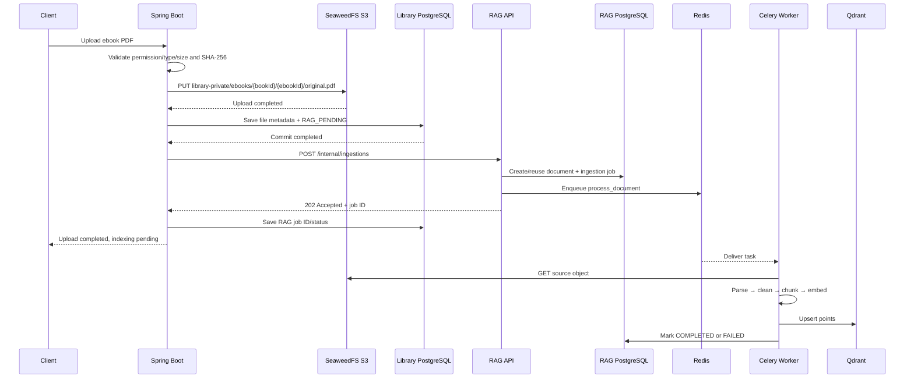

# Spring Boot → RAG Ebook Ingestion Contract

## 1. Mục đích

Tài liệu này là hợp đồng tích hợp giữa hệ thống thư viện Spring Boot và RAG service. Mỗi repo chỉ triển khai trách nhiệm của mình nhưng phải giữ nguyên network, storage và API contract trong tài liệu này.

Quyết định kiến trúc:

```text
Spring Boot sở hữu upload và metadata nghiệp vụ ebook.
RAG sở hữu ingestion job, parsing, chunking, embedding và vector index.
SeaweedFS là object storage dùng chung, không phải message broker.
Redis là broker cho Celery bên trong RAG.
```

Không dùng SeaweedFS webhook trong MVP. Spring Boot chủ động gọi RAG ngay sau khi upload và commit metadata thành công.

## 2. Ranh giới trách nhiệm

| Thành phần | Trách nhiệm |
| --- | --- |
| Spring Boot | Authorization, validate book/ebook, upload PDF, checksum, metadata file, trigger RAG, hiển thị trạng thái indexing. |
| SeaweedFS | Lưu object bền vững và phục vụ S3-compatible GET/HEAD cho Spring Boot/RAG worker. |
| RAG API | Validate ingestion request, đảm bảo idempotency, tạo document/job và enqueue Celery task. |
| Redis | Celery message broker/result backend; không lưu PDF. |
| Celery worker | Download source object, parse, clean, chunk, embed, upsert Qdrant và cập nhật job. |
| RAG PostgreSQL | Metadata document/job/artifact và trạng thái ingestion. |
| Qdrant | Vector, chunk text và metadata phục vụ retrieval. |

Cloudinary không tham gia luồng PDF. Cloudinary chỉ dùng cho ảnh public như book cover và avatar.

## 3. Network và endpoint

Hai Compose project cùng join external network `library-platform-net`.

| Consumer | Endpoint nội bộ |
| --- | --- |
| Spring Boot → RAG API | `http://rag-api:8000` |
| Spring Boot → SeaweedFS S3 | `http://rag-seaweedfs:8333` |
| RAG API/worker → SeaweedFS S3 | `http://seaweedfs:8333` |
| RAG API/worker → PostgreSQL | `postgres:5432` |
| RAG API/worker → Redis | `redis:6379` |
| RAG API/worker → Qdrant | `http://qdrant:6333` |

## 4. Bucket và object key

```text
library-private
  ebooks/{bookId}/{ebookId}/original.pdf

library-temp
  imports/{importId}/manifest.csv
  imports/{importId}/...

rag-artifacts
  documents/{documentId}/parsed_text.txt
  documents/{documentId}/cleaned_text.txt
  documents/{documentId}/chunks.jsonl
  documents/{documentId}/failed_parse.log
```

Ví dụ ebook:

```text
bucket:     library-private
objectKey: ebooks/101/55/original.pdf
```

Database lưu bucket/key và metadata file, không lưu URL có hostname như `http://localhost:8333/...`.

## 5. Luồng ebook chuẩn



Ingestion được trigger ngay sau upload; nó không chờ người dùng gửi thêm request. Điểm tách bất đồng bộ chỉ giúp HTTP upload không phải chờ parsing/embedding/indexing.

## 6. Điều kiện trước khi trigger ingestion

Spring Boot chỉ gọi RAG sau khi:

1. File đã qua validation.
2. S3 PUT hoàn tất.
3. Bucket và object key cuối cùng đã xác định.
4. SHA-256 đã tính xong.
5. Metadata ebook đã commit vào database thư viện.

Không trigger khi object đang upload dở. Nếu cần kiểm tra mạnh hơn, Spring Boot có thể gọi S3 `HEAD` để đối chiếu size/checksum metadata trước khi tạo ingestion request.

## 7. API contract đề xuất

> Endpoint đã được triển khai. Spring Boot phải gửi cùng service secret được cấu
> hình bằng `RAG_INTERNAL_API_KEY` ở RAG service.

```http
POST /internal/ingestions
Content-Type: application/json
X-RAG-API-Key: <service-secret>
```

```json
{
  "sourceType": "LIBRARY_EBOOK",
  "bookId": 101,
  "ebookId": 55,
  "bucket": "library-private",
  "objectKey": "ebooks/101/55/original.pdf",
  "originalFilename": "clean-code.pdf",
  "contentType": "application/pdf",
  "fileSizeBytes": 5242880,
  "checksumSha256": "<64-char-lowercase-hex>"
}
```

Response khi tạo job:

```http
HTTP/1.1 202 Accepted
```

```json
{
  "documentId": "doc_ebook_55",
  "ingestionJobId": 123,
  "status": "PENDING"
}
```

Request giống hệt phải trả lại document/job hiện có thay vì tạo bản ghi trùng.

Status endpoint đề xuất:

```http
GET /internal/ingestions/{ingestionJobId}
```

```json
{
  "ingestionJobId": 123,
  "status": "PROCESSING",
  "stage": "embedding",
  "errorCode": null,
  "errorMessage": null
}
```

## 8. Idempotency và versioning

Khóa idempotency đề xuất:

```text
sourceType + ebookId + checksumSha256
```

- Cùng `ebookId` và cùng checksum: trả document/job hiện có, không nhân đôi chunk/vector.
- Cùng `ebookId` nhưng checksum mới: tạo version ingestion mới.
- Worker dùng vector ID deterministic để retry không tạo point trùng.
- Chỉ chuyển version mới thành active sau khi Qdrant upsert hoàn tất.
- Khi version mới thành công, xóa hoặc retire vector của version cũ theo policy.

## 8.1. Mapping vào các class Spring Boot

Cách tách class hiện tại là đúng. Trách nhiệm đề xuất:

```text
RagServiceProperties
  baseUrl      <- RAG_SERVICE_URL=http://rag-api:8000
  apiKey       <- RAG_INTERNAL_API_KEY
  connectTimeout
  readTimeout

RagClientConfig
  tạo WebClient/RestClient dành riêng cho RAG
  cấu hình base URL, timeout và header X-RAG-API-Key

RagIngestionClient
  createIngestion(request)
  getIngestionStatus(jobId)

RagIngestionClient implementation
  gọi POST /internal/ingestions
  gọi GET /internal/ingestions/{jobId}
  map 401/422 thành lỗi không retry
  map timeout/429/5xx thành lỗi có thể retry
```

Không log request headers hoặc property chứa API key. `RAG_INTERNAL_API_KEY` phải được inject từ secret/environment, không hardcode trong `application.yml` hay source code.

Spring nên gọi client từ post-commit handler/outbox processor thay vì giữ transaction database mở trong lúc chờ HTTP response từ RAG.

## 9. Trạng thái hai hệ thống

Không gộp upload status với ingestion status. Spring Boot nên quản lý tối thiểu:

```text
uploadStatus:    PENDING | COMPLETED | FAILED
ingestionStatus: NOT_REQUESTED | PENDING | PROCESSING | COMPLETED | FAILED
ragJobId:        nullable
```

Nếu upload thành công nhưng RAG đang down:

```text
uploadStatus    = COMPLETED
ingestionStatus = PENDING
```

Không yêu cầu người dùng upload lại. Spring Boot retry request tạo ingestion job bằng cùng payload/checksum.

## 10. Failure handling

| Failure | Cách xử lý |
| --- | --- |
| S3 upload lỗi | Không lưu trạng thái upload thành công; không gọi RAG. |
| Library DB commit lỗi sau S3 PUT | Best-effort xóa object hoặc để reconciliation job dọn orphan object. |
| RAG API timeout/down | Giữ `RAG_PENDING`; retry với backoff và cùng idempotency key. |
| Redis unavailable | RAG không báo job đã enqueue thành công; trả lỗi retryable hoặc lưu outbox nội bộ. |
| Worker crash | Celery retry; task và vector write phải idempotent. |
| PDF corrupt | Mark ingestion `FAILED`; PDF vẫn là object upload thành công. |
| Embedding/Qdrant lỗi | Retry phù hợp; không đổi upload status thành failed. |

Để tránh mất request giữa Library DB commit và HTTP call, production nên dùng transactional outbox trong Spring Boot. MVP có thể dùng trạng thái `RAG_PENDING` và scheduled retry.

## 11. Vì sao không dùng S3 webhook trong MVP

Spring Boot trigger trực tiếp phù hợp hơn vì Spring Boot biết `bookId`, `ebookId`, permission, trạng thái transaction và file nào thực sự cần ingestion.

Webhook/event thường có delivery at-least-once, cần deduplication và có thể đến trước khi transaction nghiệp vụ hoàn tất. Chỉ cân nhắc khi có nhiều producer cùng ghi object hoặc cần kiến trúc event-driven độc lập hơn.

## 12. Checklist cho repo Spring Boot

- [ ] Join `library-platform-net` với alias `library-api`.
- [ ] Cấu hình `RAG_SERVICE_URL=http://rag-api:8000`.
- [ ] Gửi header `X-RAG-API-Key` bằng secret riêng cho từng environment.
- [ ] Cấu hình `OBJECT_STORAGE_ENDPOINT=http://rag-seaweedfs:8333`.
- [ ] Upload PDF vào `library-private/ebooks/{bookId}/{ebookId}/original.pdf`.
- [ ] Lưu bucket, key, filename, content type, size và checksum; không lưu endpoint URL.
- [ ] Chỉ trigger RAG sau upload và DB commit thành công.
- [ ] Lưu riêng upload status và ingestion status.
- [ ] Retry request RAG theo idempotency contract.
- [ ] Không log API key hoặc giá trị secret.

## 13. Checklist cho repo RAG

- [x] Cung cấp aliases `rag-api`, `rag-seaweedfs`, `rag-qdrant` trên shared network.
- [x] Cấu hình Redis làm Celery broker/result backend.
- [x] Khởi tạo `library-private`, `library-temp`, `rag-artifacts`.
- [x] Implement request/response schema cho `/internal/ingestions`.
- [x] Loại bỏ RAG-local user/workspace; document dùng `sourceType/sourceId`.
- [x] Implement API-key authentication và idempotency cơ bản cho internal endpoint.
- [x] Cho storage adapter download theo bucket nhận từ request.
- [ ] Hoàn thiện embedding và Qdrant upsert trước khi dùng trạng thái `COMPLETED/INDEXED`.
- [x] Implement polling status endpoint.
