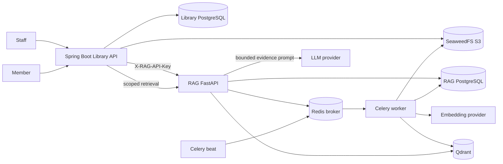

# Internal RAG Service Architecture

## 1. Kiến trúc đã chọn

RAG chạy như một internal processing/search service của Spring Boot, không phải application backend thứ hai.

```text
Spring Boot = business/auth/permission owner
RAG         = ingestion/retrieval/grounded-generation engine
```

RAG không còn quản lý:

- User/password/JWT của member hoặc staff.
- Workspace và membership.
- Chat session/feedback của giao diện thư viện.
- Upload ebook từ browser.

Spring Boot kiểm tra quyền và chỉ gọi RAG bằng service credential sau khi hoàn tất transaction nghiệp vụ.

## 2. System context



## 3. Write path

```text
Staff uploads PDF to Spring Boot
  -> Spring validates permission, type and size
  -> Spring calculates SHA-256
  -> Spring PUTs library-private/ebooks/{bookId}/{ebookId}/original.pdf
  -> Spring commits ebook metadata
  -> Spring POSTs /internal/ingestions
  -> RAG validates API key, bucket, key and checksum
  -> RAG creates/reuses document and ingestion job
  -> RAG enqueues Celery task in Redis
  -> worker downloads PDF from SeaweedFS
  -> parse -> clean -> chunk -> embed -> Qdrant
  -> worker updates job status
```

The API returns `202 Accepted` after enqueue. Upload and ingestion status are independent.

## 4. Read path hiện tại

RAG hiện đã có `POST /internal/retrieval/search`. Endpoint bắt buộc có ít nhất
một trusted scope `bookId`, `ebookId` hoặc `documentId`, tạo query embedding,
tìm Qdrant với metadata filter và trả evidence chunks kèm score/citation/page
metadata. Đây vẫn là endpoint evidence cấp thấp, không phải chatbot.

Spring hiện expose `POST /api/ebooks/{bookId}/reader/semantic-search`. Endpoint
yêu cầu member JWT và `X-Reading-Session`, kiểm tra lại active loan và chỉ gửi
trusted `ebookId` sang RAG. Kết quả có citation lệch scope bị fail closed.

Luồng Ask This Book đã có `POST /internal/answers` và public endpoint
`POST /api/ebooks/{bookId}/reader/ask`. Spring xác thực quyền đọc rồi gửi
`ebookId` đáng tin cậy; RAG retrieval evidence, áp dụng score threshold, giới hạn
context và chỉ chấp nhận source ID thuộc evidence hiện tại. Nếu evidence hoặc
citation không hợp lệ, response sẽ abstain thay vì đoán. Chi tiết roadmap nằm tại
[Secure AI Ebook Reader](../../../docs/secure-ai-ebook-reader-roadmap.md).

End-user identity remains in Spring Boot. RAG should receive the minimum trusted authorization scope required for filtering; it does not need a duplicate user database.

## 5. Authentication and network

Defense in depth:

1. `rag-internal-net` isolates RAG dependencies.
2. `library-platform-net` connects only integration-facing services.
3. `/internal/*` requires `X-RAG-API-Key`.
4. API key is compared in constant time and must not be logged.
5. Development Compose publishes selected ports; production must remove those
   host mappings at the deployment layer.
6. Swagger/OpenAPI is disabled unless `ENABLE_API_DOCS=true`.

Static API key is appropriate for MVP/local. Production upgrade options:

- TLS plus mTLS between services.
- OAuth2 client credentials at an API gateway/service mesh.
- Short-lived signed service JWT with audience `rag-api`.
- Secret manager and rotation with overlapping old/new keys.

Network membership alone is not authentication.

## 6. Data ownership

| Data | Source of truth |
| --- | --- |
| Users, staff, member roles | Spring Boot DB |
| Books, ebooks, loans, payments | Spring Boot DB |
| PDF file metadata | Spring Boot DB |
| Original PDF bytes | SeaweedFS `library-private` |
| RAG document mapping | RAG PostgreSQL |
| Ingestion job/status | RAG PostgreSQL |
| Parsed chunks during current phase | RAG PostgreSQL |
| Vectors/chunk retrieval payload | Qdrant |
| Celery messages/results | Redis |
| Extract/chunk/report snapshots | SeaweedFS `rag-artifacts` |

## 7. RAG document identity

Library ebook mapping:

```text
source_type          = LIBRARY_EBOOK
source_id            = ebook:{ebookId}
external_document_id = doc_ebook_{ebookId}
book_id              = Spring book ID
ebook_id             = Spring ebook ID
```

`source_type + source_id` is unique. For the current MVP, identical checksum requests reuse the active/completed job. A changed checksum creates a new job for the same RAG document.

Before concurrent ebook replacement is enabled, add an explicit `document_versions` table so a worker always processes an immutable object version.

## 8. Storage contract

```text
library-private/ebooks/{bookId}/{ebookId}/original.pdf
library-temp/imports/{importId}/manifest.csv
library-temp/imports/{importId}/...
rag-artifacts/documents/{documentId}/parsed_text.txt
rag-artifacts/documents/{documentId}/cleaned_text.txt
rag-artifacts/documents/{documentId}/chunks.jsonl
rag-artifacts/documents/{documentId}/failed_parse.log
```

Database rows store bucket and key, never endpoint URL. The worker reads ebook
sources from the bucket recorded on the source artifact. Batch import staging
belongs to `library-temp`; RAG-generated outputs belong to `rag-artifacts`.

## 9. Ingestion states

```text
QUEUED
  -> PROCESSING/parsing_pdf
  -> PROCESSING/cleaning
  -> PROCESSING/chunking
  -> CHUNKED
  -> EMBEDDING
  -> EMBEDDED
  -> INDEXING
  -> INDEXED
```

Any stage can transition to `FAILED`. `INDEXED` is only used after embedding
and Qdrant upsert are real and verified.

## 10. Qdrant payload target

```json
{
  "text": "Clean code requires meaningful names...",
  "documentId": "doc_ebook_55",
  "sourceType": "LIBRARY_EBOOK",
  "bookId": 101,
  "ebookId": 55,
  "chunkIndex": 1,
  "pageStart": 10,
  "pageEnd": 11
}
```

Point IDs should be deterministic so Celery retries perform upserts instead of creating duplicates.

## 11. Failure boundaries

| Failure | Owner/action |
| --- | --- |
| Upload/validation fails | Spring does not trigger RAG. |
| Spring DB commit fails | Do not trigger RAG; cleanup orphan object later. |
| RAG unavailable lúc trigger | Source hiện tại ghi `FAILED`; production target là outbox/retry idempotent thay vì yêu cầu upload lại. |
| RAG unavailable lúc polling | Spring giữ trạng thái gần nhất và thử lại ở chu kỳ sau. |
| Invalid API key/bucket/key | RAG rejects request without enqueue. |
| Redis unavailable | RAG returns retryable enqueue failure. |
| Worker/parser fails | RAG marks job `FAILED`; upload remains successful. |
| Embedding/Qdrant fails | Retry idempotently; do not change upload status. |

Production should use a Spring transactional outbox for reliable post-commit delivery. SeaweedFS webhook is not part of the MVP because it lacks the business transaction context owned by Spring.

## 12. Runtime components

| Compose service | Network | Responsibility |
| --- | --- | --- |
| `api` | internal + shared | Internal HTTP API, alias `rag-api`. |
| `worker` | internal | Celery ingestion tasks. |
| `beat` | internal | Optional scheduled-job runner; placeholder tasks are profile-gated. |
| `migrate` | internal | Alembic migration runner. |
| `postgres` | internal | RAG metadata/job DB. |
| `redis` | internal | Celery broker/backend. |
| `qdrant` | internal + shared | Vector DB, alias `rag-qdrant`. |
| `seaweedfs` | internal + shared | S3 storage, alias `rag-seaweedfs`. |
| `seaweedfs-init` | internal | Idempotent bucket initialization. |

## 13. Known gaps

- No immutable document version model yet.
- API key rotation supports one active key only.
- No grounded answer-generation endpoint or abstention policy yet.
- No member-facing Ask This Book answer-generation API yet; current public API
  returns retrieval evidence only.
- Reader citation-to-page navigation and retrieval evaluation are not complete.
- `/metrics` is not exposed by FastAPI yet.
