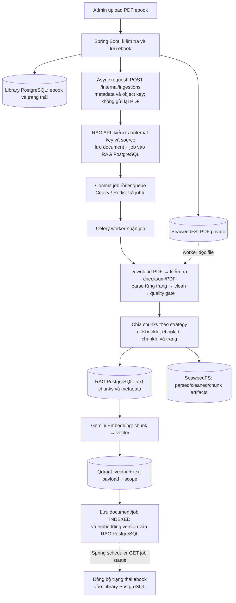
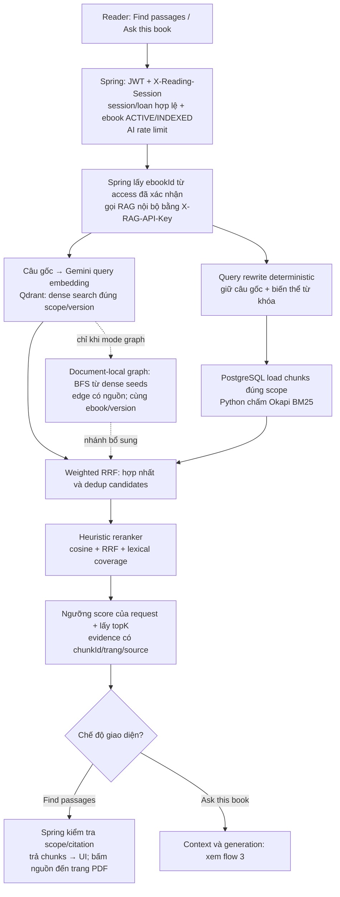
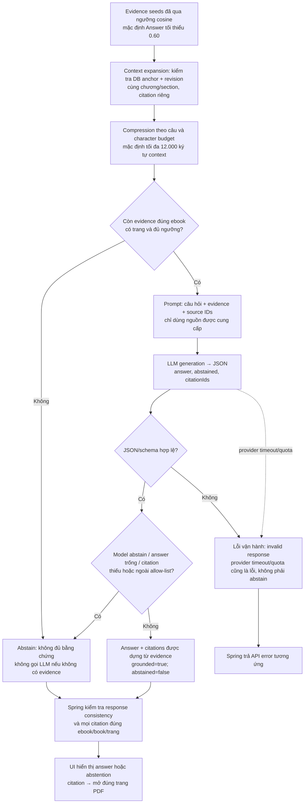
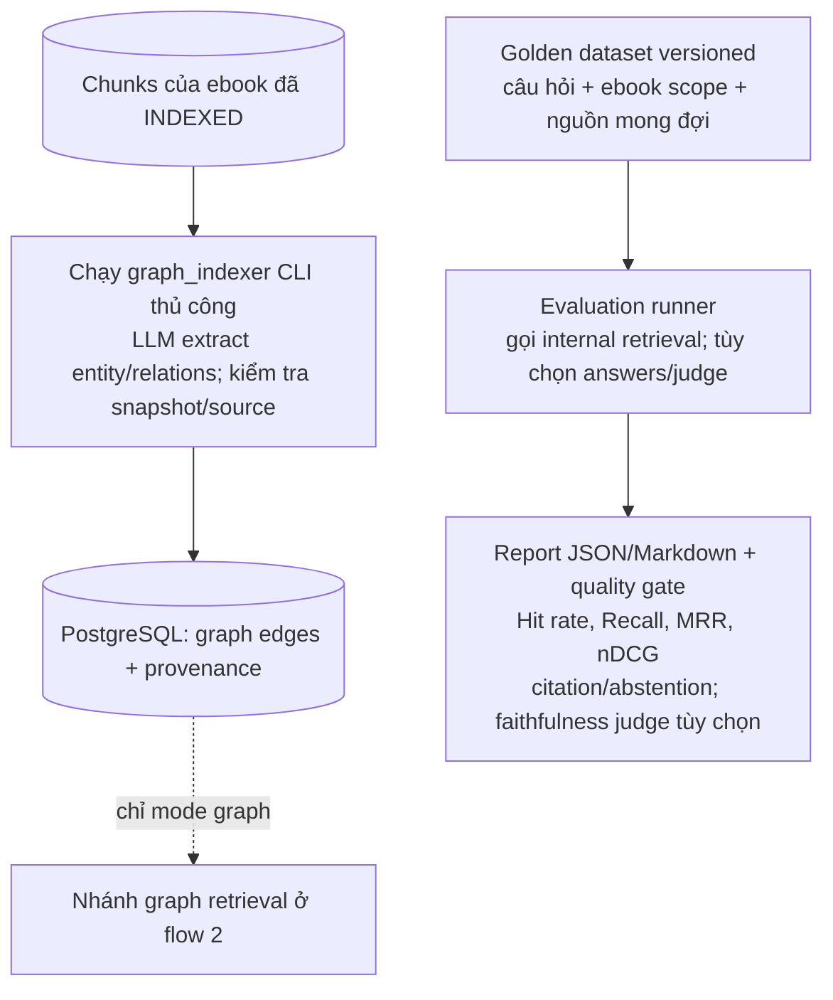

# Full flow RAG trong Library

Đối chiếu source ngày 2026-10-05. Đây là sơ đồ implementation hiện tại, không
phải sơ đồ mọi chức năng trong advanced RAG roadmap.

Mục tiêu: giúp thành viên tìm đoạn liên quan và hỏi đáp **trong ebook đang được
cấp quyền đọc**, kèm nguồn theo trang. Đây không phải chatbot tự tìm toàn bộ
thư viện, tự truy cập Internet hoặc một agent tự quyết định mọi bước.

Mũi tên liền biểu thị luồng chính; mũi tên nét đứt biểu thị đọc dữ liệu, polling
hoặc nhánh tùy chọn. Các nhánh retrieval trong sơ đồ là cách chia trách nhiệm,
không có nghĩa tất cả lời gọi dependency đang chạy song song.

## 1. Chuẩn bị dữ liệu: upload PDF → INDEXED

### Nó đang làm gì?

- File PDF gốc nằm trong object storage private. Worker đọc file từ object key
  đã được Spring xác nhận, không nhận URL tùy ý từ người dùng.
- **Chunk** là một đoạn nhỏ của sách. Text và metadata nguồn được lưu ở
  PostgreSQL; vector và payload tìm kiếm được lưu ở Qdrant. Không có bước đọc
  lại và chia toàn bộ PDF mỗi khi người dùng hỏi.
- Gemini Embedding biến nội dung chunk thành dãy số phục vụ tìm theo ý nghĩa;
  đây không phải bước viết câu trả lời.
- Celery/Redis tách công việc xử lý PDF dài khỏi HTTP request. Spring lưu jobId
  và scheduler polling để đồng bộ tiến độ; đây không phải webhook push status.
- Chỉ ebook `INDEXED` mới được Spring cho phép dùng tính năng AI. PDF scan không
  có text layer bị từ chối với yêu cầu OCR; chưa có OCR tự động.
- Retry có rebuild chunks thay vì append và dùng định danh vector ổn định;
  không nên diễn giải cơ chế này thành bảo đảm exactly-once toàn pipeline.

## 2. Khi người dùng tìm hoặc hỏi: lấy đúng evidence

Trước khi vào flow dưới đây, thành viên có ebook loan hợp lệ, mở phiên đọc qua
`POST /api/ebooks/{bookId}/reading-sessions`, rồi lấy signed PDF URL qua
`GET /api/ebooks/{bookId}/reader/content`. URL đọc PDF có hạn; session được
refresh nhưng không kéo dài vượt thời hạn loan.

### Các bước retrieval bổ sung giải quyết gì?

1. **Dense retrieval:** tìm đoạn có ý nghĩa gần câu hỏi, dù cách diễn đạt khác.
2. **BM25:** bổ sung các đoạn chứa đúng từ khóa, tên riêng hoặc thuật ngữ.
3. **Query rewriting:** normalize và tạo biến thể thiên về từ khóa. Bản hiện
   tại không dùng LLM để dịch hoặc sinh nhiều câu hỏi mới.
4. **RRF:** hợp nhất thứ hạng của các nhánh, dedup cùng chunk. Không cộng trực
   tiếp BM25 raw score với cosine.
5. **Reranker:** xếp lại candidates bằng heuristic; chưa phải cross-encoder.
6. **Graph (tùy chọn):** tìm thêm evidence qua quan hệ entity trong một ebook,
   rồi đưa candidates vào RRF. Không phải full community/global GraphRAG.

Mặc định code là `RETRIEVAL_MODE=hybrid` (dense + keyword). Spring không gửi
`retrievalMode`; service dùng cấu hình mặc định. Internal API có thể chọn
`dense`, `hybrid`, `graph`, nhưng browser không tự chọn scope/mode qua endpoint
Spring hiện tại. Nhánh keyword gọi sau dense; các biến thể keyword được gather.

Filter được áp dụng trong source/query, không chỉ lọc kết quả sau khi tìm toàn
kho. Public request lấy `ebookId` tin cậy từ phiên đọc; internal API có thêm
scope `bookId`/`ebookId`/`documentId`. Các nhánh giữ active/current-version scope.

`score` trả ra vẫn là cosine; RRF/reranker score nằm riêng trong metadata.
Keyword/graph-only candidates có cosine bằng 0 nên không tự vượt ngưỡng
semantic evidence của Ask.

## 3. Chỉ Ask: evidence → câu trả lời có citation

Context expansion bổ sung đoạn liền trước/sau để tránh thiếu mạch truyện.
Sau [bước 3](chunking/chapter-aware-context-expansion.md), phải có current DB
anchor và cùng scope/revision/chương; không nhảy qua missing/stale chunk hoặc
boundary. Không rõ chương thì fallback trong một trang. Seeds độc lập vẫn
có thể thuộc nhiều chương; guards chỉ giới hạn neighbors được bổ sung.
Neighbor dùng score của seed làm tín hiệu eligibility (metadata ghi rõ), không
phải một lần đo cosine độc lập. Compression chọn/cắt nội dung trong budget;
chưa phải LLM summarization. Pipeline áp dụng ngưỡng và topK trước expansion;
AnswerGenerator kiểm tra eligibility/citation lại sau khi chuẩn bị context.

LLM chỉ được chọn source ID có trong prompt; backend dựng citation từ evidence
thật, không tin trang hoặc source do LLM tự viết. Spring kiểm tra scope thêm
một lần trước khi trả kết quả. `grounded=true` là kiểm tra cấu trúc
evidence/citation, **không chứng minh mọi câu trong answer chắc chắn đúng**.

`Find passages` dừng ở flow 2: vẫn gọi embedding để tìm theo ý nghĩa, nhưng
không gọi LLM generation, không chạy context expansion của Answer.

## 4. Hai flow chạy riêng: graph index và evaluation

- Graph chưa tự build sau mỗi upload/reindex. CLI kiểm tra chunks/version chưa
  đổi trước khi publish edges; graph phải được build lại theo ebook/version mới.
- Evaluation không chèn vào từng request của người đọc. Nó là công cụ developer
  đo retrieval/answer sau thay đổi; optional LLM judge phát sinh provider calls.
- Dataset hiện có 20 câu trên một PDF mẫu local. Nó chưa đại diện chất lượng
  của tất cả sách và IDs cần cập nhật khi thay dataset/chunker/database.
- Ledger trước đó ghi nhận retrieval-only benchmark đã chạy; full answer
  evaluation chưa hoàn thành do quota provider. Không diễn giải report lỗi
  thành quality baseline đạt.

## 5. Vai trò của các thành phần

| Thành phần | Trách nhiệm |
| --- | --- |
| Frontend reader | Gửi câu hỏi với JWT/session, hiển thị evidence và điều hướng trang PDF. |
| Spring Boot | Quyền đọc, loan/session, rate limit, trusted ebook scope, public API response. |
| RAG API | Internal-key auth, nhận job, retrieval và generation orchestration. |
| Celery + RAG Redis | Queue và worker cho ingestion dài; không phải kho tri thức. |
| Spring Redis | Cache reading session và AI rate limit; không thay kiểm tra loan trong DB. |
| Library PostgreSQL | Ebook, quyền mượn, phiên đọc và trạng thái ingestion phía Library. |
| RAG PostgreSQL | Documents/jobs, chunks, metadata, keyword corpus và graph edges. |
| SeaweedFS/S3-compatible | PDF private và processing artifacts. |
| Qdrant | Vector search và payload filters; không tự viết câu trả lời. |
| Gemini Embedding | Vector hóa chunks lúc index và query lúc search. |
| Generation LLM | Viết answer JSON dựa trên evidence được chọn. |

Browser gọi Spring cho AI, không giữ internal RAG key. Browser đọc PDF qua
signed object URL có hạn; đó là nhánh khác với lời gọi AI. Sơ đồ là logical
flow của code; không xác nhận topology/public exposure của VPS hiện tại.

## 6. Nhánh lỗi và giới hạn

| Tình huống | Hành vi hiện tại |
| --- | --- |
| JWT/session/loan không hợp lệ, ebook chưa INDEXED | Spring chặn trước khi gọi RAG. |
| Vượt AI rate limit | Spring từ chối theo rate-limit error contract. |
| BM25 dependency lỗi và `HYBRID_FAIL_OPEN=true` | Trả dense baseline, không bỏ ebook scope. |
| Graph lỗi và fail-open bật | Bỏ nhánh graph, tiếp tục hybrid. |
| Expansion lỗi và fail-open bật | Dùng seeds đã qua ngưỡng, không bịa neighbor. |
| Dense embedding/Qdrant hoặc generation provider lỗi | API error; không coi là một answer abstain hợp lệ. |
| Không có evidence đạt yêu cầu | Abstain, không gọi generation LLM. |
| LLM abstain hoặc citation ID bịa/thiếu | Abstain; citation ngoài allow-list không được trả ra. |
| Spring thấy citation sai scope hoặc response không nhất quán | Reject RAG response với service error. |

## 7. Source map và kiểm chứng

- [Spring reader endpoints](../../src/main/java/com/vn/ebook/controller/EbookReaderController.java)
- [Quyền đọc và reading session](../../src/main/java/com/vn/ebook/service/impl/EbookReaderSessionServiceImpl.java)
- [Upload ebook](../../src/main/java/com/vn/ebook/service/impl/BookEbookServiceImpl.java)
- [Async ingestion request](../../src/main/java/com/vn/rag/service/EbookRagIngestionAsyncProcessor.java)
- [Status polling job](../../src/main/java/com/vn/rag/job/EbookRagIngestionStatusSyncJob.java)
- [Spring Ask service](../../src/main/java/com/vn/ebook/service/impl/EbookQuestionAnswerServiceImpl.java)
- [RAG internal routers/auth dependency](../app/api/internal/__init__.py)
- [Ingestion API](../app/api/internal/routes_ingestions.py), [Celery task](../app/jobs/ingestion_jobs.py), [worker pipeline](../app/ingestion/pipeline.py)
- [Retrieval pipeline](../app/retrieval/retrieval_pipeline.py), [BM25](../app/retrieval/keyword_retriever.py)
- [Context](../app/retrieval/context_expander.py), [answer generator](../app/generation/answer_generator.py), [prompt](../app/generation/prompt_builder.py)
- [Graph indexer](../app/retrieval/graph_indexer.py), [evaluation runner](../app/evaluation/run_eval.py)
- [Implementation và verification ledger](retrieval-evaluation-implementation.md)

Frontend đã đối chiếu `ebookService.ts`, `EbookSemanticSearchPanel.tsx` và
`EbookReaderPage.tsx` trong repo `se313-fe`: có cả Find/Ask và callback điều
hướng citation đến trang. Đối chiếu source không thay thế test browser live.

Lượt vẽ flow này chỉ bổ sung tài liệu, không sửa business logic, không gọi
provider, không chạy migration/deploy hay chạy lại benchmark. Public
Spring JWT/session → UI E2E vẫn chưa được xác nhận bởi lượt này.
