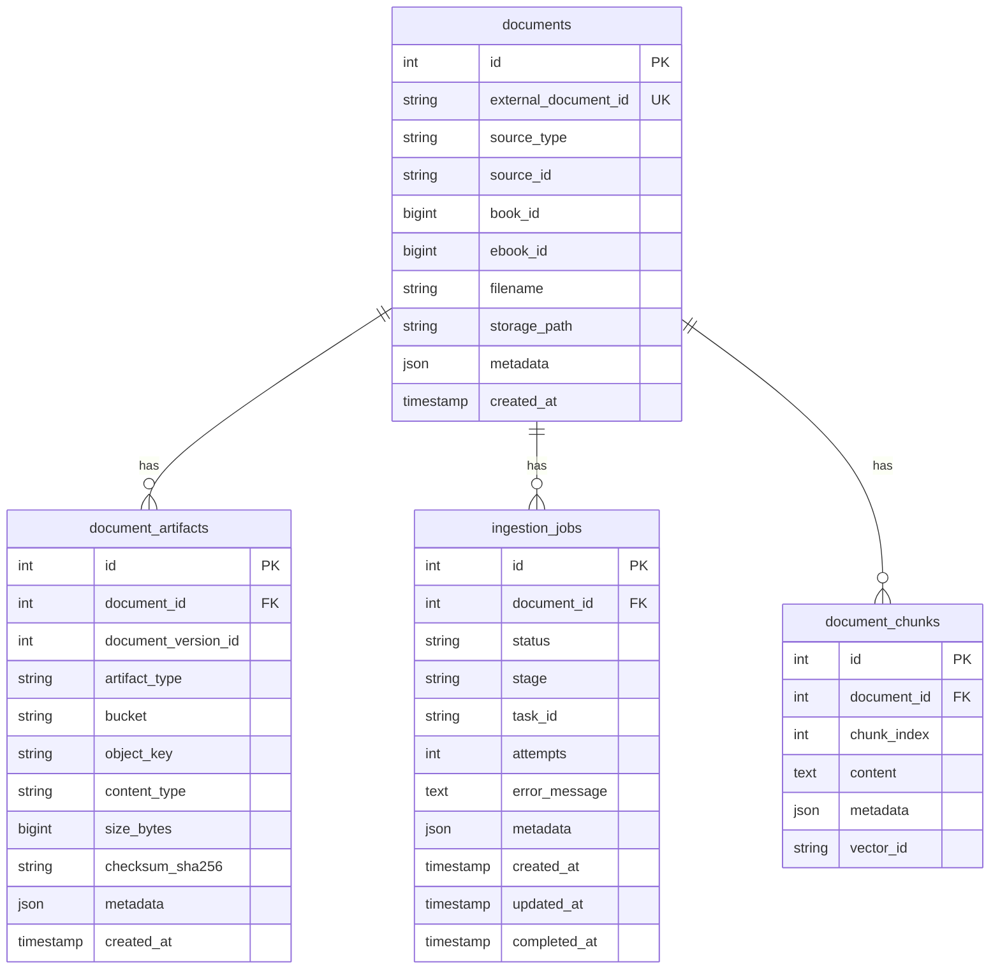

# RAG Metadata Schema

Spring Boot owns application users, permissions, books and ebook business data. The RAG database stores only processing/indexing metadata.

## Current tables



## Identity rules

```text
UNIQUE documents.external_document_id
UNIQUE documents(source_type, source_id)
UNIQUE document_artifacts(bucket, object_key)
```

Library ebook example:

```text
external_document_id = doc_ebook_55
source_type          = LIBRARY_EBOOK
source_id            = ebook:55
book_id              = 101
ebook_id             = 55
```

## Removed tables

Migration `004_internal_service_schema` removes:

```text
users
workspaces
chat_sessions
chat_messages
feedback
```

This migration is intentionally destructive for those legacy RAG-local application tables. Back up any required legacy data before applying it.

## Planned document versioning

The current artifact row can be updated when an ebook checksum changes. Before allowing concurrent replacement/re-ingestion in production, add an immutable version model:

```text
document_versions
  id
  document_id
  version_number
  bucket
  object_key
  checksum_sha256
  status
  created_at
  activated_at
```

Workers should ingest a specific version so replacing `original.pdf` cannot change bytes while an older job is running.
