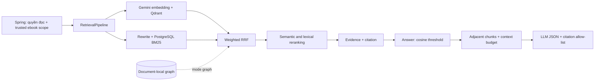

# Retrieval, evaluation và graph theo ebook

Cập nhật: 2026-10-05. Đây là implementation thực tế của Library. Folder
`advanced-rag-production-guide/` vẫn là tài liệu học và roadmap tổng quát.

Bài giải thích từng phần và tiến độ học: [retrieval learning notes](retrieval-learning-notes.md).

Sơ đồ từ upload PDF đến câu trả lời và các flow offline:
[full flow RAG trong Library](rag-full-flow.md).

## Luồng đang chạy



`POST /internal/retrieval/search` và `POST /internal/answers` nhận thêm
`retrievalMode`: `dense`, `hybrid`, `graph`. Spring không gửi field này nên dùng
`RETRIEVAL_MODE`, mặc định `hybrid`. Browser vẫn gọi Spring và không có endpoint
RAG public mới.

| Phần | Implementation |
| --- | --- |
| Dense | Gemini + Qdrant, active/version/ebook filter bắt buộc. |
| Keyword | Okapi BM25 trên chunk PostgreSQL đúng scope. |
| Candidate index | Alembic 005: GIN `to_tsvector('simple', content)` + document/chunk index. |
| Hybrid | Weighted RRF, dedup theo vector ID. |
| Rewrite | NFKC/whitespace normalization + keyword-focused variant, giữ original. |
| Rerank | Heuristic phối hợp cosine, RRF và lexical coverage. |
| Context | Chunk lân cận giữ citation riêng; nén theo câu và character budget. |
| Evaluation | Dataset versioned, runner HTTP, JSON/Markdown reports, quality gate. |
| Graph | LLM extraction + PostgreSQL edge provenance + bounded BFS + RRF branch. |

Reranker là heuristic có test/số đo, chưa phải cross-encoder đã train. Rewrite
chưa dịch ngôn ngữ hoặc sinh multi-query bằng LLM. BM25 dùng toàn corpus trong
scope khi số chunk <= `KEYWORD_CANDIDATE_LIMIT=5000`; với scope lớn hơn, GIN
prefilter giới hạn candidate rồi dùng candidate-local BM25/IDF. Một PDF hiện
bị giới hạn 1000 chunk, nên Ask một ebook dùng toàn corpus. `simple` không có
Vietnamese stemming.

Keyword chỉ nhận document `INDEXED`, đúng embedding version và active chunks.
Lexical DB lỗi thì `HYBRID_FAIL_OPEN=true` trả dense baseline. Đặt false để
diagnostics bắt lỗi nhánh lexical.
Context expansion lỗi cũng dùng lại seeds đã qua threshold khi fail-open;
không gán score mới hoặc bịa thêm evidence để che lỗi dependency.

## Điểm và citation

- `score` giữ cosine similarity, tương thích `scoreThreshold` của Spring.
- `metadata.rrf_score`, `rrf_raw_score`, `reranker_score` phục vụ xếp hạng.
- Keyword/graph-only hit có cosine bằng 0 và không tự vượt ngưỡng evidence.
- Context expansion lấy sau khi seed qua threshold. Mỗi chunk giữ đúng ID/trang
  của chính nó, không gộp nội dung trang khác vào citation của seed.
  [Bước 3](chunking/chapter-aware-context-expansion.md) thêm current DB anchor,
  chapter/section + source revision guards và dừng ở boundary/gap. Không rõ
  chương thì chỉ fallback cùng trang; không invent source version cho legacy.
- LLM chỉ được chọn ID có trong prompt; citation bịa hoặc thiếu evidence dẫn
  đến abstain. `grounded=true` biểu thị kiểm tra evidence/citation cấu trúc,
  chưa chứng minh tự động mọi claim được nguồn entail.

## Evaluation

Chunking v1/v2 có [benchmark PDF thật riêng](chunking/real-book-chunking-benchmark.md)
với page/quote source anchors, không phụ thuộc IDs của dataset HTTP dưới đây.
BM25 + opt-in real Gemini dense/hybrid chạy trong chỉ mục tạm in-memory;
context retention/source mapping/chapter labels được đo riêng. HOLD default v1
do detector gaps/regressions, chưa reindex hoặc khẳng định answer quality.

`app/evaluation/datasets/gift_of_the_magi_v1.json` chứa 20 câu gán nhãn từ PDF
6 trang đang index thành ebook 10: fact, multi-hop, reasoning và 3 câu không có
đáp án. IDs gắn với local DB/chunker; phải gán nhãn lại khi chuyển DB/chunker.

Từ root monorepo, sau khi RAG healthy:

```powershell
docker compose -f compose.yaml -f compose.rag.yaml exec -T rag-api python -m app.evaluation.run_eval --base-url http://127.0.0.1:8000 --modes dense hybrid --top-k 3 --skip-answers --min-hit-rate 0.8
```

Bỏ `--skip-answers` để đo citation/abstention. Thêm `--judge` để LLM ước lượng
claim faithfulness (thêm provider call mỗi answer); verdict lưu tách riêng.
Nếu source không nằm trong retrieval result, judge dùng citation excerpt và
đánh dấu `judgeEvidenceUsesExcerpts=true`.

Với key có quota 5 lượt generation/phút, dùng `--llm-interval-seconds 15`.
Pacer dùng chung cho cả answer và judge, không chỉ giữa hai câu hỏi. Đây là
control cho benchmark tuần tự, không thay thế distributed rate limiter của
production. CLI mặc định không giãn nhịp; phải chọn theo quota thực tế của key.
Provider 429 trả mã lỗi nội bộ ổn định `LLM_RATE_LIMITED`; runner ghi HTTP
status/type, không chép thông tin nhạy cảm từ message provider vào report.

Trong image production, reports local không được đóng gói. Chạy CLI với
`--output-dir /tmp/rag-eval` hoặc một volume writable riêng; user non-root
không nên cần quyền ghi vào source application.

Runner đọc key trong container, không đưa key vào command/report. Reports nằm
trong `app/evaluation/reports/`. Provider error, scope violation hoặc hit rate
dưới quality gate làm CLI exit 1. Failure không bị bỏ khỏi mẫu số. Recall,
precision, MRR/nDCG tính trên answerable cases; abstention accuracy tính toàn
dataset. Answer-point coverage là lexical, không phải semantic correctness.

CI chạy metric/dataset tests và integration HTTP → hybrid → answer/abstain với
deterministic adapters, không cần provider secrets. Live benchmark cần stack,
PDF/provider thật. Dataset chỉ có một cuốn sách, là development regression set
đầu tiên; chưa phải held-out test hoặc bằng chứng tổng quát.

### Kết quả retrieval local ngày 2026-10-05

Report: [`rag-eval-20261005T101256Z.md`](../app/evaluation/reports/rag-eval-20261005T101256Z.md).
20 câu tổng cộng, metrics retrieval dưới đây tính trên 17 câu có đáp án,
`topK=3`, không chạy answer trong lượt này.

| Mode | Hit rate@3 | Recall@3 | MRR | nDCG@3 | Errors / scope violations |
| --- | ---: | ---: | ---: | ---: | --- |
| Dense | 0.882 | 0.853 | 0.804 | 0.812 | 0 / 0 |
| Hybrid | 0.941 | 0.912 | 0.725 | 0.762 | 0 / 0 |
| Graph | 0.941 | 0.912 | 0.725 | 0.762 | 0 / 0 |

Hybrid tăng coverage của top 3 nhưng xếp nguồn đúng lên đầu chưa tốt bằng dense.
Graph đã thực sự tham gia fusion, nhưng chưa cải thiện thêm metrics trên mẫu
sáu chunks này; không mặc định bật graph chỉ vì đã implement. Reranker đã được
điều chỉnh trên chính development set này, nên cần thêm dữ liệu held-out trước
khi kết luận chất lượng ngoài mẫu. Latency một lượt tuần tự có warm-up không
phải load-test hoặc bằng chứng hybrid nhanh hơn dense.

Answer evaluation đã thử live nhưng hai lượt full run không đạt:
[`101751Z`](../app/evaluation/reports/rag-eval-20261005T101751Z.md) vướng 5 RPM,
[`102837Z`](../app/evaluation/reports/rag-eval-20261005T102837Z.md) vướng quota
20 generation/ngày sau khi đã giãn nhịp. Một số answer/citation đã trả thành
công và câu hỏi thiếu evidence đã abstain, nhưng **chưa kiểm chứng đủ 20 câu
answer/abstention live**. Kết quả judge trên ba câu không đại diện cho cả dataset.
Không tự đổi provider/model hoặc bật billing để vượt giới hạn.

Sau khi quota đủ, chạy lại answer trước (không judge):

```powershell
docker compose -f compose.yaml -f compose.rag.yaml exec -T rag-api python -m app.evaluation.run_eval --modes hybrid --top-k 3 --llm-interval-seconds 15 --min-hit-rate 0.8
```

Judge nên chạy trên subset được chọn rõ khi quota nhỏ, ví dụ thêm
`--judge --case-ids rooms-rent two-sacrifices unknown-city`. Report ghi số câu
và `selectedItemIds`; không diễn giải subset như một full dataset run.
Giãn nhịp chỉ giải quyết RPM, không tạo thêm quota theo ngày.

## Graph

Đây là **local graph-enhanced RAG cho một ebook**. Quan hệ do LLM trích xuất lưu
trong `document_graph_edges`, có FK tới source chunk. Source/target phải xuất
hiện trong chunk; quote phải khớp nội dung thực tế. Quote hợp lệ chưa chứng minh
relation được suy luận đúng; graph chỉ tìm chunks, answer vẫn dựa trên text gốc.

Build sau khi ebook INDEXED:

```powershell
docker compose -f compose.yaml -f compose.rag.yaml exec -T rag-api python -m app.retrieval.graph_indexer --ebook-id 10
```

Flow: đọc chunk snapshot → trích xuất batch 4 chunks → kiểm tra nguồn → lock
document, kiểm tra snapshot còn nguyên → replace edges trong một transaction.
Provider/JSON lỗi không publish partial graph. Reindex thay chunks tự xóa edges
cũ qua FK cascade; cần rebuild graph sau reindex.

Retrieval chỉ đọc graph cùng scope/version, BFS tối đa `GRAPH_MAX_HOPS=2`, edge
budget 5000, dedup và fallback về hybrid nếu graph không sẵn sàng. Đo bằng runner
`--modes dense hybrid graph`. Mặc định sản phẩm vẫn dùng hybrid.

Community detection, community summaries và global multi-book GraphRAG vẫn là
backlog cho sản phẩm đa sách; nhánh local không phải full Microsoft GraphRAG.

## Cấu hình và migration

Biến mới đã có trong ba `.env.example` và local/production compose:

```dotenv
RETRIEVAL_MODE=hybrid
KEYWORD_CANDIDATE_LIMIT=5000
HYBRID_CANDIDATE_MULTIPLIER=3
HYBRID_RRF_K=60
HYBRID_FAIL_OPEN=true
QUERY_REWRITE_MAX_QUERIES=2
CONTEXT_EXPANSION_WINDOW=1
GRAPH_MAX_HOPS=2
GRAPH_EDGE_LIMIT=5000
GRAPH_RRF_WEIGHT=0.15
GRAPH_LLM_MAX_TOKENS=8192
```

Alembic 005/006 thêm indexes/table, giữ nguyên PDF/chunks/vectors. Mutable chunk
metadata được deepcopy tại create/update để ingestion mới persist đúng metadata.

### Verification ledger

- `pytest -q`: 229 tests passed, 6 Pydantic alias/schema warnings; Docker image
  build đã qua. Không diễn giải các warning này thành lỗi test.
- Alembic local đã tới `006_document_graph_edges`; GIN index đã được xác nhận
  trong PostgreSQL query plan.
- Ebook 10/doc 1 có 6 chunks; graph extraction publish 15 edges hợp lệ.
- Test HTTP integration chạy orchestration thật với deterministic adapters:
  internal key, hybrid, citation, threshold và abstain.
- Public Spring JWT/reading-session → reader UI E2E chưa kiểm chứng trong lượt
  triển khai này. Unit tests không thay thế bước đó.
- Full community/global GraphRAG, LLM multi-query rewrite và cross-encoder
  reranker vẫn là nâng cấp sau này, không bị ghi nhầm là đã hoàn thành.

Tham khảo: [PostgreSQL GIN](https://www.postgresql.org/docs/16/textsearch-indexes.html),
[Qdrant hybrid/RRF](https://qdrant.tech/documentation/search/hybrid-queries/),
[Gemini thinking budget](https://ai.google.dev/gemini-api/docs/generate-content/thinking).
